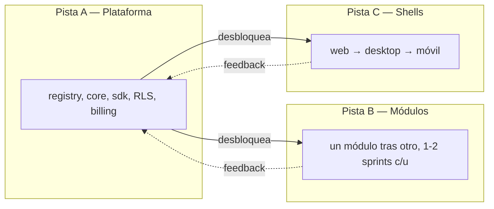
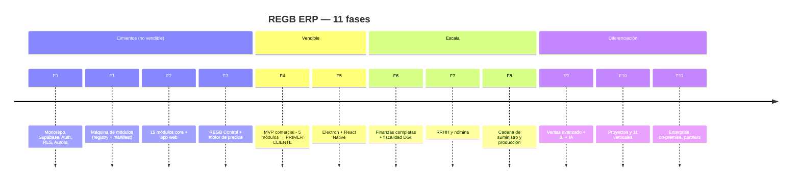

# 🗓️ REGB ERP — Plan de Fases de Desarrollo

> Documento operativo. El [documento maestro](PROYECTO-REGB-ERP.md) dice **qué** se construye.
> Este dice **en qué orden, con qué esfuerzo y cuándo se puede vender**.

|                       |                                                                |
| --------------------- | -------------------------------------------------------------- |
| **Versión**           | 1.0                                                            |
| **Fecha**             | 2026-07-22                                                     |
| **Unidad de trabajo** | 1 sprint = 2 semanas                                           |
| **Esfuerzo**          | expresado en **sprint-persona** (1 sp = 1 persona × 2 semanas) |
| **Módulos totales**   | 92, repartidos en 11 fases                                     |

---

## 0. Cómo leer este plan

### 0.1 La regla que ordena todo

> **No construyes 93 módulos. Construyes la máquina que fabrica módulos, y luego fabricas los que el cliente paga.**

Por eso las fases 0 a 3 no entregan casi ningún módulo de negocio: entregan el **registry**, el **contrato de módulo**, el **motor de precios** y el **aislamiento por tenant**. Después de eso, cada módulo cuesta 1–2 sprints en vez de 6.

### 0.2 Esfuerzo vs. calendario

El esfuerzo es fijo; el calendario depende de cuánta gente hay.

| Escenario                | Personas | Duración de las 11 fases    |
| ------------------------ | -------: | --------------------------- |
| **Solo** (tú + agentes)  |        1 | ~116 semanas · **27 meses** |
| **Núcleo** (tú + 2 devs) |        3 | ~46 semanas · **11 meses**  |
| **Equipo** (tú + 4 devs) |        5 | ~30 semanas · **7 meses**   |

> ⚠️ El roadmap de §18 del documento maestro (38 clientes, US$47K MRR en 12 meses) **solo es alcanzable con el escenario Equipo**. En solitario, la meta realista del mes 12 es **fin de Fase 5: 3–5 clientes piloto pagando**. Ajusta las expectativas comerciales a la capacidad real, no al revés.

### 0.3 Las tres pistas paralelas

A partir de la Fase 4, el trabajo corre en tres pistas que **no se bloquean entre sí**:



Si tienes 3 personas, una por pista. Si estás solo, alternas: **2 sprints de pista B por cada 1 de pista A**.

### 0.4 Puertas de no-avance (gates)

Cada fase termina en una **puerta**. Si la puerta no pasa, **no se avanza a la siguiente fase** — se repara. Las puertas no son opcionales ni negociables por presión comercial. Una puerta forzada en Fase 1 se paga cinco veces en Fase 8.

---

## 1. Mapa general



### 1.1 Tabla resumen

| Fase    | Nombre                  |   Esfuerzo | Módulos | ¿Vendible al terminar?                 |
| ------- | ----------------------- | ---------: | ------: | -------------------------------------- |
| **F0**  | Cimientos               |       8 sp |       0 | ❌                                     |
| **F1**  | La máquina de módulos   |       6 sp |       0 | ❌                                     |
| **F2**  | Core + app web          |      12 sp |      15 | ❌ (falta cobrar)                      |
| **F3**  | REGB Control + dinero   |       8 sp |       0 | ⚠️ Técnicamente sí, sin nada que hacer |
| **F4**  | **MVP comercial**       |      10 sp |       5 | ✅ **Primer cliente PYME**             |
| **F5**  | Desktop + móvil         |      10 sp |       0 | ✅ POS y campo                         |
| **F6**  | Finanzas + fiscalidad   |      12 sp |      11 | ✅ **Cliente Mediano**                 |
| **F7**  | RRHH y nómina           |      11 sp |      10 | ✅                                     |
| **F8**  | Suministro y producción |      18 sp |      18 | ✅ **Cliente Grande**                  |
| **F9**  | Ventas avanzado + IA    |      14 sp |      16 | ✅                                     |
| **F10** | Proyectos y verticales  |      16 sp |      16 | ✅ Nuevos nichos                       |
| **F11** | Enterprise              |       5 sp |       1 | ✅ Contratos grandes                   |
|         | **TOTAL**               | **130 sp** |  **92** |                                        |

---

## 2. FASE 0 — Cimientos

> **Objetivo:** que exista un esqueleto donde dos tenants distintos no puedan verse, y un botón azul que se vea igual en las tres plataformas.

**Esfuerzo:** 8 sprint-persona · **Módulos:** 0 · **Agentes:** `regb-architect`, `regb-db`, `regb-security`, `regb-design`

### 2.1 Sprints

| Sprint | Entregable                                                                                                                                                                                                                |
| ------ | ------------------------------------------------------------------------------------------------------------------------------------------------------------------------------------------------------------------------- |
| **S1** | Monorepo Turborepo + pnpm. Paquetes vacíos pero cableados: `core`, `sdk`, `ui`, `ui-native`, `config`, `permissions`. ESLint/TS/Prettier compartidos. CI que construye y prueba en <6 min.                                |
| **S2** | Proyecto Supabase. Esquemas `public`, `regb`, `audit`. Migraciones versionadas con `up`/`down`. Helpers `auth.tenant_id()`, `auth.is_provider()`, `auth.module_active()`.                                                 |
| **S3** | Auth completo: login, magic link, MFA, JWT con `app_metadata` (tenant_id, role_id, is_provider, branches). Tablas `companies`, `branches`, `roles`, `memberships`. RLS en todas.                                          |
| **S4** | Design System Aurora: `tokens.json` como fuente única, tema oscuro y claro, 12 componentes base en `packages/ui` (Button, Input, Table, Modal, Toast, Badge, Avatar, Sidebar, Card, Tabs, Select, EmptyState). Storybook. |

### 2.2 🚪 Puerta F0 — no se avanza sin esto

- [ ] Dos tenants con datos; usuario del tenant A obtiene **0 filas** de B en `select`, `update` y `delete` sobre **toda** tabla existente
- [ ] El test de aislamiento corre **en CI**, no a mano
- [ ] `service_role` no aparece en ningún bundle de `apps/` (escaneo automático en CI)
- [ ] `tenant_id` nunca se lee de `body`, `params` ni `searchParams` — verificado por lint rule propia
- [ ] Los 12 componentes pasan contraste AA en ambos temas
- [ ] `pnpm build && pnpm test` verde en <6 min

> 💡 Ejecuta `/rls-audit` como parte de la puerta. Si reporta un solo hallazgo CRÍTICO, la puerta no pasa.

---

## 3. FASE 1 — La máquina de módulos

> **Objetivo:** activar un módulo desde una tabla y que aparezca solo en el sidebar de quien debe verlo, sin tocar el código del core.

**Esfuerzo:** 6 sp · **Módulos:** 0 · **Agentes:** `regb-architect`, `regb-module-builder`

### 3.1 Sprints

| Sprint | Entregable                                                                                                                                                                             |
| ------ | -------------------------------------------------------------------------------------------------------------------------------------------------------------------------------------- |
| **S5** | `packages/module-registry`: `defineModule()`, descubrimiento en runtime desde `regb.tenant_modules`, carga dinámica por `import()`, construcción de rutas y sidebar.                   |
| **S6** | Contrato `manifest.ts` cerrado y validado por Zod. Tablas `regb.module_catalog` y `regb.module_pricing`. Ciclo de vida: install → activo → suspendido → archivado (**nunca borrado**). |
| **S7** | Bus de eventos: `event_outbox` + LISTEN/NOTIFY + Edge Function despachadora. Entrega _at-least-once_ con `correlation_id`. Dos módulos de juguete que se comuniquen solo por eventos.  |

### 3.2 🚪 Puerta F1

- [ ] Insertar una fila en `tenant_modules` hace aparecer el módulo en el sidebar del cliente en **<5 s**, sin desplegar código
- [ ] Desactivarlo lo hace desaparecer y la ruta directa devuelve **403**, no datos
- [ ] Un módulo con dependencia faltante **degrada**, no crashea
- [ ] Los dos módulos de juguete no se importan entre sí — solo eventos (verificado por lint)
- [ ] Cero `if (moduleX)` fuera de `module-registry` (grep en CI)

> ⚠️ Esta es la puerta más importante del proyecto. Si el registry no es realmente dinámico aquí, cada uno de los 93 módulos costará el triple.

---

## 4. FASE 2 — Los 15 módulos core + app web

> **Objetivo:** un ERP vacío pero completo: se entra, se navega, se configura, se busca, se aprende. Sin nada de negocio todavía.

**Esfuerzo:** 12 sp · **Módulos:** 15 · **Agentes:** `regb-web`, `regb-module-builder`, `regb-tutorial`

### 4.1 Sprints

| Sprint  | Módulos entregados                                                                    |
| ------- | ------------------------------------------------------------------------------------- |
| **S8**  | `auth`, `users`, `rbac` — incluye el editor visual de permisos de §8.4                |
| **S9**  | `orgs`, `branches`, `settings` — multi-empresa con herencia de configuración          |
| **S10** | `dashboard`, `search` (`Ctrl+K`), `notifications`                                     |
| **S11** | `audit`, `files`, `backup`                                                            |
| **S12** | `imports` (mapeo visual, validación previa, deshacer), `marketplace` (vista cliente)  |
| **S13** | `tour` — motor de tutoriales completo: 4 capas, `tour_progress`, checklist gamificado |

### 4.2 App web en paralelo

Layout Aurora de 4 columnas, responsive `xs`→`2xl`, PWA con service worker, `Ctrl+K` global, Suspense + streaming.

### 4.3 🚪 Puerta F2

- [ ] Un usuario nuevo entra, configura empresa, invita a alguien y navega **sin documentación externa**
- [ ] El editor de permisos oculta módulos por rol y la ruta directa devuelve 403
- [ ] `Ctrl+K` encuentra módulos, registros, acciones y artículos del tutorial
- [ ] El tour de bienvenida se completa, se salta y se retoma correctamente
- [ ] Responsive verificado en 375 / 768 / 1440 px, temas oscuro y claro
- [ ] LCP < 1.5 s · bundle inicial < 200 KB gzip

---

## 5. FASE 3 — REGB Control y el dinero

> **Objetivo:** poder cobrar. Sin esto no hay negocio, solo software.

**Esfuerzo:** 8 sp · **Módulos:** 0 (es tu panel, no del catálogo) · **Agentes:** `regb-billing`, `regb-security`

### 5.1 Sprints

| Sprint  | Entregable                                                                                                                             |
| ------- | -------------------------------------------------------------------------------------------------------------------------------------- |
| **S14** | `packages/billing`: la fórmula de §6.4 completa, con prorrateo, grandfathering y `price_override`. **Los 3 casos de §6.5 al centavo.** |
| **S15** | REGB Control v1: Overview (MRR, ARR, churn), Clientes, Ficha 360 del cliente, health score.                                            |
| **S16** | Facturación: generación, `invoices.lines` reproducible, pasarelas (Stripe + Azul), idempotencia, reintentos días 1/3/7/14.             |
| **S17** | Dunning (5→10→15→30→90), impersonación segura con MFA + razón + ticket + 60 min + banner + doble auditoría, onboarding kanban.         |

### 5.2 🚪 Puerta F3

- [ ] Los 3 casos de cotización de §6.5 salen **exactos**: US$123.25 · US$906 · US$3,946
- [ ] Alta y baja de módulo a mitad de ciclo prorratean correctamente
- [ ] Un webhook de pago duplicado **no cobra dos veces**
- [ ] La impersonación exige MFA + razón, expira a los 60 min y queda en el log de **ambos** lados
- [ ] Ningún paso de dunning borra datos — verificado con test
- [ ] Un tenant no-proveedor recibe 0 filas de todo el esquema `regb`

> 💡 Ejecuta `/pricing-calc` contra los 3 casos como test de aceptación de la puerta.

---

## 6. FASE 4 — MVP comercial 🚀

> **Objetivo:** el primer cliente real paga y opera 30 días sin volver a Excel.

**Esfuerzo:** 10 sp · **Módulos:** 5 (total acumulado: 20) · **Agentes:** `regb-module-builder`, `regb-qa`

### 6.1 Por qué estos 5 módulos

Son el mínimo con el que un colmado, una ferretería o una distribuidora pequeña puede **dejar de usar Excel**: comprar, guardar, vender, cobrar.

| Sprint  | Módulo              | Por qué es imprescindible                |
| ------- | ------------------- | ---------------------------------------- |
| **S18** | `products` (47)     | Nada funciona sin catálogo               |
| **S19** | `inventory` (48)    | Saber qué hay y cuánto vale              |
| **S20** | `sales-orders` (32) | Vender formalmente                       |
| **S21** | `pos` (35)          | Vender en mostrador — es lo que engancha |
| **S22** | `ar` (17)           | Cobrar y perseguir la cartera            |

### 6.2 Trabajo de campo (no es código)

- Elegir **3 clientes piloto** de sectores distintos
- Migrar sus datos reales con `imports`
- Acompañamiento presencial la primera semana
- Registrar **cada** fricción — esa lista dirige la Fase 5

### 6.3 🚪 Puerta F4 — la puerta del negocio

- [ ] **Un negocio real operó 30 días corridos** sin volver a Excel
- [ ] Facturó, cobró, ajustó inventario y cerró caja **sin llamar a soporte** más de 1 vez por semana
- [ ] La primera factura de REGB se cobró automáticamente y el cliente **no la disputó**
- [ ] Tiempo hasta la primera transacción real del cliente: **< 48 h**
- [ ] Los 5 módulos pasan los 14 puntos de la Definición de Terminado

> 🎯 **Este es el hito que importa.** Todo lo anterior es inversión; aquí empieza el retorno. Si la puerta F4 no pasa, **no sigas construyendo módulos** — arregla lo que impide que un cliente opere.

---

## 7. FASE 5 — Electron y React Native

> **Objetivo:** que el POS venda sin internet y que el vendedor facture desde el celular.

**Esfuerzo:** 10 sp · **Módulos:** 0 (shells) · **Agentes:** `regb-desktop`, `regb-mobile`, `regb-qa`

### 7.1 Sprints

| Sprint  | Pista   | Entregable                                                                                                                  |
| ------- | ------- | --------------------------------------------------------------------------------------------------------------------------- |
| **S23** | Desktop | Shell Electron seguro: `contextIsolation`, `sandbox`, `contextBridge` mínimo, validación Zod de cada payload, `safeStorage` |
| **S24** | Desktop | Offline real: réplica SQLite, cola de mutaciones, folio al sincronizar, indicador de estado                                 |
| **S25** | Desktop | Hardware: impresora ESC/POS, cajón, lector USB, visor. `electron-builder`, firma, auto-update con rollback                  |
| **S26** | Móvil   | Shell Expo: navegación, nav inferior de 5, Aurora nativo desde `tokens.json`, biometría                                     |
| **S27** | Móvil   | Offline WatermelonDB + cámara (escaneo y foto) + push accionable. `mobileScope` de los 5 módulos de F4                      |

### 7.2 🚪 Puerta F5

- [ ] **El POS vende 8 horas sin internet y cuadra al reconectar** — probado desconectando el cable, no simulado
- [ ] Una mutación creada en móvil aparece en web tras sincronizar, sin duplicar y en orden
- [ ] La app móvil abre y muestra datos **con el avión activado**
- [ ] Arranque en frío móvil < 2 s
- [ ] Auto-update de Electron instala y hace rollback correctamente
- [ ] Cero lógica de negocio duplicada: `grep` de la fórmula de precios da **una sola** ocurrencia, en `packages/`

> 💡 Usa `/tri-platform` para cada feature de esta fase. Es literalmente para lo que existe.

---

## 8. FASE 6 — Finanzas completas y fiscalidad

> **Objetivo:** que un contador dominicano pueda cerrar el mes y presentar a la DGII desde REGB.

**Esfuerzo:** 12 sp · **Módulos:** 11 (acumulado: 31) · **Agentes:** `regb-module-builder`, `regb-db`

| Sprint     | Módulos                                                               |
| ---------- | --------------------------------------------------------------------- |
| **S28–29** | `accounting` (16) — catálogo, asientos, mayor, balanza, cierres       |
| **S30**    | `ap` (18), `treasury` (19)                                            |
| **S31**    | `bank-rec` (20) con matching asistido, `multicurrency` (26)           |
| **S32–33** | `taxes` (24) + `e-invoice` (25) — **e-CF DGII, formatos 606/607/608** |
| **S34**    | `payments` (27), `fixed-assets` (21)                                  |
| **S35**    | `budgets` (22), `cost-centers` (23)                                   |

### 8.1 🚪 Puerta F6

- [ ] Un contador externo cierra un mes completo y **firma que los estados cuadran**
- [ ] Un e-CF se emite, se firma y la DGII lo acepta **en producción**
- [ ] El modo contingencia de e-CF funciona con la DGII caída
- [ ] Los formatos 606/607/608 se generan y validan en la herramienta oficial
- [ ] Toda cifra monetaria es `numeric(12,2)` — cero `float` en el esquema

> ⚠️ El módulo `e-invoice` es el que más cambia por decreto. Manténlo aislado y versionado: es el riesgo 5 del documento maestro.

---

## 9. FASE 7 — RRHH y nómina

> **Objetivo:** pagar la quincena con TSS, AFP, ARS e ISR correctos.

**Esfuerzo:** 11 sp · **Módulos:** 10 (acumulado: 41) · **Agentes:** `regb-module-builder`, `regb-security`

| Sprint     | Módulos                                                              |
| ---------- | -------------------------------------------------------------------- |
| **S36**    | `employees` (61)                                                     |
| **S37–38** | `payroll` (62) — TSS, AFP, ARS, ISR, prestaciones, regalía, volantes |
| **S39**    | `attendance` (63) — biométrico, geocerca, QR · `time-off` (64)       |
| **S40**    | `expenses` (68) con OCR · `hr-portal` (70)                           |
| **S41**    | `benefits` (69), `recruiting` (65)                                   |
| **S42**    | `performance` (66), `training` (67)                                  |

### 9.1 🚪 Puerta F7

- [ ] Una nómina real de ≥50 empleados cuadra **al centavo** contra el cálculo manual del cliente
- [ ] Los archivos de TSS se generan y el portal los acepta
- [ ] Salarios y cédulas están cifrados con `pgsodium` — verificado leyendo la tabla en crudo
- [ ] Un empleado ve **solo** su volante; ningún rol operativo accede a salarios ajenos
- [ ] El ponche por geocerca funciona en un celular real, en la calle

---

## 10. FASE 8 — Cadena de suministro y producción

> **Objetivo:** el cliente Grande. Es la fase más larga y la que más margen genera.

**Esfuerzo:** 18 sp · **Módulos:** 18 (acumulado: 59) · **Agentes:** `regb-module-builder`, `regb-mobile`

| Sprint     | Módulos                                            |
| ---------- | -------------------------------------------------- |
| **S43**    | `suppliers` (42), `price-lists` (41)               |
| **S44**    | `requisitions` (43), `rfq` (44)                    |
| **S45**    | `purchase-orders` (45), `receipts` (46)            |
| **S46**    | `lots-serials` (49) — trazabilidad, FEFO, recall   |
| **S47**    | `transfers` (50), `stock-counts` (51)              |
| **S48**    | `barcode` (52) — escaneo con la cámara del celular |
| **S49**    | `logistics` (53), `fleet` (54)                     |
| **S50–51** | `bom` (55), `manufacturing` (56)                   |
| **S52**    | `mrp` (57)                                         |
| **S53**    | `quality` (58), `maintenance` (59)                 |
| **S54**    | `shopfloor` (60) — terminal táctil, OEE            |

### 10.1 🚪 Puerta F8

- [ ] Trazabilidad completa: dado un lote vendido, se reconstruye **hasta la materia prima** en <10 s
- [ ] Un simulacro de recall identifica todos los clientes afectados
- [ ] MRP sugiere compras coherentes contra un plan de producción real
- [ ] P95 de query sigue **< 150 ms** con 10M de filas en movimientos de inventario
- [ ] Un conteo cíclico completo se hace **solo con el celular**

> ⚠️ Aquí es donde el volumen de datos empieza a doler. Particiona `inventory_movements` y `journal_entries` **antes** de esta fase, no después.

---

## 11. FASE 9 — Ventas avanzado, BI e inteligencia

> **Objetivo:** dejar de competir por precio. Estos módulos son los que Odoo no hace bien.

**Esfuerzo:** 14 sp · **Módulos:** 16 (acumulado: 75) · **Agentes:** `regb-module-builder`, `regb-web`

| Sprint     | Módulos                                                |
| ---------- | ------------------------------------------------------ |
| **S55**    | `crm` (29), `pipeline` (30)                            |
| **S56**    | `quotes` (31), `e-sign` (91)                           |
| **S57**    | `contracts` (33), `commissions` (34)                   |
| **S58**    | `customer-portal` (39), `helpdesk` (40)                |
| **S59**    | `loyalty` (38), `marketing` (37)                       |
| **S60**    | `ecommerce` (36) — Shopify / WooCommerce bidireccional |
| **S61–62** | `bi` (87) — constructor visual de reportes             |
| **S63**    | `automations` (88) — reglas sin código entre módulos   |
| **S64**    | `api-webhooks` (89)                                    |
| **S65–66** | `ai-copilot` (90), `chat` (92)                         |

### 11.1 🚪 Puerta F9

- [ ] Un usuario no técnico construye un reporte útil **sin ayuda**
- [ ] Una automatización cruza 3 módulos sin código
- [ ] El copiloto responde correctamente 8 de 10 preguntas reales sobre datos del tenant
- [ ] El copiloto **nunca** devuelve datos de otro tenant — probado adversarialmente
- [ ] La API pública respeta rate limit por tenant y no filtra entre tenants

> ⚠️ El copiloto IA es el mayor riesgo de fuga entre tenants del proyecto: consulta datos en lenguaje natural. Que `regb-security` lo audite específicamente antes de publicarlo.

---

## 12. FASE 10 — Proyectos y verticales

> **Objetivo:** abrir nichos nuevos sin construir un producto nuevo.

**Esfuerzo:** 16 sp · **Módulos:** 16 (acumulado: 91) · **Agentes:** `regb-module-builder`, `regb-docs`

| Sprint     | Módulos                                             |
| ---------- | --------------------------------------------------- |
| **S67**    | `projects` (71), `timesheets` (72)                  |
| **S68**    | `project-costing` (73), `resources` (75)            |
| **S69**    | `field-service` (74) — móvil-primero                |
| **S70–71** | `restaurant` (76) — mesas, KDS, delivery, food cost |
| **S72**    | `clinic` (77)                                       |
| **S73**    | `workshop` (79)                                     |
| **S74**    | `real-estate` (80)                                  |
| **S75**    | `gym` (82), `laundry` (86)                          |
| **S76**    | `pharmacy` (83)                                     |
| **S77**    | `hotel` (78)                                        |
| **S78**    | `education` (81)                                    |
| **S79**    | `agro` (84), `construction` (85)                    |

### 12.1 Regla de oro de los verticales

> **No construyas un vertical sin un cliente que ya lo pidió y va a pagar la instalación.**

Reordena esta fase según quién aparezca primero. El orden de arriba es una hipótesis de demanda (restaurante y clínica son los mercados más grandes en RD), no un compromiso.

### 12.2 🚪 Puerta F10

- [ ] Cada vertical construido tiene **al menos 1 cliente pagando** antes de publicarse en el marketplace
- [ ] Cada vertical reutiliza ≥70% de módulos existentes — si reescribe inventario, está mal diseñado
- [ ] Ficha de módulo publicada en `docs/modules/` para cada uno

---

## 13. FASE 11 — Enterprise

> **Objetivo:** poder decir que sí a un grupo empresarial.

**Esfuerzo:** 5 sp · **Módulos:** 1 (acumulado: **92** ✅) · **Agentes:** `regb-architect`, `regb-security`

| Sprint  | Entregable                                                                |
| ------- | ------------------------------------------------------------------------- |
| **S80** | `consolidation` (28) — estados consolidados, eliminaciones inter-compañía |
| **S81** | Despliegue on-premise / VPC dedicada                                      |
| **S82** | SSO empresarial (SAML, Azure AD), SCIM                                    |
| **S83** | Pentest externo + SOC2 lite + plan de continuidad                         |
| **S84** | Marketplace de partners: SDK público, revenue share, certificación        |

### 13.1 🚪 Puerta F11

- [ ] Pentest externo sin hallazgos críticos ni altos
- [ ] Restore point-in-time probado **de verdad**, con cronómetro
- [ ] Un partner externo construye y publica un módulo sin acceso a tu código

---

## 14. Asignación de agentes por fase

| Fase | Agentes principales                     | Skills que se usan                          |
| ---- | --------------------------------------- | ------------------------------------------- |
| F0   | `architect`, `db`, `security`, `design` | `/rls-audit`, `/aurora-ui`                  |
| F1   | `architect`, `module-builder`           | `/new-module`                               |
| F2   | `web`, `module-builder`, `tutorial`     | `/new-module`, `/tour-writer`, `/aurora-ui` |
| F3   | `billing`, `security`                   | `/pricing-calc`, `/rls-audit`               |
| F4   | `module-builder`, `qa`                  | `/new-module`, `/tour-writer`               |
| F5   | `desktop`, `mobile`, `qa`               | `/tri-platform`                             |
| F6   | `module-builder`, `db`                  | `/new-module`, `/rls-audit`                 |
| F7   | `module-builder`, `security`            | `/new-module`, `/rls-audit`                 |
| F8   | `module-builder`, `mobile`, `db`        | `/new-module`, `/tri-platform`              |
| F9   | `module-builder`, `web`, `security`     | `/new-module`, `/rls-audit`                 |
| F10  | `module-builder`, `docs`                | `/new-module`, `/tour-writer`               |
| F11  | `architect`, `security`, `docs`         | `/rls-audit`                                |

### 14.1 Ritual por cada módulo (a partir de F4)

```
1. /new-module <id>              → scaffold completo
2. regb-db revisa migraciones y RLS
3. regb-design revisa la UI contra Aurora
4. /tour-writer <id>             → tutorial
5. /pricing-calc                 → cargar precio en los 3 tiers
6. regb-qa ejecuta los 14 puntos
7. /rls-audit                    → antes de publicar
```

Si el paso 7 reporta un CRÍTICO, el módulo **no se publica**.

---

## 15. Anti-roadmap: qué NO construir

Tan importante como el plan es la lista de lo que se rechaza.

| No construir                      | Por qué                                 | Qué hacer en su lugar                                             |
| --------------------------------- | --------------------------------------- | ----------------------------------------------------------------- |
| Módulos "a la medida" antes de F8 | Fragmentan el producto y no se revenden | Solo tier Grande, cotizado aparte, y **como módulo del catálogo** |
| App móvil con paridad total       | El móvil no es el ERP completo          | `mobileScope` explícito por módulo                                |
| Una BD por cliente                | Mata la economía del multi-tenant       | Un Postgres + RLS                                                 |
| Reescribir la UI en Electron      | Duplica el trabajo para siempre         | Electron reutiliza `apps/web` al ~95%                             |
| Verticales sin cliente            | Construyes para nadie                   | Regla de oro §12.1                                                |
| Optimizar antes de F8             | No sabes dónde duele                    | Mide con `pg_stat_statements`, luego optimiza                     |
| Migrar de Supabase                | Es Postgres estándar                    | El `sdk` ya abstrae el cliente                                    |

---

## 16. Riesgos por fase

| Fase | Riesgo dominante               | Señal temprana                               | Mitigación                          |
| ---- | ------------------------------ | -------------------------------------------- | ----------------------------------- |
| F0   | RLS mal cimentado              | Un test de aislamiento "difícil de escribir" | Parar y rediseñar el esquema        |
| F1   | Registry no realmente dinámico | Aparece el primer `if (moduleX)`             | Refactor inmediato, no acumular     |
| F2   | Scope creep en el core         | "Aprovechando, agrego…"                      | Congelar en 15 módulos              |
| F3   | Precio mal calculado           | Los 3 casos no cuadran                       | No avanzar hasta que cuadren        |
| F4   | El cliente vuelve a Excel      | Uso diario cae en semana 2                   | Ir presencial, arreglar la fricción |
| F5   | Paridad ahoga al equipo        | Móvil intenta hacer todo                     | Recortar `mobileScope`              |
| F6   | Cambio de decreto DGII         | Rechazo de e-CF                              | Módulo aislado y versionado         |
| F7   | Error de nómina                | Un empleado cobra mal                        | Doble cálculo paralelo 3 meses      |
| F8   | Postgres se satura             | P95 sube de 150 ms                           | Particionar antes, no después       |
| F9   | Copiloto filtra datos          | Cualquier respuesta rara                     | Auditoría adversarial dedicada      |
| F10  | Verticales sin demanda         | Construir "por si acaso"                     | Regla de oro §12.1                  |
| F11  | Un cliente enorme te secuestra | 80% del tiempo en 1 cliente                  | Precio enterprise que lo pague      |

---

## 17. Checklist maestro

```
CIMIENTOS
[ ] F0  Monorepo, Supabase, Auth, RLS, Aurora          8 sp
[ ] F1  Máquina de módulos (registry + eventos)        6 sp
[ ] F2  15 módulos core + app web                     12 sp
[ ] F3  REGB Control + motor de precios               8 sp
        └─ 34 sp invertidos, 0 ingresos. Es normal.

VENDIBLE
[ ] F4  MVP comercial (5 módulos) 🚀 PRIMER CLIENTE   10 sp
[ ] F5  Electron + React Native                       10 sp
        └─ 54 sp. Aquí empieza a entrar dinero.

ESCALA
[ ] F6  Finanzas + fiscalidad DGII (11 módulos)       12 sp
[ ] F7  RRHH y nómina (10 módulos)                    11 sp
[ ] F8  Suministro y producción (18 módulos)          18 sp
        └─ 95 sp. Ya puedes vender los 3 tiers.

DIFERENCIACIÓN
[ ] F9  Ventas avanzado + BI + IA (16 módulos)        14 sp
[ ] F10 Proyectos y verticales (16 módulos)           16 sp
[ ] F11 Enterprise (1 módulo)                          5 sp
        └─ 130 sp · 93 módulos ✅
```

---

## 18. Lo que haría yo el lunes

1. **Fase 0, Sprint 1.** Monorepo y CI. Nada más. Un día.
2. **Sprint 2–3 sin saltarse el RLS.** Es la única parte del proyecto que no se puede arreglar después.
3. **No mirar los 93 módulos.** Mirar los 15 de F2 y los 5 de F4. Los otros 73 son ruido hasta que tengas un cliente pagando.
4. **Buscar el cliente piloto ahora**, no en F4. Que vea el avance y ajuste el rumbo. Un cliente comprometido en el mes 1 vale más que diez interesados en el mes 8.

---

_Documento generado el 2026-07-22 · Complemento operativo de [PROYECTO-REGB-ERP.md](PROYECTO-REGB-ERP.md)_
