# 🛰️ REGB ERP — Documento Maestro del Proyecto

> **ERP modular multi-tenant con identidad propia.**
> Web (Next.js) · Desktop (Electron) · Móvil (React Native) · Backend (Supabase)
> **80 módulos** activables por cliente · Licenciamiento variable · Panel de propietario integrado

|                                             |                                                                                         |
| ------------------------------------------- | --------------------------------------------------------------------------------------- |
| **Nombre del producto**                     | REGB ERP                                                                                |
| **Nombre interno del panel de propietario** | REGB Control (`owner-console`)                                                          |
| **Versión del documento**                   | 1.0                                                                                     |
| **Fecha**                                   | 2026-07-21                                                                              |
| **Autor**                                   | Randy Grullón                                                                           |
| **Stack**                                   | Next.js 15 · Electron 33 · React Native (Expo 54) · Supabase (Postgres 16) · TypeScript |
| **Repos**                                   | Monorepo `REGB-ERP/` (Turborepo + pnpm)                                                 |

---

## 📑 Índice

1. [Visión y propuesta de valor](#1-visión-y-propuesta-de-valor)
2. [Arquitectura general](#2-arquitectura-general)
3. [Monorepo y estructura de carpetas](#3-monorepo-y-estructura-de-carpetas)
4. [Sistema de módulos (el corazón)](#4-sistema-de-módulos-el-corazón)
5. [Catálogo completo de 80 módulos](#5-catálogo-completo-de-80-módulos)
6. [Tipos de cliente y modelo de precios](#6-tipos-de-cliente-y-modelo-de-precios)
7. [REGB Control — el panel del propietario](#7-regb-control--el-panel-del-propietario)
8. [Roles, permisos y visibilidad de módulos](#8-roles-permisos-y-visibilidad-de-módulos)
9. [Modelo de datos (Supabase)](#9-modelo-de-datos-supabase)
10. [Seguridad y multi-tenancy (RLS)](#10-seguridad-y-multi-tenancy-rls)
11. [Design System "Aurora" — identidad propia](#11-design-system-aurora--identidad-propia)
12. [Mockups de pantallas](#12-mockups-de-pantallas)
13. [Responsive: desktop, tablet y celular](#13-responsive-desktop-tablet-y-celular)
14. [Sistema de tutorial y onboarding](#14-sistema-de-tutorial-y-onboarding)
15. [Estrategia de los 3 clientes en paralelo](#15-estrategia-de-los-3-clientes-en-paralelo)
16. [Agentes especializados](#16-agentes-especializados)
17. [Skills del proyecto](#17-skills-del-proyecto)
18. [Roadmap y fases](#18-roadmap-y-fases)
19. [Métricas de éxito y KPIs](#19-métricas-de-éxito-y-kpis)
20. [Riesgos y mitigaciones](#20-riesgos-y-mitigaciones)

---

## 1. Visión y propuesta de valor

### 1.1 El problema

Las empresas de LATAM (especialmente RD y Centroamérica) viven atrapadas entre tres malas opciones:

| Opción                      | Problema                                                                  |
| --------------------------- | ------------------------------------------------------------------------- |
| **SAP / Oracle / Dynamics** | US$150k+ de implementación, 12-18 meses, requiere consultores permanentes |
| **Odoo / ERPNext**          | Open source pero UX de 2012, curva de aprendizaje brutal, hosting propio  |
| **Excel + WhatsApp**        | Lo que realmente usa el 70% de las PYMES                                  |

### 1.2 La solución

**REGB ERP** = un ERP donde **todo** se hace desde adentro, pero donde el cliente **solo paga por lo que enciende**.

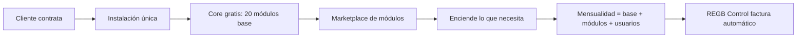

### 1.3 Los 5 diferenciadores

| #   | Diferenciador               | Por qué gana                                                                                           |
| --- | --------------------------- | ------------------------------------------------------------------------------------------------------ |
| 1   | **Estética propia**         | La gente ya sabe usarlo. Cero fricción cognitiva. Sidebar de servidores = empresas, canales = módulos. |
| 2   | **Modularidad real**        | Cada módulo es un paquete npm + migración SQL + registro. Encender = 1 click, no un proyecto.          |
| 3   | **Precio variable honesto** | PYME de 5 personas no paga lo de una empresa de 500. Cálculo transparente y visible.                   |
| 4   | **Tri-plataforma nativa**   | Mismo core, 3 shells. El vendedor factura desde el celular, contabilidad desde Electron offline.       |
| 5   | **Tutorial vivo**           | Cada módulo trae su propio tour interactivo. Onboarding sin consultores.                               |

### 1.4 Pitch de una línea

> _"El ERP que se aprende en una tarde, cuesta como Netflix y hace lo que hace SAP."_

---

## 2. Arquitectura general

### 2.1 Vista de 10.000 pies

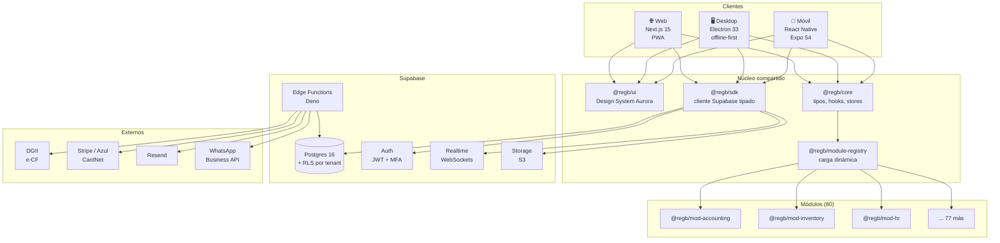

### 2.2 Principios arquitectónicos

| Principio                             | Implicación práctica                                                                               |
| ------------------------------------- | -------------------------------------------------------------------------------------------------- |
| **Un solo Postgres, RLS estricto**    | Multi-tenant por `tenant_id` en cada tabla + políticas RLS. Nada de una BD por cliente.            |
| **Módulos son paquetes, no features** | Cada módulo = carpeta autocontenida con `manifest.ts`, `migrations/`, `ui/`, `api/`, `tour/`.      |
| **El core no conoce los módulos**     | El registry los descubre en runtime desde `tenant_modules`. Cero `if (moduleX)` en el core.        |
| **Offline-first en Electron y móvil** | Cache local (SQLite/WatermelonDB) + cola de mutaciones + sync al reconectar.                       |
| **Server-side todo lo crítico**       | Cálculos de precio, cierres contables y firma fiscal viven en Edge Functions, nunca en el cliente. |
| **Todo evento se audita**             | Tabla `audit_log` particionada por mes, escrita por trigger.                                       |

### 2.3 Flujo de arranque de la app

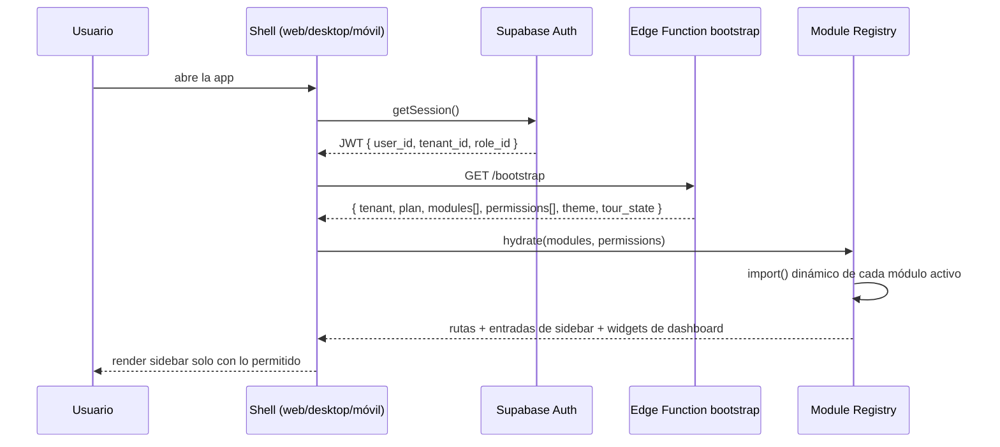

---

## 3. Monorepo y estructura de carpetas

```
REGB-ERP/
├── apps/
│   ├── web/                  # Next.js 15 (App Router) — cliente principal + PWA
│   ├── desktop/              # Electron 33 — envuelve web/ + capacidades nativas
│   ├── mobile/               # Expo 54 / React Native — app iOS + Android
│   └── owner-console/        # REGB Control (puede vivir dentro de web/ bajo /regb)
│
├── packages/
│   ├── core/                 # tipos, zod schemas, stores zustand, lógica de negocio pura
│   ├── ui/                   # Design System Aurora (web) — shadcn + tailwind
│   ├── ui-native/            # Design System Aurora (RN) — mismos tokens
│   ├── sdk/                  # cliente Supabase tipado + repos + cola offline
│   ├── module-registry/      # descubrimiento y carga dinámica de módulos
│   ├── tour/                 # motor de tutoriales interactivos
│   ├── billing/              # motor de cálculo de precios y facturación
│   ├── permissions/          # evaluador RBAC/ABAC compartido
│   └── config/               # eslint, tsconfig, tailwind, prettier compartidos
│
├── modules/                  # ⭐ los 80 módulos
│   ├── _template/            # scaffold para crear módulos nuevos
│   ├── accounting/
│   │   ├── manifest.ts       # id, nombre, icono, precio, deps, permisos, rutas
│   │   ├── migrations/       # 001_init.sql, 002_...
│   │   ├── ui/               # componentes web
│   │   ├── ui-native/        # componentes RN
│   │   ├── api/              # edge functions específicas
│   │   ├── tour/             # pasos del tutorial
│   │   └── seed/             # datos demo
│   ├── inventory/
│   └── ... (78 más)
│
├── supabase/
│   ├── migrations/           # migraciones del core
│   ├── functions/            # edge functions compartidas
│   └── seed.sql
│
├── docs/                     # este documento y anexos
│   ├── PROYECTO-REGB-ERP.md
│   ├── MODULOS.md
│   ├── DESIGN-SYSTEM.md
│   └── API.md
│
├── .claude/
│   ├── agents/               # 12 agentes especializados
│   └── skills/               # 6 skills del proyecto
│
├── turbo.json
├── pnpm-workspace.yaml
└── package.json
```

---

## 4. Sistema de módulos (el corazón)

### 4.1 Anatomía de un módulo

Cada módulo es **autocontenido** y declara todo lo que necesita:

```typescript
// modules/inventory/manifest.ts
import { defineModule } from '@regb/module-registry'

export default defineModule({
  id: 'inventory',
  name: 'Inventario',
  description: 'Almacenes, existencias, movimientos, lotes y series.',
  icon: 'Package', // lucide-react
  category: 'supply-chain',
  version: '1.4.0',

  // ── Comercial ─────────────────────────────
  pricing: {
    install: { pyme: 200, mediano: 800, grande: 2500 }, // USD, una vez
    monthly: { pyme: 25, mediano: 90, grande: 260 }, // USD/mes
    perUser: { pyme: 0, mediano: 2, grande: 4 }, // USD/usuario/mes extra
    metered: [{ key: 'sku', included: 500, overageUnit: 100, price: 5 }],
  },

  // ── Dependencias ──────────────────────────
  requires: ['core', 'products'],
  recommends: ['purchasing', 'sales'],
  conflicts: [],

  // ── Permisos que expone ───────────────────
  permissions: [
    'inventory.view',
    'inventory.adjust',
    'inventory.transfer',
    'inventory.count',
    'inventory.cost.view',
    'inventory.export',
  ],

  // ── Navegación ────────────────────────────
  routes: [
    { path: '/inventory', label: 'Existencias', perm: 'inventory.view' },
    { path: '/inventory/movements', label: 'Movimientos', perm: 'inventory.view' },
    { path: '/inventory/transfers', label: 'Transferencias', perm: 'inventory.transfer' },
    { path: '/inventory/counts', label: 'Conteos', perm: 'inventory.count' },
  ],

  // ── Extensiones al sistema ────────────────
  dashboardWidgets: ['stock-alerts', 'top-movers', 'inventory-value'],
  reports: ['stock-valuation', 'movement-ledger', 'aging'],
  events: {
    emits: ['inventory.stock.low', 'inventory.movement.created'],
    listens: ['sales.order.confirmed', 'purchasing.receipt.posted'],
  },

  // ── Plataformas soportadas ────────────────
  platforms: { web: true, desktop: true, mobile: true },
  mobileScope: ['view', 'count', 'transfer'], // en móvil solo estas acciones

  // ── Tutorial ──────────────────────────────
  tour: () => import('./tour'),

  // ── Ciclo de vida ─────────────────────────
  onInstall: async (ctx) => {
    await ctx.runMigrations()
    await ctx.seedDemo()
  },
  onUninstall: async (ctx) => {
    await ctx.archiveData()
  }, // nunca borra, archiva
})
```

### 4.2 Ciclo de vida de un módulo

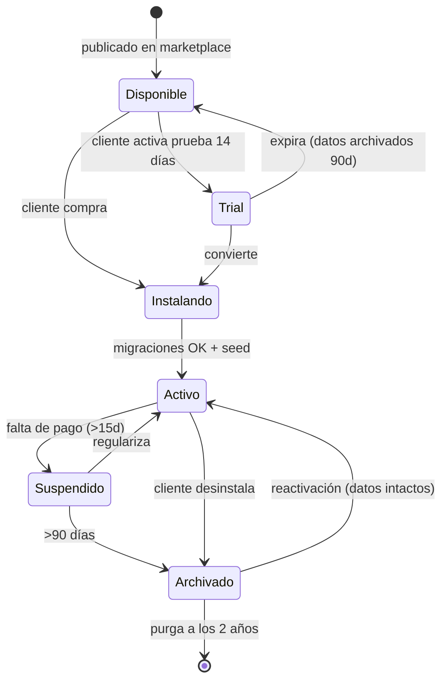

### 4.3 Reglas de oro de los módulos

1. **Nunca borran datos.** Desinstalar = archivar. La reactivación restaura todo.
2. **Migraciones idempotentes y con rollback.** Cada `NNN_up.sql` tiene su `NNN_down.sql`.
3. **Comunicación por eventos, no por imports.** Inventario no importa Ventas: escucha `sales.order.confirmed`.
4. **Todo módulo declara sus permisos.** Si no está en `permissions[]`, no existe.
5. **Todo módulo trae tour.** Sin tutorial no se aprueba el PR.
6. **Degradación elegante.** Si falta una dependencia opcional, el módulo funciona con menos features, no crashea.

### 4.4 Bus de eventos entre módulos

```typescript
// packages/core/events.ts
type RegbEvent = {
  id: string
  tenant_id: string
  type: string // 'sales.order.confirmed'
  payload: unknown
  emitted_by: string // module id
  emitted_at: string
  correlation_id: string
}
```

Se implementa con **Postgres LISTEN/NOTIFY + tabla `event_outbox`** procesada por una Edge Function, garantizando entrega _at-least-once_ y trazabilidad completa.

---

## 5. Catálogo completo de 80 módulos

> 🟢 **Core** (incluido en todos los planes) · 🔵 **Estándar** · 🟣 **Avanzado** · 🟠 **Vertical** · 🔴 **Enterprise**

### 5.1 Plataforma / Core (1–15) 🟢

| #   | ID              | Módulo                       | Qué hace                                                                                |
| --- | --------------- | ---------------------------- | --------------------------------------------------------------------------------------- |
| 1   | `auth`          | **Autenticación & SSO**      | Login, MFA, magic link, Google/Microsoft SSO, políticas de contraseña, sesiones activas |
| 2   | `users`         | **Usuarios & Perfiles**      | Alta/baja, perfil, avatar, preferencias, idioma, zona horaria                           |
| 3   | `rbac`          | **Roles & Permisos**         | Roles, permisos granulares, visibilidad de módulos, ABAC por sucursal/monto             |
| 4   | `orgs`          | **Multi-empresa**            | Varias razones sociales bajo un mismo tenant, consolidación                             |
| 5   | `branches`      | **Sucursales & Ubicaciones** | Jerarquía de sucursales, horarios, geocerca                                             |
| 6   | `dashboard`     | **Dashboard & Widgets**      | Home configurable por rol, widgets arrastrables de cada módulo                          |
| 7   | `search`        | **Búsqueda global**          | `Ctrl+K` sobre todas las entidades, full-text + fuzzy                                   |
| 8   | `notifications` | **Notificaciones**           | In-app, push, email, WhatsApp; centro de notificaciones propio                          |
| 9   | `audit`         | **Auditoría**                | Quién hizo qué, cuándo, desde dónde; diff antes/después; export firmado                 |
| 10  | `settings`      | **Configuración**            | Ajustes por tenant, empresa, sucursal y usuario, con herencia                           |
| 11  | `files`         | **Gestor documental**        | Carpetas, versiones, OCR, previsualización, adjuntos polimórficos                       |
| 12  | `tour`          | **Tutorial & Onboarding**    | Motor de tours, checklists, academia, videos                                            |
| 13  | `marketplace`   | **Marketplace de módulos**   | Explorar, probar 14 días, activar, ver precio en vivo                                   |
| 14  | `imports`       | **Importar / Exportar**      | CSV/XLSX con mapeo visual, validación previa, deshacer importación                      |
| 15  | `backup`        | **Respaldos**                | Snapshots programados, export total del tenant, restore point-in-time                   |

### 5.2 Finanzas & Contabilidad (16–28) 🔵🟣

| #   | ID                | Módulo                      | Qué hace                                                                                |
| --- | ----------------- | --------------------------- | --------------------------------------------------------------------------------------- |
| 16  | `accounting`      | **Contabilidad general**    | Catálogo de cuentas, asientos, mayor, balanza, cierres                                  |
| 17  | `ar`              | **Cuentas por cobrar**      | Facturas, antigüedad de saldos, recordatorios automáticos, notas de crédito             |
| 18  | `ap`              | **Cuentas por pagar**       | Facturas de proveedor, programación de pagos, retenciones                               |
| 19  | `treasury`        | **Tesorería & Bancos**      | Cuentas bancarias, flujo de caja proyectado, transferencias                             |
| 20  | `bank-rec`        | **Conciliación bancaria**   | Import de estados, matching automático con IA, partidas pendientes                      |
| 21  | `fixed-assets`    | **Activos fijos**           | Alta, depreciación (línea recta/acelerada), revalúo, baja                               |
| 22  | `budgets`         | **Presupuestos**            | Por cuenta/centro/proyecto, comparativo real vs. presupuesto, alertas                   |
| 23  | `cost-centers`    | **Centros de costo**        | Distribución, prorrateo, rentabilidad por centro                                        |
| 24  | `taxes`           | **Impuestos**               | ITBIS/IVA, retenciones, formatos 606/607/608, calendario fiscal                         |
| 25  | `e-invoice`       | **Facturación electrónica** | e-CF DGII (RD), CFDI (MX), FE (CO/CR); firma digital, contingencia                      |
| 26  | `multicurrency`   | **Multimoneda**             | Tasas automáticas (BCRD/API), diferencia cambiaria, reexpresión                         |
| 27  | `payments`        | **Pasarelas de cobro**      | Stripe, Azul, CardNet, PayPal; links de pago, cobro recurrente                          |
| 28  | `consolidation`   | **Consolidación** 🔴        | Estados consolidados multi-empresa, eliminaciones inter-compañía                        |
| 93  | `invoice-capture` | **Captura de facturas** 🟣  | Fotografía la factura del proveedor y el sistema extrae RNC, NCF, fecha, ITBIS y líneas |

<details>
<summary><b>📸 Por qué <code>invoice-capture</code> es un módulo aparte y no una función de <code>ap</code></b></summary>

En República Dominicana, el **606** se arma con las facturas que te dan tus proveedores. Teclearlas una por una es donde una contabilidad pierde más horas y comete más errores: un NCF mal digitado es un rechazo de la DGII.

`invoice-capture` recibe una foto —del celular, del escáner o de un correo— y devuelve un borrador de factura con RNC, NCF, fecha, subtotal, ITBIS y líneas ya separadas. El contador **revisa y aprueba**, no teclea.

**Es módulo propio por dos razones concretas:**

1. **Cuesta dinero cada vez.** Cada documento procesado consume OCR y un modelo de visión. Necesita su propio consumo medido, igual que los e-CF, o el margen se lo come el cliente que sube 3.000 facturas al mes.
2. **Se vende solo.** Un contador externo que lleva 15 empresas pequeñas quiere esto sin comprar contabilidad completa. Si vive dentro de `ap`, no se lo puedes vender.

|                    |                                                                                         |
| ------------------ | --------------------------------------------------------------------------------------- |
| **Categoría**      | 🟣 Avanzado                                                                             |
| **Instalación**    | $400 PYME · $1.500 Mediano · $4.000 Grande                                              |
| **Mensual**        | $45 · $160 · $420                                                                       |
| **Consumo medido** | 100 documentos incluidos; luego **US$0.04** por documento                               |
| **Recomienda**     | `ap`, `taxes`, `files` — funciona sin ellos, pero con `ap` crea la factura directamente |
| **Móvil**          | ✔️ **Móvil-primero.** El caso real es fotografiar la factura al recibir la mercancía    |
| **Emite**          | `invoice-capture.document.extracted`, `invoice-capture.document.rejected`               |

**Regla de diseño:** el módulo **nunca contabiliza solo**. Siempre genera un borrador que una persona aprueba. Una extracción con 94% de confianza sigue siendo un 6% de facturas mal contabilizadas, y eso en fiscalidad no se perdona. La confianza por campo se muestra en la UI: lo dudoso va resaltado en ámbar.

**Riesgo a vigilar:** las fotos de facturas contienen RNC y montos de terceros. Se guardan cifradas con `pgsodium` y se purgan a los 90 días de aprobada la factura — el dato que importa ya vive en `ap`.

</details>

### 5.3 Ventas & CRM (29–41) 🔵🟣

| #   | ID                | Módulo                        | Qué hace                                                                |
| --- | ----------------- | ----------------------------- | ----------------------------------------------------------------------- |
| 29  | `crm`             | **CRM / Leads**               | Captura, scoring, asignación automática, timeline de interacciones      |
| 30  | `pipeline`        | **Oportunidades**             | Kanban de etapas, forecast ponderado, motivos de pérdida                |
| 31  | `quotes`          | **Cotizaciones**              | Plantillas, versiones, aprobación, envío y firma electrónica            |
| 32  | `sales-orders`    | **Pedidos de venta**          | Confirmación, reserva de stock, entregas parciales, backorder           |
| 33  | `contracts`       | **Contratos & Suscripciones** | Recurrencia, renovación automática, escalamiento de precio              |
| 34  | `commissions`     | **Comisiones**                | Esquemas por vendedor/producto/margen, liquidación a nómina             |
| 35  | `pos`             | **Punto de venta**            | Táctil, offline, cajas, turnos, arqueo, impresora térmica, propinas     |
| 36  | `ecommerce`       | **E-commerce sync**           | Shopify/WooCommerce/Tiendanube: catálogo, stock y pedidos bidireccional |
| 37  | `marketing`       | **Marketing & Campañas**      | Segmentos, email/WhatsApp masivo, landing, UTM, atribución              |
| 38  | `loyalty`         | **Fidelización**              | Puntos, niveles, cupones, referidos, wallet de cliente                  |
| 39  | `customer-portal` | **Portal de clientes**        | El cliente ve sus facturas, paga, descarga, abre tickets                |
| 40  | `helpdesk`        | **Mesa de ayuda**             | Tickets, SLA, base de conocimiento, chat, satisfacción (CSAT)           |
| 41  | `price-lists`     | **Listas de precios**         | Por cliente/canal/volumen, descuentos escalonados, vigencias            |

### 5.4 Compras & Cadena de suministro (42–54) 🔵🟣

| #   | ID                | Módulo                           | Qué hace                                                             |
| --- | ----------------- | -------------------------------- | -------------------------------------------------------------------- |
| 42  | `suppliers`       | **Proveedores**                  | Ficha, evaluación, documentos, cuentas bancarias, homologación       |
| 43  | `requisitions`    | **Requisiciones**                | Solicitud interna, flujo de aprobación por monto y jerarquía         |
| 44  | `rfq`             | **Cotización a proveedores**     | RFQ multi-proveedor, comparativo automático, adjudicación            |
| 45  | `purchase-orders` | **Órdenes de compra**            | Emisión, seguimiento, recepción parcial, cierre                      |
| 46  | `receipts`        | **Recepciones**                  | Entrada de mercancía, inspección, discrepancias, devolución          |
| 47  | `products`        | **Productos & Catálogo**         | Variantes, unidades, atributos, imágenes, kits, categorías           |
| 48  | `inventory`       | **Inventario**                   | Existencias multi-almacén, kardex, costo promedio/FIFO, valorización |
| 49  | `lots-serials`    | **Lotes, series y vencimientos** | Trazabilidad completa, FEFO, alertas de caducidad, recall            |
| 50  | `transfers`       | **Transferencias**               | Entre almacenes/sucursales, en tránsito, confirmación de recepción   |
| 51  | `stock-counts`    | **Conteos cíclicos**             | Programación ABC, conteo ciego, ajustes con aprobación               |
| 52  | `barcode`         | **Códigos de barra & RFID**      | Generación, etiquetas, escaneo con la cámara del celular             |
| 53  | `logistics`       | **Logística & Rutas**            | Planificación de rutas, tracking GPS, prueba de entrega con firma    |
| 54  | `fleet`           | **Flota & Vehículos**            | Vehículos, combustible, mantenimiento, licencias, multas             |

### 5.5 Producción & Operaciones (55–60) 🟣

| #   | ID              | Módulo                        | Qué hace                                                     |
| --- | --------------- | ----------------------------- | ------------------------------------------------------------ |
| 55  | `bom`           | **Lista de materiales (BOM)** | Multinivel, versiones, sustitutos, costeo del producto       |
| 56  | `manufacturing` | **Órdenes de producción**     | Lanzamiento, consumo, reporte de avance, mermas              |
| 57  | `mrp`           | **Planificación MRP**         | Explosión de necesidades, sugerencias de compra/producción   |
| 58  | `quality`       | **Control de calidad**        | Planes de inspección, no conformidades, CAPA, certificados   |
| 59  | `maintenance`   | **Mantenimiento (CMMS)**      | Preventivo y correctivo, órdenes de trabajo, repuestos, MTBF |
| 60  | `shopfloor`     | **Piso de planta**            | Terminal táctil para operarios, marcaje de tiempos, OEE      |

### 5.6 Recursos Humanos (61–70) 🔵🟣

| #   | ID            | Módulo                    | Qué hace                                                        |
| --- | ------------- | ------------------------- | --------------------------------------------------------------- |
| 61  | `employees`   | **Empleados**             | Expediente, contratos, documentos, organigrama, historial       |
| 62  | `payroll`     | **Nómina**                | Cálculo, TSS/AFP/ARS (RD), ISR, prestaciones, regalía, volantes |
| 63  | `attendance`  | **Asistencia & Ponches**  | Biométrico, geocerca, QR, horas extra, tardanzas                |
| 64  | `time-off`    | **Vacaciones & Permisos** | Solicitud, aprobación, saldos, calendario del equipo            |
| 65  | `recruiting`  | **Reclutamiento (ATS)**   | Vacantes, portal de empleo, pipeline de candidatos, entrevistas |
| 66  | `performance` | **Desempeño**             | OKR/KPI, evaluación 360°, 1:1, planes de mejora                 |
| 67  | `training`    | **Capacitación (LMS)**    | Cursos, evaluaciones, certificados, matriz de competencias      |
| 68  | `expenses`    | **Gastos & Reembolsos**   | Foto del recibo → OCR → aprobación → reembolso en nómina        |
| 69  | `benefits`    | **Beneficios**            | Seguros, préstamos internos, adelantos, plan de beneficios      |
| 70  | `hr-portal`   | **Portal del empleado**   | Autoservicio: volantes, vacaciones, datos personales, anuncios  |

### 5.7 Proyectos & Servicios (71–75) 🔵

| #   | ID                | Módulo                        | Qué hace                                                            |
| --- | ----------------- | ----------------------------- | ------------------------------------------------------------------- |
| 71  | `projects`        | **Proyectos & Tareas**        | Kanban, Gantt, dependencias, hitos, plantillas                      |
| 72  | `timesheets`      | **Hojas de tiempo**           | Registro por tarea, aprobación, facturación por horas               |
| 73  | `project-costing` | **Costeo de proyectos**       | Presupuesto vs. real, margen, WIP, avance de obra                   |
| 74  | `field-service`   | **Servicio en campo**         | Órdenes de servicio, agenda de técnicos, checklist móvil, repuestos |
| 75  | `resources`       | **Planificación de recursos** | Capacidad, asignación, sobrecarga, calendario maestro               |

### 5.8 Verticales (76–86) 🟠

| #   | ID             | Módulo                        | Qué hace                                                      |
| --- | -------------- | ----------------------------- | ------------------------------------------------------------- |
| 76  | `restaurant`   | **Restaurante & KDS**         | Mesas, comandas, cocina, delivery, recetas, food cost         |
| 77  | `clinic`       | **Clínica & Citas**           | Agenda médica, historia clínica, recetas, seguros/ARS         |
| 78  | `hotel`        | **Hotelería**                 | Reservas, rack de habitaciones, check-in/out, housekeeping    |
| 79  | `workshop`     | **Taller & Servicio técnico** | Recepción de equipos, diagnóstico, presupuesto, garantías     |
| 80  | `real-estate`  | **Inmobiliaria**              | Propiedades, alquileres, contratos, cobros, mantenimiento     |
| 81  | `education`    | **Educación**                 | Estudiantes, matrícula, cursos, calificaciones, mensualidades |
| 82  | `gym`          | **Gimnasio & Membresías**     | Planes, accesos, clases, entrenadores, congelamientos         |
| 83  | `pharmacy`     | **Farmacia**                  | Recetas, controlados, vencimientos, seguros médicos           |
| 84  | `agro`         | **Agropecuario**              | Lotes, siembra, cosecha, ganado, tratamientos                 |
| 85  | `construction` | **Construcción**              | Partidas, cubicaciones, avance de obra, subcontratos          |
| 86  | `laundry`      | **Lavandería / Servicios**    | Órdenes, prendas, rutas de recogida, tickets                  |

### 5.9 Inteligencia & Plataforma avanzada (87–92) 🟣🔴

| #   | ID             | Módulo                | Qué hace                                                                       |
| --- | -------------- | --------------------- | ------------------------------------------------------------------------------ |
| 87  | `bi`           | **BI & Reportes**     | Constructor visual de reportes, dashboards, export programado                  |
| 88  | `automations`  | **Automatizaciones**  | Reglas _si esto → entonces aquello_, sin código, entre módulos                 |
| 89  | `api-webhooks` | **API & Webhooks**    | API REST/GraphQL por tenant, keys, rate limit, webhooks salientes              |
| 90  | `ai-copilot`   | **Copiloto IA**       | Preguntas en lenguaje natural sobre tus datos, resúmenes, sugerencias          |
| 91  | `e-sign`       | **Firma electrónica** | Firma de contratos y cotizaciones con validez legal y trazabilidad             |
| 92  | `chat`         | **Chat interno**      | Canales por módulo/proyecto/sucursal, hilos, menciones — con hilos y menciones |

> **Total: 93 módulos** (superamos el mínimo de 50 solicitado). Los 15 primeros son core gratuito.

### 5.10 Mapa de dependencias (extracto)

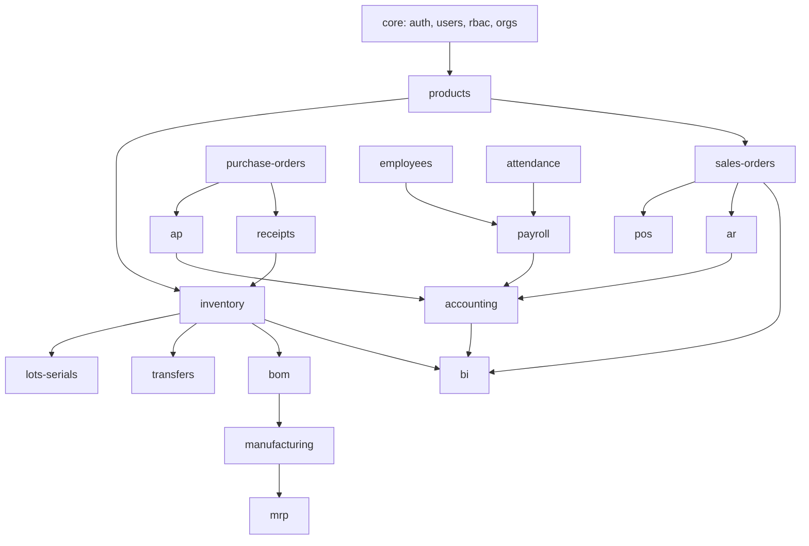

---

## 6. Tipos de cliente y modelo de precios

### 6.1 Los tres perfiles

|                                | 🟢 **PYME**   | 🔵 **MEDIANO**         | 🟣 **GRANDE**               |
| ------------------------------ | ------------- | ---------------------- | --------------------------- |
| **Empleados**                  | 1 – 25        | 26 – 200               | 200+                        |
| **Usuarios del ERP incluidos** | 5             | 25                     | 100                         |
| **Sucursales**                 | 1             | hasta 5                | ilimitadas                  |
| **Empresas (RNC)**             | 1             | 3                      | ilimitadas                  |
| **Módulos incluidos**          | 15 core       | 15 core + 5 a elección | 15 core + 15 a elección     |
| **Transacciones/mes**          | 5.000         | 50.000                 | ilimitadas                  |
| **Almacenamiento**             | 10 GB         | 100 GB                 | 1 TB                        |
| **Soporte**                    | Email, 48h    | Email + chat, 8h       | Dedicado + WhatsApp, 2h     |
| **SLA**                        | 99.0%         | 99.5%                  | 99.9% + contrato            |
| **Capacitación incluida**      | Tour in-app   | Tour + 2 sesiones      | Tour + 8 sesiones + on-site |
| **Ambiente de pruebas**        | ❌            | ✔️                     | ✔️ + staging propio         |
| **API**                        | 1.000 req/día | 50.000 req/día         | ilimitada                   |
| **Personalización**            | ❌            | Campos custom          | Módulos a medida            |
| **On-premise / VPC**           | ❌            | ❌                     | ✔️ (add-on)                 |

### 6.2 Precios base

| Concepto                      |                            🟢 PYME |                              🔵 MEDIANO |                                                🟣 GRANDE |
| ----------------------------- | ---------------------------------: | --------------------------------------: | -------------------------------------------------------: |
| **Instalación (única vez)**   |                        **US$ 500** |                           **US$ 3.500** |                                           **US$ 15.000** |
| ↳ incluye                     | Setup + import de datos + 1 sesión | Setup + migración + config + 4 sesiones | Setup + migración completa + consultoría + integraciones |
| **Mensualidad base**          |                   **US$ 79 / mes** |                       **US$ 399 / mes** |                                      **US$ 1.500 / mes** |
| **Usuario adicional**         |                         US$ 9 /mes |                              US$ 7 /mes |                                               US$ 5 /mes |
| **Sucursal adicional**        |                        US$ 25 /mes |                             US$ 20 /mes |                                                 incluido |
| **Empresa adicional (RNC)**   |                                n/a |                             US$ 90 /mes |                                                 incluido |
| **GB extra de storage**       |                           US$ 0.50 |                                US$ 0.40 |                                                 US$ 0.25 |
| **1.000 transacciones extra** |                              US$ 5 |                                   US$ 3 |                                                      n/a |

### 6.3 Precio de los módulos (matriz por tier)

Cada módulo tiene precio **de instalación** y **mensual**, distinto por tier:

| Categoría de módulo                               | Instalación PYME/MED/GRA | Mensual PYME/MED/GRA |
| ------------------------------------------------- | ------------------------ | -------------------- |
| 🟢 **Core** (15)                                  | $0 / $0 / $0             | $0 / $0 / $0         |
| 🔵 **Estándar** (ej. inventario, CRM, POS)        | $150 / $600 / $1.800     | $19 / $69 / $190     |
| 🟣 **Avanzado** (ej. MRP, nómina, BI, IA)         | $400 / $1.500 / $4.000   | $45 / $160 / $420    |
| 🟠 **Vertical** (ej. clínica, hotel, restaurante) | $600 / $2.200 / $6.000   | $59 / $210 / $550    |
| 🔴 **Enterprise** (consolidación, on-premise)     | — / — / $12.000          | — / — / $900         |

### 6.4 Fórmula de facturación

```
MENSUALIDAD =
    base_del_tier
  + Σ (mensual_de_cada_módulo_activo)
  + max(0, usuarios_activos − usuarios_incluidos) × precio_usuario_extra
  + max(0, sucursales − incluidas)              × precio_sucursal
  + max(0, empresas − incluidas)                × precio_empresa
  + max(0, storage_gb − incluido)               × precio_gb
  + Σ (consumos_medidos: SKUs, transacciones, e-CF, SMS, WhatsApp)
  − descuentos (anual −15% · volumen · partner · promo)
  + impuestos (ITBIS 18% si aplica)
```

### 6.5 Ejemplos reales de cotización

<details open>
<summary><b>🟢 Ejemplo 1 — "Colmado La Esperanza" (PYME, 6 empleados)</b></summary>

| Concepto                  | Detalle                                |            USD |
| ------------------------- | -------------------------------------- | -------------: |
| Instalación               | Tier PYME                              |            500 |
| + Instalación módulos     | inventory (150) + pos (150) + ar (150) |            450 |
| **Total instalación**     |                                        |    **US$ 950** |
|                           |                                        |                |
| Base mensual              | PYME                                   |             79 |
| Módulo Inventario         | estándar/PYME                          |             19 |
| Módulo POS                | estándar/PYME                          |             19 |
| Módulo Cuentas por cobrar | estándar/PYME                          |             19 |
| Usuarios extra            | 6 usuarios, 5 incluidos → 1 × $9       |              9 |
| Descuento anual           | −15%                                   |         −21.75 |
| **Total mensual**         |                                        | **US$ 123.25** |

</details>

<details>
<summary><b>🔵 Ejemplo 2 — "Distribuidora Caribe SRL" (MEDIANO, 85 empleados)</b></summary>

> Corregido tras implementar `packages/billing`: "los más caros primero" (regla del agente `regb-billing`) descuenta los **3 avanzados + 2 estándar** más caros de los 9 módulos activos, no una mezcla arbitraria. La versión anterior de este ejemplo no reproducía la fórmula; esta sí, al centavo (`formula.test.ts`).

| Concepto              | Detalle                                                                                                                   |           USD |
| --------------------- | ------------------------------------------------------------------------------------------------------------------------- | ------------: |
| Instalación           | Tier MEDIANO                                                                                                              |         3.500 |
| + Instalación módulos | 9 módulos, 4 facturables tras descontar los 5 incluidos (más caros primero: 3 avanzados + 2 estándar) → 4 estándar × $600 |         2.400 |
| **Total instalación** |                                                                                                                           | **US$ 5.900** |
|                       |                                                                                                                           |               |
| Base mensual          | MEDIANO                                                                                                                   |           399 |
| Módulos activos       | 4 estándar facturables (5 de 9 incluidos en el tier) × $69                                                                |           276 |
| Usuarios extra        | 40 usuarios, 25 incluidos → 15 × $7                                                                                       |           105 |
| Sucursales            | 4, incluidas 5                                                                                                            |             0 |
| e-CF medidos          | 3.500 comprobantes × $0.01                                                                                                |            35 |
| **Total mensual**     |                                                                                                                           |   **US$ 815** |

</details>

<details>
<summary><b>🟣 Ejemplo 3 — "Grupo Industrial Quisqueya" (GRANDE, 640 empleados)</b></summary>

> Corregido junto con el ejemplo 2: los 15 módulos incluidos toman los 3 verticales + 9 avanzados + 3 estándar más caros, dejando 7 estándar facturables. El "contrato de 3 años" corresponde al descuento **trianual −25 %** de §6.6, no −20 %.

| Concepto                    | Detalle                                                                                                                   |            USD |
| --------------------------- | ------------------------------------------------------------------------------------------------------------------------- | -------------: |
| Instalación                 | Tier GRANDE                                                                                                               |         15.000 |
| + Instalación módulos       | 22 módulos, 7 facturables tras descontar los 15 incluidos (3 verticales + 9 avanzados + 3 estándar) → 7 estándar × $1.800 |         12.600 |
| Integraciones a medida      | SAP legacy + banco + DGII                                                                                                 |         12.000 |
| **Total instalación**       |                                                                                                                           | **US$ 39.600** |
|                             |                                                                                                                           |                |
| Base mensual                | GRANDE                                                                                                                    |          1.500 |
| Módulos activos             | 7 estándar facturables (15 de 22 incluidos en el tier) × $190                                                             |          1.330 |
| Usuarios extra              | 260 usuarios, 100 incluidos → 160 × $5                                                                                    |            800 |
| Storage                     | 2.4 TB, 1 TB incluido → 1.400 GB × $0.25                                                                                  |            350 |
| Descuento contrato trianual | −25 %                                                                                                                     |           −995 |
| **Total mensual**           |                                                                                                                           |  **US$ 2.985** |

</details>

### 6.6 Política comercial

| Política             | Regla                                                                                       |
| -------------------- | ------------------------------------------------------------------------------------------- |
| **Prueba de módulo** | 14 días gratis, 1 vez por módulo por tenant                                                 |
| **Upgrade de tier**  | Inmediato, prorrateado, sin costo de instalación adicional                                  |
| **Downgrade**        | Al final del ciclo, con advertencia de módulos que se suspenden                             |
| **Mora**             | Día 5 aviso · día 10 banner rojo · día 15 solo lectura · día 30 suspensión · día 90 archivo |
| **Descuentos**       | Anual −15% · Bianual −20% · Trianual −25% · Partner −20% · ONG −30%                         |
| **Moneda**           | Precios en USD, facturación en DOP a tasa del día (configurable)                            |

---

## 7. REGB Control — el panel del propietario

> Tu módulo. **Invisible para todos los clientes.** Vive en el mismo ERP pero bajo un tenant especial `REGB_ROOT` con `is_provider = true`.

### 7.1 Qué ves ahí

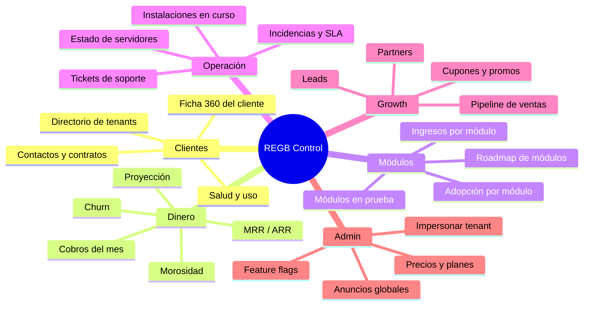

### 7.2 Pantallas de REGB Control

| Pantalla              | Contenido                                                                                                                                           |
| --------------------- | --------------------------------------------------------------------------------------------------------------------------------------------------- |
| **Overview**          | MRR, ARR, clientes activos, churn, nuevos del mes, cobros pendientes, gráfico de crecimiento                                                        |
| **Clientes**          | Tabla de todos los tenants: nombre, tier, módulos activos, usuarios, MRR, estado de pago, última actividad, health score                            |
| **Ficha del cliente** | Todo del tenant: contrato, historial de facturas, módulos con fecha de activación, uso real vs. límites, tickets, notas del CSM, botón _Impersonar_ |
| **Facturación**       | Ciclo de facturación, generar facturas, cobros automáticos, reintentos, notas de crédito, recordatorios                                             |
| **Módulos**           | Cuántos clientes tienen cada módulo, ingreso por módulo, tasa de conversión de prueba, módulos abandonados                                          |
| **Precios**           | Editor de la matriz de precios (tier × categoría), promociones, cupones, grandfathering                                                             |
| **Instalaciones**     | Kanban de onboarding: vendido → migración → config → capacitación → live                                                                            |
| **Soporte**           | Tickets de todos los tenants, SLA, escalamiento                                                                                                     |
| **Salud del sistema** | Uso de Postgres por tenant, queries lentas, errores, storage, costos de infraestructura vs. ingresos                                                |
| **Anuncios**          | Publicar novedades que aparecen en todos los ERPs de los clientes                                                                                   |

### 7.3 Health Score del cliente (0–100)

```
health = 0.30 × uso_diario_normalizado
       + 0.20 × porcentaje_usuarios_activos
       + 0.20 × módulos_usados / módulos_pagados
       + 0.15 × puntualidad_de_pago
       + 0.10 × CSAT_de_soporte
       + 0.05 × antigüedad
```

| Rango  | Color        | Acción automática                       |
| ------ | ------------ | --------------------------------------- |
| 80–100 | 🟢 Saludable | Candidato a upsell                      |
| 60–79  | 🟡 Atención  | Email de check-in del CSM               |
| 40–59  | 🟠 En riesgo | Llamada + sesión de capacitación gratis |
| 0–39   | 🔴 Crítico   | Alerta al dueño, plan de rescate        |

### 7.4 Impersonación segura

- Requiere MFA en el momento.
- Exige razón escrita (ligada a un ticket).
- Sesión de máx. 60 minutos.
- Banner rojo permanente: _"Estás viendo como [Cliente] — sesión auditada"_.
- Modo lectura por defecto; escritura requiere consentimiento del cliente registrado.
- Todo queda en `audit_log` del cliente **y** del proveedor.

---

## 8. Roles, permisos y visibilidad de módulos

### 8.1 Modelo híbrido RBAC + ABAC

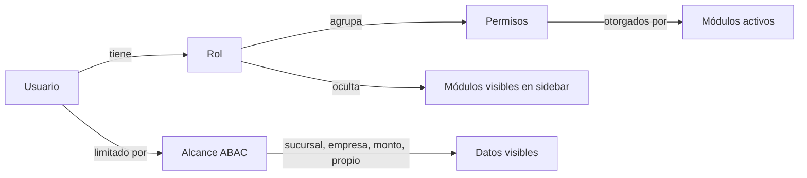

**Regla de evaluación:**

```
puede(usuario, acción, recurso) =
      módulo_activo_en_tenant(recurso.módulo)
  AND rol_tiene_permiso(usuario.rol, acción)
  AND dentro_del_alcance(usuario.scope, recurso)
  AND NOT denegación_explícita(usuario, acción)
```

La **denegación siempre gana** sobre cualquier concesión.

### 8.2 Roles predefinidos

| Rol                     | Ve                   | Puede                                      | Módulos ocultos                     |
| ----------------------- | -------------------- | ------------------------------------------ | ----------------------------------- |
| **Owner** (dueño)       | Todo el tenant       | Todo, incluye facturación y borrado        | ninguno                             |
| **Admin**               | Todo el tenant       | Todo menos facturación y borrado de tenant | Suscripción                         |
| **Gerente General**     | Todas las sucursales | Aprobar, ver costos y márgenes             | Configuración técnica, API          |
| **Gerente de Sucursal** | Su sucursal          | Operar y aprobar hasta $X                  | Contabilidad, Nómina, Config        |
| **Contador**            | Toda la empresa      | Contabilidad, impuestos, conciliación      | RRHH, CRM, Producción               |
| **Vendedor**            | Sus clientes         | Cotizar, vender, ver su comisión           | Costos, Contabilidad, RRHH, Compras |
| **Cajero**              | Su caja/turno        | POS, cobrar, cerrar turno                  | Todo lo demás                       |
| **Almacenista**         | Su almacén           | Recibir, transferir, contar                | Precios de venta, Finanzas, RRHH    |
| **Comprador**           | Compras              | RFQ, OC, proveedores                       | Ventas, RRHH, Contabilidad          |
| **RRHH**                | Empleados            | Nómina, asistencia, contratación           | Ventas, Inventario, Contabilidad    |
| **Empleado**            | Solo lo suyo         | Portal: volante, vacaciones, gastos        | Todo lo operativo                   |
| **Auditor**             | Todo (solo lectura)  | Leer y exportar, nada más                  | ninguno (pero read-only)            |
| **Cliente externo**     | Su portal            | Ver facturas, pagar, abrir tickets         | ERP completo                        |
| **Técnico de campo**    | Sus órdenes          | Ejecutar servicio, consumir repuestos      | Finanzas, RRHH                      |

### 8.3 Ocultar módulos: tres niveles

| Nivel                 | Quién controla          | Efecto                                                                                        |
| --------------------- | ----------------------- | --------------------------------------------------------------------------------------------- |
| **1. Licencia**       | Tú (REGB Control)       | El módulo no existe para el tenant. Ni rutas, ni tablas expuestas, ni API.                    |
| **2. Configuración**  | Owner/Admin del cliente | Módulo comprado pero desactivado en su empresa. Datos intactos.                               |
| **3. Permiso de rol** | Admin del cliente       | Módulo activo pero invisible para ciertos roles. No aparece en sidebar, la ruta devuelve 403. |

> **Importante:** ocultar en el sidebar **nunca** es la única defensa. Toda ruta valida en servidor y toda tabla tiene RLS. Un usuario que adivine la URL recibe 403, no datos.

### 8.4 Editor visual de permisos

```
┌──────────────────────────────────────────────────────────────────┐
│  Roles y Permisos                              [+ Nuevo rol]     │
├───────────────┬──────────────────────────────────────────────────┤
│ ROLES         │  Rol: Vendedor            👥 12 usuarios         │
│               │  ─────────────────────────────────────────────    │
│ ○ Owner       │  MÓDULOS VISIBLES                                │
│ ○ Admin       │  ┌──────────────────────────────────────────┐    │
│ ● Vendedor  ✓ │  │ ✅ CRM          ✅ Cotizaciones           │    │
│ ○ Cajero      │  │ ✅ Pedidos      ✅ Clientes               │    │
│ ○ Contador    │  │ ⬜ Inventario   ⬜ Contabilidad           │    │
│ ○ Almacenista │  │ ⬜ Nómina       ⬜ Compras                │    │
│ ○ Empleado    │  └──────────────────────────────────────────┘    │
│               │                                                   │
│               │  PERMISOS · Cotizaciones                         │
│               │  Ver         ●━━━━━━━━━━ Todos │ Equipo │ Propio │
│               │  Crear       [✔]                                 │
│               │  Editar      [✔]  hasta  [ US$ 50,000 ]          │
│               │  Aprobar     [ ]  → requiere Gerente             │
│               │  Eliminar    [ ]                                 │
│               │  Ver costos  [ ]  🔒 dato sensible               │
│               │  Exportar    [✔]  ⚠️ se audita                   │
│               │                                                   │
│               │  ALCANCE DE DATOS                                │
│               │  Sucursales: [Santo Domingo ×] [Santiago ×] [+]  │
│               │  Horario:    Lun-Vie 7:00–19:00                  │
│               │  IP:         sin restricción                     │
└───────────────┴──────────────────────────────────────────────────┘
```

---

## 9. Modelo de datos (Supabase)

### 9.1 Esquemas

| Esquema   | Contenido                                                                                 |
| --------- | ----------------------------------------------------------------------------------------- |
| `public`  | Entidades de negocio de los tenants (con `tenant_id` + RLS)                               |
| `regb`    | Tablas del proveedor: tenants, suscripciones, facturas, precios. **Solo rol `provider`.** |
| `auth`    | Gestionado por Supabase                                                                   |
| `audit`   | Log particionado por mes                                                                  |
| `storage` | Gestionado por Supabase                                                                   |

### 9.2 Tablas del proveedor (`regb`)

```sql
-- ═══════════════════════════════════════════════════════════
--  REGB — esquema del proveedor (invisible para clientes)
-- ═══════════════════════════════════════════════════════════

create type tenant_tier   as enum ('pyme','mediano','grande');
create type tenant_status as enum ('trial','active','past_due','readonly','suspended','archived');

create table regb.tenants (
  id                uuid primary key default gen_random_uuid(),
  slug              text unique not null,
  legal_name        text not null,
  trade_name        text,
  tax_id            text,                       -- RNC / RFC / NIT
  country           char(2) not null default 'DO',
  tier              tenant_tier not null,
  status            tenant_status not null default 'trial',
  timezone          text not null default 'America/Santo_Domingo',
  currency          char(3) not null default 'DOP',
  logo_url          text,
  primary_color     text default '#0D847C',
  installed_at      timestamptz,
  go_live_at        timestamptz,
  health_score      int default 100,
  csm_user_id       uuid,                       -- tu ejecutivo asignado
  notes             text,
  created_at        timestamptz default now()
);

create table regb.subscriptions (
  id                   uuid primary key default gen_random_uuid(),
  tenant_id            uuid not null references regb.tenants on delete cascade,
  tier                 tenant_tier not null,
  billing_cycle        text not null default 'monthly',  -- monthly|annual|biennial
  base_price           numeric(12,2) not null,
  install_price        numeric(12,2) not null,
  install_paid         boolean default false,
  included_users       int not null,
  included_branches    int not null,
  included_companies   int not null,
  included_storage_gb  int not null,
  discount_pct         numeric(5,2) default 0,
  discount_reason      text,
  started_at           date not null,
  renews_at            date not null,
  cancel_at            date,
  payment_method       jsonb,
  created_at           timestamptz default now()
);

create table regb.module_catalog (
  id            text primary key,               -- 'inventory'
  name          text not null,
  category      text not null,                  -- core|standard|advanced|vertical|enterprise
  description   text,
  icon          text,
  version       text not null,
  requires      text[] default '{}',
  recommends    text[] default '{}',
  platforms     jsonb default '{"web":true,"desktop":true,"mobile":true}',
  is_published  boolean default true,
  released_at   date
);

create table regb.module_pricing (
  module_id     text references regb.module_catalog,
  tier          tenant_tier,
  install_price numeric(12,2) not null,
  monthly_price numeric(12,2) not null,
  per_user      numeric(12,2) default 0,
  primary key (module_id, tier)
);

create table regb.tenant_modules (
  tenant_id       uuid references regb.tenants on delete cascade,
  module_id       text references regb.module_catalog,
  status          text not null default 'active',   -- trial|active|suspended|archived
  enabled         boolean default true,             -- el cliente puede apagarlo sin perderlo
  trial_ends_at   date,
  activated_at    timestamptz default now(),
  archived_at     timestamptz,
  price_override  numeric(12,2),                    -- precio negociado
  primary key (tenant_id, module_id)
);

create table regb.usage_meters (
  tenant_id   uuid references regb.tenants on delete cascade,
  period      date not null,                    -- primer día del mes
  metric      text not null,                    -- users|storage_gb|transactions|ecf|sms|whatsapp|api_calls
  quantity    numeric(14,2) not null default 0,
  primary key (tenant_id, period, metric)
);

create table regb.invoices (
  id             uuid primary key default gen_random_uuid(),
  tenant_id      uuid references regb.tenants,
  number         text unique not null,
  period_start   date not null,
  period_end     date not null,
  subtotal       numeric(12,2) not null,
  discount       numeric(12,2) default 0,
  tax            numeric(12,2) default 0,
  total          numeric(12,2) not null,
  currency       char(3) default 'USD',
  fx_rate        numeric(12,4),
  status         text not null default 'draft',  -- draft|sent|paid|overdue|void
  due_at         date not null,
  paid_at        timestamptz,
  lines          jsonb not null,                 -- desglose: base, cada módulo, extras
  created_at     timestamptz default now()
);

create table regb.onboarding (
  tenant_id     uuid primary key references regb.tenants on delete cascade,
  stage         text not null default 'sold',   -- sold|migration|config|training|live
  owner_user_id uuid,
  checklist     jsonb default '[]',
  target_go_live date,
  blockers      text
);

create table regb.impersonation_log (
  id           uuid primary key default gen_random_uuid(),
  provider_user uuid not null,
  tenant_id    uuid not null references regb.tenants,
  reason       text not null,
  ticket_ref   text,
  write_mode   boolean default false,
  started_at   timestamptz default now(),
  ended_at     timestamptz
);
```

### 9.3 Tablas del core de tenant (`public`)

```sql
create table public.companies (
  id uuid primary key default gen_random_uuid(),
  tenant_id uuid not null,
  legal_name text not null, tax_id text, currency char(3),
  is_default boolean default false
);

create table public.branches (
  id uuid primary key default gen_random_uuid(),
  tenant_id uuid not null,
  company_id uuid references public.companies,
  name text not null, code text, address text,
  lat numeric, lng numeric, geofence_m int default 150,
  is_active boolean default true
);

create table public.roles (
  id uuid primary key default gen_random_uuid(),
  tenant_id uuid not null,
  name text not null,
  is_system boolean default false,
  visible_modules text[] default '{}',       -- módulos visibles en sidebar
  permissions   jsonb not null default '{}', -- { "quotes.create": true, "quotes.approve": false }
  scope         jsonb not null default '{}', -- { branches:[...], max_amount:50000, own_only:true }
  unique (tenant_id, name)
);

create table public.memberships (
  id uuid primary key default gen_random_uuid(),
  tenant_id uuid not null,
  user_id uuid not null references auth.users on delete cascade,
  role_id uuid not null references public.roles,
  branch_ids uuid[] default '{}',
  company_ids uuid[] default '{}',
  is_active boolean default true,
  invited_at timestamptz, accepted_at timestamptz,
  unique (tenant_id, user_id)
);

create table public.tour_progress (
  tenant_id uuid not null,
  user_id   uuid not null,
  tour_id   text not null,                  -- 'inventory.intro'
  step      int default 0,
  completed boolean default false,
  skipped   boolean default false,
  updated_at timestamptz default now(),
  primary key (tenant_id, user_id, tour_id)
);

create table audit.log (
  id bigserial,
  tenant_id uuid not null,
  user_id uuid,
  module_id text,
  entity text, entity_id uuid,
  action text not null,                      -- create|update|delete|approve|export|login
  before jsonb, after jsonb,
  ip inet, user_agent text, platform text,   -- web|desktop|mobile
  at timestamptz default now()
) partition by range (at);
```

### 9.4 Diagrama entidad-relación (núcleo)

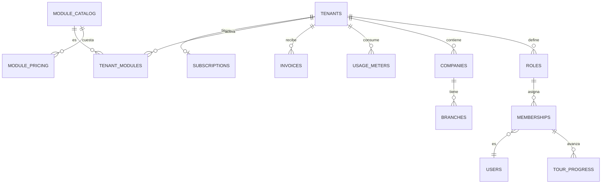

---

## 10. Seguridad y multi-tenancy (RLS)

### 10.1 El JWT

```json
{
  "sub": "uuid-del-usuario",
  "email": "maria@distribuidora.do",
  "app_metadata": {
    "tenant_id": "uuid-del-tenant",
    "role_id": "uuid-del-rol",
    "is_provider": false,
    "branches": ["uuid-1", "uuid-2"],
    "companies": ["uuid-a"]
  }
}
```

### 10.2 Políticas RLS base

```sql
-- Helper: tenant actual
create or replace function rls.tenant_id() returns uuid
language sql stable as $$
  select nullif(current_setting('request.jwt.claims', true)::json
         -> 'app_metadata' ->> 'tenant_id','')::uuid
$$;

create or replace function rls.is_provider() returns boolean
language sql stable as $$
  select coalesce((current_setting('request.jwt.claims', true)::json
         -> 'app_metadata' ->> 'is_provider')::boolean, false)
$$;

-- Helper: ¿el módulo está activo y habilitado?
create or replace function rls.module_active(p_module text) returns boolean
language sql stable as $$
  select exists (
    select 1 from regb.tenant_modules
    where tenant_id = rls.tenant_id()
      and module_id = p_module
      and status in ('trial','active')
      and enabled
  )
$$;

-- Patrón aplicado a TODA tabla de negocio
alter table public.products enable row level security;

create policy tenant_isolation on public.products
  for all
  using      (tenant_id = rls.tenant_id() and rls.module_active('products'))
  with check (tenant_id = rls.tenant_id() and rls.module_active('products'));

-- Acceso del proveedor: solo con impersonación activa y auditada
create policy provider_impersonation on public.products
  for select
  using (rls.is_provider() and exists (
    select 1 from regb.impersonation_log
    where tenant_id = products.tenant_id
      and provider_user = auth.uid()
      and ended_at is null
      and started_at > now() - interval '60 minutes'
  ));

-- Esquema regb: SOLO proveedor
alter table regb.tenants enable row level security;
create policy provider_only on regb.tenants for all using (rls.is_provider());
```

### 10.3 Controles adicionales

| Control               | Implementación                                                              |
| --------------------- | --------------------------------------------------------------------------- |
| **MFA**               | Obligatorio para Owner, Admin, Contador y todo usuario de REGB Control      |
| **Cifrado en reposo** | `pgsodium` para columnas sensibles (cuentas bancarias, salarios, cédulas)   |
| **Rate limiting**     | Por tenant y por endpoint en el API Gateway                                 |
| **Secretos**          | Nunca en el cliente. Todo en Edge Functions con secrets de Supabase         |
| **Sesiones**          | Refresh rotativo, revocación remota, lista de dispositivos                  |
| **Exportaciones**     | Marca de agua, límite por rol, auditadas siempre                            |
| **Retención**         | Configurable por tenant; borrado suave + purga programada (GDPR/Ley 172-13) |
| **Pentest**           | Anual + escaneo de dependencias en cada PR                                  |

---

## 11. Design System "Aurora" — identidad propia

### 11.1 Filosofía

> **Oscuro por defecto. Denso pero respirable. Todo a un `Ctrl+K` de distancia.**

Aurora toma de las aplicaciones de trabajo modernas lo que funciona —doble navegación lateral, colores planos, tipografía compacta, sensación de _app_ y no de _sitio web_— y le pone identidad propia: **teal profundo** en vez de los violetas de las apps de consumo, fichas cuadradas en vez de círculos, y radios contenidos porque un ERP con esquinas muy redondeadas se lee como juguete.

> **Sobre parecerse a otros productos.** Los colores no son propiedad de nadie y los patrones de navegación son funcionales y comunes. Aun así REGB no copia la identidad de nadie: "se parece a X" describe, no diferencia. Cada valor de esta sección está **calculado** para cumplir AA y verificado en cada build.

### 11.2 Paleta de colores

#### Superficies (modo oscuro — por defecto)

| Token             | Hex       | Uso                                 |
| ----------------- | --------- | ----------------------------------- |
| `--bg-deepest`    | `#1E1F22` | Sidebar de empresas (la más oscura) |
| `--bg-deep`       | `#2B2D31` | Sidebar de módulos                  |
| `--bg-base`       | `#313338` | Área de contenido principal         |
| `--bg-raised`     | `#383A40` | Tarjetas, filas de tabla            |
| `--bg-overlay`    | `#404249` | Modales, popovers, hover            |
| `--bg-input`      | `#1E1F22` | Inputs y campos de formulario       |
| `--border`        | `#3F4147` | Separadores                         |
| `--border-strong` | `#4E5058` | Bordes de foco                      |

```
■ #1E1F22   ■ #2B2D31   ■ #313338   ■ #383A40   ■ #404249   ■ #3F4147
  deepest      deep        base       raised     overlay     border
```

#### Superficies (modo claro)

| Token          | Hex                | Uso                 |
| -------------- | ------------------ | ------------------- |
| `--bg-deepest` | `#E3E5E8`          | Sidebar de empresas |
| `--bg-deep`    | `#F2F3F5`          | Sidebar de módulos  |
| `--bg-base`    | `#FFFFFF`          | Contenido           |
| `--bg-raised`  | `#F8F9FA`          | Tarjetas            |
| `--bg-overlay` | `#FFFFFF` + sombra | Modales             |
| `--border`     | `#E3E5E8`          | Separadores         |

#### Marca y acentos

| Token              | Hex             | Uso                                                |
| ------------------ | --------------- | -------------------------------------------------- |
| `--brand`          | `#0D847C`       | **Teal profundo.** Botón primario, activo, enlaces |
| `--brand-hover`    | `#0B7069`       | Hover del primario                                 |
| `--brand-active`   | `#095C57`       | Pressed                                            |
| `--brand-soft`     | `#0D847C` @ 15% | Fondo de estado seleccionado                       |
| `--accent-fuchsia` | `#9B4DBF`       | REGB Control, features premium                     |
| `--accent-teal`    | `#C2872B`       | IA / Copiloto                                      |

```
■ #0D847C   ■ #0B7069   ■ #095C57   ■ #9B4DBF   ■ #C2872B
  brand       hover       active      fuchsia      teal
```

#### Semánticos — relleno vs. texto

> ⚠️ **Un color de relleno no sirve como color de texto.** Un color vistoso rara vez cumple AA sobre fondo oscuro: el rojo puro da **2.66:1** y el verde **3.15:1**, muy por debajo del 4.5:1 exigido. Por eso hay dos juegos. Los valores de texto están **calculados**, no elegidos a ojo, y los verifica `packages/config/src/contrast.test.ts` en cada build.

**Relleno** — badges, barras, puntos de estado. Umbral de componente (3:1).

| Token                      | Oscuro    | Claro     | Uso                        |
| -------------------------- | --------- | --------- | -------------------------- |
| `--color-semantic-success` | `#23A559` | `#1A8245` | Pagado, aprobado, en línea |
| `--color-semantic-warning` | `#F0B232` | `#B8860B` | Por vencer, stock bajo     |
| `--color-semantic-danger`  | `#F23F43` | `#D02B2F` | Vencido, error, eliminar   |
| `--color-semantic-info`    | `#00A8FC` | `#0068E0` | Informativo, tips          |
| `--color-semantic-neutral` | `#80848E` | `#6D6F78` | Deshabilitado, borrador    |

```
■ #23A559   ■ #F0B232   ■ #F23F43   ■ #00A8FC   ■ #80848E
  success     warning     danger       info       neutral
```

**Texto** — "Vencido", "Stock bajo", mensajes de error. AA 4.5:1 verificado sobre contenido, tarjeta y modal.

| Token                           | Oscuro    | Claro     |
| ------------------------------- | --------- | --------- |
| `--color-semantic-text-success` | `#65C08B` | `#1A8245` |
| `--color-semantic-text-warning` | `#F0B232` | `#936B09` |
| `--color-semantic-text-danger`  | `#F89294` | `#D02B2F` |
| `--color-semantic-text-info`    | `#30B9FD` | `#0068E0` |
| `--color-semantic-text-neutral` | `#ABAEB4` | `#6D6F78` |

```
■ #65C08B   ■ #F0B232   ■ #F89294   ■ #30B9FD   ■ #ABAEB4
  success     warning     danger       info       neutral
```

#### Foco

| Token                  | Oscuro    | Claro     | Uso                          |
| ---------------------- | --------- | --------- | ---------------------------- |
| `--color-brand-bright` | `#7983F5` | `#0B7069` | Anillo de foco e indicadores |

El teal puro (`#0D847C`) solo alcanza **2.74:1** sobre `#313338`: un anillo de foco con ese color es invisible. `brand-bright` da 3.84:1.

#### Texto

| Token              | Oscuro    | Claro     | Uso                        |
| ------------------ | --------- | --------- | -------------------------- |
| `--text-primary`   | `#F2F3F5` | `#060607` | Títulos, datos importantes |
| `--text-secondary` | `#B5BAC1` | `#4E5058` | Cuerpo, etiquetas          |
| `--text-muted`     | `#80848E` | `#80848E` | Metadatos, placeholders    |
| `--text-link`      | `#00A8FC` | `#0068E0` | Enlaces                    |
| `--text-on-brand`  | `#FFFFFF` | `#FFFFFF` | Texto sobre teal           |

#### Colores por categoría de módulo

| Categoría       | Color   | Hex       |
| --------------- | ------- | --------- |
| 🟢 Core         | Verde   | `#23A559` |
| 🔵 Estándar     | Teal    | `#0D847C` |
| 🟣 Avanzado     | Púrpura | `#9B59F6` |
| 🟠 Vertical     | Naranja | `#F0883E` |
| 🔴 Enterprise   | Rojo    | `#F23F43` |
| 🩷 REGB Control | Fucsia  | `#9B4DBF` |

### 11.3 Tipografía

| Rol                    | Fuente                                                   | Fallback              |
| ---------------------- | -------------------------------------------------------- | --------------------- |
| **UI**                 | `gg sans` → **Inter**                                    | system-ui, sans-serif |
| **Números y tablas**   | **Inter Tabular** (`font-variant-numeric: tabular-nums`) | ui-monospace          |
| **Código / SKU / RNC** | **JetBrains Mono**                                       | ui-monospace          |

| Escala     | Tamaño / Interlineado | Peso                          | Uso                         |
| ---------- | --------------------- | ----------------------------- | --------------------------- |
| `display`  | 32 / 40               | 700                           | Título de página grande     |
| `h1`       | 24 / 32               | 700                           | Título de pantalla          |
| `h2`       | 20 / 28               | 600                           | Sección                     |
| `h3`       | 16 / 24               | 600                           | Tarjeta                     |
| `body`     | 14 / 20               | 400                           | Texto general (el estándar) |
| `body-sm`  | 13 / 18               | 400                           | Tablas densas               |
| `caption`  | 12 / 16               | 500                           | Etiquetas, ayudas           |
| `overline` | 11 / 14               | 700 · `tracking-wide` · MAYÚS | Encabezados de sidebar      |

### 11.4 Espaciado, radios y sombras

```
Espaciado (escala de 4):  4 · 8 · 12 · 16 · 20 · 24 · 32 · 40 · 48 · 64

Radios:
  --r-sm:   4px   (badges, chips)
  --r-md:   8px   (botones, inputs)
  --r-lg:  12px   (tarjetas)
  --r-xl:  16px   (modales)
  --r-full: 999px (avatares, píldoras)

Sombras:
  --sh-sm:  0 1px 2px rgba(0,0,0,.2)
  --sh-md:  0 4px 12px rgba(0,0,0,.3)
  --sh-lg:  0 8px 24px rgba(0,0,0,.4)
  --sh-brand: 0 0 0 3px rgba(88,101,242,.35)   /* anillo de foco */
```

### 11.5 Componentes clave

| Componente          | Detalle de Aurora                                                                                                          |
| ------------------- | -------------------------------------------------------------------------------------------------------------------------- |
| **Server rail**     | Barra izquierda de 72px con iconos redondeados de cada empresa. Activa = píldora blanca a la izquierda + esquina cuadrada. |
| **Channel sidebar** | 240px. Grupos colapsables en `overline` MAYÚSCULAS, ítems con icono + nombre, badge de conteo a la derecha.                |
| **Miembros**        | Panel derecho opcional (240px) con usuarios en línea por rol con estado de conexion.                                       |
| **Botón primario**  | Teal, radio 8, peso 500, `active:translate-y-[1px]`                                                                        |
| **Toast**           | Esquina inferior derecha, fondo `--bg-overlay`, barra de color a la izquierda según semántica                              |
| **Modal**           | Fondo `--bg-base`, overlay negro 70%, radio 16, animación scale 0.95→1 en 150ms                                            |
| **Tabla**           | Filas de 40px, hover `--bg-raised`, encabezado sticky, selección con checkbox, acciones al hover                           |
| **Command palette** | `Ctrl+K` — busca módulos, registros, acciones y páginas del tutorial                                                       |
| **Badge de estado** | Píldora + punto de color, igual que el estado en línea/ausente/no molestar                                                 |
| **Empty state**     | Ilustración + frase con humor + botón de acción + enlace al tutorial                                                       |

### 11.6 Movimiento

| Interacción      | Duración | Curva                       |
| ---------------- | -------- | --------------------------- |
| Hover            | 100 ms   | `ease-out`                  |
| Cambio de página | 150 ms   | `cubic-bezier(.4,0,.2,1)`   |
| Modal entrada    | 150 ms   | `cubic-bezier(.16,1,.3,1)`  |
| Toast            | 200 ms   | `ease-out`                  |
| Sidebar móvil    | 250 ms   | `cubic-bezier(.32,.72,0,1)` |

> Todo respeta `prefers-reduced-motion`.

### 11.7 Accesibilidad

- Contraste mínimo **AA 4.5:1** en texto; verificado en ambos temas.
- Foco visible siempre (`--sh-brand`), nunca `outline: none` sin reemplazo.
- Navegación completa por teclado; `Ctrl+K` como punto de entrada universal.
- Objetivos táctiles ≥ 44×44 px en móvil.
- Nunca solo color para transmitir estado: siempre color + icono + texto.
- Soporte de lector de pantalla en todos los formularios y tablas.

---

## 12. Mockups de pantallas

### 12.1 Layout general (Desktop / Web / Electron)

```
┌────┬──────────────────┬───────────────────────────────────────────────────────┬───────────────┐
│ 🏢 │  DISTRIBUIDORA   │  Inventario › Existencias                    ⌘K  🔔3 │  EN LÍNEA (8) │
│ ●  │  CARIBE SRL      ├───────────────────────────────────────────────────────┤               │
│    │                  │                                                        │ ADMINISTRACIÓN│
│ 🏭 │ ▾ FINANZAS       │  ┌────────┬────────┬────────┬────────┐                │ 🟢 María R.   │
│    │   💰 Contabilidad│  │ SKUs   │ Valor  │ Bajos  │ Vencen │                │ 🟢 Juan P.    │
│ 🏪 │   📥 Por cobrar  │  │ 1,284  │$2.4M   │  ⚠️ 23 │  🔴 7  │                │               │
│    │   📤 Por pagar   │  └────────┴────────┴────────┴────────┘                │ VENTAS        │
│ ➕ │   🏦 Bancos      │                                                        │ 🟢 Ana G.     │
│    │                  │  🔍 Buscar producto…    [Almacén ▾] [Categoría ▾] [⤓] │ 🟡 Luis M.    │
│    │ ▾ INVENTARIO   3 │                                                        │ ⚫ Carla S.   │
│    │   📦 Existencias●│  ┌──────────────────────────────────────────────────┐ │               │
│    │   🔄 Movimientos │  │ SKU      PRODUCTO         ALM   STOCK  COSTO  ⚙️ │ │ ALMACÉN       │
│    │   🚚 Transferenc.│  ├──────────────────────────────────────────────────┤ │ 🟢 Pedro V.   │
│    │   📋 Conteos   2 │  │ ARZ-001  Arroz Selecto 5L  A-1   1,240  $180  ⋯ │ │ ⚫ José R.    │
│    │                  │  │ ACT-114  Aceite Girasol 1L A-1  ⚠️  18  $ 95  ⋯ │ │               │
│    │ ▾ VENTAS       12│  │ LEC-220  Leche Entera 1L   REF  🔴   4  $ 62  ⋯ │ │               │
│    │   🎯 CRM         │  │ HAR-008  Harina de Trigo   A-2     890  $ 45  ⋯ │ │               │
│    │   📄 Cotizaciones│  │ AZU-030  Azúcar Crema      A-2   2,100  $ 38  ⋯ │ │               │
│    │   🛒 Pedidos   12│  └──────────────────────────────────────────────────┘ │               │
│    │   💳 POS         │                                                        │               │
│    │                  │  ◀ 1 2 3 … 26 ▶              Mostrando 1-25 de 1,284  │               │
│    │ ▸ COMPRAS        │                                                        │               │
│    │ ▸ RRHH           │                                                        │               │
│    │ ▸ PRODUCCIÓN     │                                                        │               │
│    │                  │                                                        │               │
│    │ ⚙️  Configuración │                                                        │               │
│    │ 🎓 Tutorial      │                                                        │               │
│    │ 🧩 Marketplace   │                                                        │               │
│    ├──────────────────┤                                                        │               │
│    │ 🟢 María Rosario │                                                        │               │
│    │    Admin    🎤🎧⚙️│                                                        │               │
└────┴──────────────────┴───────────────────────────────────────────────────────┴───────────────┘
  72px      240px                        flexible                                    240px
```

**Anatomía:**

1. **Rail de empresas (60px)** — una empresa/RNC por ficha cuadrada, con barra de marca en la activa.
2. **Channel sidebar (240px)** — módulos agrupados por categoría, colapsables, con badges.
3. **Contenido (flex)** — header con breadcrumb + `⌘K` + notificaciones; luego KPIs y datos.
4. **Members (240px, opcional)** — quién está conectado, por departamento. Colapsable.
5. **User bar (abajo izq.)** — avatar, nombre, rol, ajustes rápidos.

### 12.2 Dashboard / Home

```
┌────┬──────────────────┬──────────────────────────────────────────────────────────────────┐
│    │                  │  👋 Buenos días, María            Lunes 21 de julio · 8:14 AM    │
│ 🏢 │  ▾ FINANZAS      │                                                                   │
│    │  ▾ INVENTARIO    │  ╔═══════════════════════════════════════════════════════════╗   │
│ 🏭 │  ▾ VENTAS        │  ║ 🎓 Te faltan 3 pasos para dominar REGB       [Continuar] ║   │
│    │  ▸ COMPRAS       │  ║ ████████████████████░░░░░░░░  68%                         ║   │
│ 🏪 │                  │  ╚═══════════════════════════════════════════════════════════╝   │
│    │                  │                                                                   │
│    │                  │  ┌─────────────┬─────────────┬─────────────┬─────────────┐      │
│    │                  │  │ VENTAS HOY  │ POR COBRAR  │ CAJA        │ PEDIDOS     │      │
│    │                  │  │ $284,500    │ $1,240,000  │ $412,300    │ 24          │      │
│    │                  │  │ ▲ 12% ayer  │ ⚠️ 18 vencid│ 3 cuentas   │ 6 urgentes  │      │
│    │                  │  └─────────────┴─────────────┴─────────────┴─────────────┘      │
│    │                  │                                                                   │
│    │                  │  ┌───────────────────────────────┬───────────────────────────┐  │
│    │                  │  │ VENTAS ÚLTIMOS 30 DÍAS        │ ⚡ ACCIONES RÁPIDAS       │  │
│    │                  │  │        ╱╲      ╱╲╱╲           │ [+ Factura] [+ Cotización]│  │
│    │                  │  │    ╱╲╱  ╲╱╲╱╲╱    ╲╱╲         │ [+ Producto] [+ Cliente]  │  │
│    │                  │  │ ╱╲╱                  ╲        │ [📦 Recibir] [💳 Cobrar]  │  │
│    │                  │  │ 1    7    14   21   30        │                           │  │
│    │                  │  ├───────────────────────────────┼───────────────────────────┤  │
│    │                  │  │ 🔔 REQUIERE TU ATENCIÓN       │ 📊 TOP PRODUCTOS          │  │
│    │                  │  │ 🔴 7 productos por vencer     │ 1. Arroz Selecto   $84K   │  │
│    │                  │  │ 🟠 3 OC pendientes de aprobar │ 2. Aceite Girasol  $61K   │  │
│    │                  │  │ 🟡 12 facturas por enviar     │ 3. Leche Entera    $47K   │  │
│    │                  │  │ 🔵 Nómina cierra en 4 días    │ 4. Harina Trigo    $39K   │  │
│    │                  │  └───────────────────────────────┴───────────────────────────┘  │
└────┴──────────────────┴──────────────────────────────────────────────────────────────────┘
```

### 12.3 Marketplace de módulos (visión del cliente)

```
┌──────────────────────────────────────────────────────────────────────────────────┐
│  🧩 Marketplace                                    Tu plan: MEDIANO · 9 módulos  │
│                                                                                   │
│  [Todos] [Finanzas] [Ventas] [Inventario] [RRHH] [Producción] [Verticales] [IA]  │
│                                                                                   │
│  ┌────────────────────────┐ ┌────────────────────────┐ ┌────────────────────────┐│
│  │ 📦 Inventario     🔵   │ │ 💰 Contabilidad   🟣   │ │ 👥 Nómina         🟣   ││
│  │ ─────────────────────  │ │ ─────────────────────  │ │ ─────────────────────  ││
│  │ Existencias, kardex,   │ │ Asientos, mayor,       │ │ Cálculo, TSS, AFP,     ││
│  │ costos y valorización. │ │ balanza y cierres.     │ │ ISR y volantes.        ││
│  │                        │ │                        │ │                        ││
│  │ Instalación   $600     │ │ Instalación   $1,500   │ │ Instalación   $1,500   ││
│  │ Mensual       $69/mes  │ │ Mensual       $160/mes │ │ Mensual       $160/mes ││
│  │                        │ │                        │ │ + $2 por empleado      ││
│  │ ⚠️ Requiere: Productos │ │ ✅ Todo listo          │ │ ⚠️ Requiere: Empleados ││
│  │                        │ │                        │ │                        ││
│  │ ✅ ACTIVO              │ │ ✅ ACTIVO              │ │ [Probar 14 días]       ││
│  │ desde 12 mar 2026      │ │ desde 12 mar 2026      │ │ [Activar ahora]        ││
│  └────────────────────────┘ └────────────────────────┘ └────────────────────────┘│
│                                                                                   │
│  ┌────────────────────────┐ ┌────────────────────────┐ ┌────────────────────────┐│
│  │ 🤖 Copiloto IA    🟣   │ │ 🍽️ Restaurante    🟠   │ │ 🏭 Producción     🟣   ││
│  │ Pregunta en español    │ │ Mesas, comandas, KDS,  │ │ Órdenes, BOM,          ││
│  │ sobre tus datos.       │ │ delivery y recetas.    │ │ consumos y mermas.     ││
│  │ Instalación   $1,500   │ │ Instalación   $2,200   │ │ Instalación   $1,500   ││
│  │ Mensual       $160/mes │ │ Mensual       $210/mes │ │ Mensual       $160/mes ││
│  │ 🔥 EN PRUEBA · 9 días  │ │ [Probar 14 días]       │ │ [Probar 14 días]       ││
│  └────────────────────────┘ └────────────────────────┘ └────────────────────────┘│
│                                                                                   │
│  ╔═════════════════════════════════════════════════════════════════════════════╗ │
│  ║  💵 SIMULADOR DE COSTO                                                       ║ │
│  ║  Módulos seleccionados: 9 activos + Nómina + Producción                     ║ │
│  ║  Mensualidad actual  US$   815.00                                            ║ │
│  ║  Con lo seleccionado US$ 1,135.00   (+ US$ 320.00)                          ║ │
│  ║  Instalación única   US$ 3,000.00                                            ║ │
│  ║                                            [Ver desglose]  [Solicitar]       ║ │
│  ╚═════════════════════════════════════════════════════════════════════════════╝ │
└──────────────────────────────────────────────────────────────────────────────────┘
```

### 12.4 REGB Control — Overview (tu panel)

```
┌────┬──────────────────┬──────────────────────────────────────────────────────────────┐
│ 🩷 │ REGB CONTROL    │  Panel del propietario                     Julio 2026     ⌘K │
│    │ ════════════════ │                                                               │
│    │                  │  ┌──────────┬──────────┬──────────┬──────────┬──────────┐   │
│    │ ▾ NEGOCIO        │  │ MRR      │ ARR      │ CLIENTES │ CHURN    │ POR COBRAR│  │
│    │   📊 Overview  ● │  │ $47,280  │ $567,360 │   38     │  2.1%    │ $12,400   │  │
│    │   🏢 Clientes 38 │  │ ▲ 8.4%   │ ▲ 8.4%   │ ▲ 3 nuevo│ ▼ 0.4pp  │ ⚠️ 4 mora │  │
│    │   💵 Facturación │  └──────────┴──────────┴──────────┴──────────┴──────────┘   │
│    │   📈 Crecimiento │                                                               │
│    │                  │  ┌────────────────────────────────┬─────────────────────────┐│
│    │ ▾ PRODUCTO       │  │ MRR ÚLTIMOS 12 MESES           │ MRR POR TIER            ││
│    │   🧩 Módulos     │  │                         ▁▂▃▅▆█ │ 🟣 Grande   $28,100 59% ││
│    │   🏷️ Precios     │  │                    ▁▂▃▅▆       │ 🔵 Mediano  $15,900 34% ││
│    │   🚩 Feature flag│  │           ▁▂▃▄▅                │ 🟢 PYME     $ 3,280  7% ││
│    │                  │  │  ▁▂▃▄                          │                         ││
│    │ ▾ OPERACIÓN      │  │ A S O N D E F M A M J J        │ 38 clientes activos     ││
│    │   🚀 Onboarding 4│  ├────────────────────────────────┴─────────────────────────┤│
│    │   🎫 Soporte  17 │  │ 🚨 REQUIERE ACCIÓN                                        ││
│    │   💚 Salud       │  │ 🔴 Ferretería El Martillo — 34 días de mora · $890        ││
│    │   🖥️ Infra       │  │ 🔴 Textiles Duarte — health 28 · sin login hace 12 días   ││
│    │                  │  │ 🟠 Grupo Quisqueya — renueva en 21 días · contrato 3 años ││
│    │ ▾ GROWTH         │  │ 🟡 6 pruebas de módulo vencen esta semana                 ││
│    │   🎯 Pipeline    │  │ 🟢 Distribuidora Caribe — health 94 · candidata a upsell  ││
│    │   🤝 Partners    │  └──────────────────────────────────────────────────────────┘│
│    │   🎟️ Cupones     │                                                               │
│    │                  │  ┌──────────────────────────────────────────────────────────┐│
│    │ ▾ SISTEMA        │  │ TOP MÓDULOS POR INGRESO                                   ││
│    │   👁️ Impersonar  │  │ Contabilidad  ████████████████████  28 clientes  $8,960/m ││
│    │   📢 Anuncios    │  │ Inventario    ██████████████████    31 clientes  $6,420/m ││
│    │   📜 Auditoría   │  │ Nómina        ███████████           19 clientes  $5,180/m ││
│    ├──────────────────┤  │ Facturación e-│█████████            26 clientes  $4,940/m ││
│    │ 🩷 Randy G.      │  │ POS           ████████              14 clientes  $2,380/m ││
│    │    Propietario   │  └──────────────────────────────────────────────────────────┘│
└────┴──────────────────┴──────────────────────────────────────────────────────────────┘
```

### 12.5 REGB Control — Ficha del cliente

```
┌──────────────────────────────────────────────────────────────────────────────────────┐
│  ← Clientes  ›  Distribuidora Caribe SRL                    [Impersonar] [Editar]    │
├──────────────────────────────────────────────────────────────────────────────────────┤
│  🏭  DISTRIBUIDORA CARIBE SRL              🔵 MEDIANO   ✅ ACTIVO   💚 Health 94     │
│      RNC 131-45678-9 · Santo Domingo, RD · Cliente desde 12 mar 2026 (4 meses)       │
│                                                                                       │
│  [Resumen] [Módulos] [Facturación] [Usuarios] [Uso] [Soporte] [Contrato] [Notas]     │
│  ─────────                                                                            │
│  ┌────────────────┬────────────────┬────────────────┬────────────────┐               │
│  │ MRR            │ LTV acumulado  │ Usuarios       │ Última actividad│              │
│  │ US$ 815.00     │ US$ 8,284      │ 40 / 25 incl.  │ hace 6 minutos │               │
│  └────────────────┴────────────────┴────────────────┴────────────────┘               │
│                                                                                       │
│  DESGLOSE DE LA MENSUALIDAD                    MÓDULOS ACTIVOS (9)                   │
│  ┌──────────────────────────────────┐          ┌──────────────────────────────────┐  │
│  │ Base MEDIANO           $  399.00 │          │ ✅ Inventario      12 mar  🔥 alto│  │
│  │ Inventario             $   69.00 │          │ ✅ Contabilidad    12 mar  🔥 alto│  │
│  │ Pedidos de venta       $   69.00 │          │ ✅ Pedidos venta   12 mar  🔥 alto│  │
│  │ Órdenes de compra      $   69.00 │          │ ✅ Órdenes compra  12 mar  📊 med │  │
│  │ CRM                    $   69.00 │          │ ✅ CRM             02 abr  📉 bajo│  │
│  │ Por cobrar             $   69.00 │          │ ✅ Por cobrar      12 mar  🔥 alto│  │
│  │ Por pagar              $   69.00 │          │ ✅ Por pagar       12 mar  📊 med │  │
│  │ Contabilidad           $  160.00 │          │ ✅ Facturación e-CF 20 mar 🔥 alto│  │
│  │ Facturación e-CF       $  160.00 │          │ 🔥 Copiloto IA  PRUEBA · 9 días   │  │
│  │ BI & Reportes          $  160.00 │          │ ✅ BI & Reportes   15 may  📉 bajo│  │
│  │ (5 incluidos en tier)  $ -618.00 │          └──────────────────────────────────┘  │
│  │ 15 usuarios × $7       $  105.00 │                                                │
│  │ e-CF 3,500 × $0.01     $   35.00 │          💡 SUGERENCIAS DE IA                  │
│  ├──────────────────────────────────┤          ┌──────────────────────────────────┐  │
│  │ TOTAL MENSUAL          $  815.00 │          │ • CRM con uso bajo → capacitación │  │
│  │ Próximo cobro     12 ago · Azul  │          │ • 40/25 usuarios → sugerir GRANDE │  │
│  └──────────────────────────────────┘          │ • Copiloto IA prueba: 78% de uso  │  │
│                                                 │   → alta probabilidad de compra   │  │
│  HISTORIAL DE PAGOS                             └──────────────────────────────────┘  │
│  ✅ Jul 2026  $815.00  pagado 12 jul                                                  │
│  ✅ Jun 2026  $815.00  pagado 12 jun                                                  │
│  ✅ May 2026  $754.00  pagado 13 may                                                  │
│  ✅ Instalación $5,900  pagado 10 mar                                                 │
└──────────────────────────────────────────────────────────────────────────────────────┘
```

### 12.6 POS (Punto de venta — táctil, Electron/tablet)

```
┌──────────────────────────────────────────┬───────────────────────────────────────────┐
│ 🔍 Buscar o escanear…            [📷]    │  🛒 TICKET #00284        Caja 1 · María   │
│                                           │  ─────────────────────────────────────    │
│ [Todos][Bebidas][Abarrotes][Limpieza][+] │  Arroz Selecto 5L      2 × $180   $360.00 │
│                                           │  Aceite Girasol 1L     1 × $ 95   $ 95.00 │
│ ┌────────┐┌────────┐┌────────┐┌────────┐ │  Leche Entera 1L       6 × $ 62   $372.00 │
│ │  🍚    ││  🛢️    ││  🥛    ││  🌾    │ │  Harina de Trigo       1 × $ 45   $ 45.00 │
│ │ Arroz  ││ Aceite ││ Leche  ││ Harina │ │                                            │
│ │ $180   ││ $95    ││ $62    ││ $45    │ │  ─────────────────────────────────────    │
│ └────────┘└────────┘└────────┘└────────┘ │  Subtotal                        $872.00  │
│ ┌────────┐┌────────┐┌────────┐┌────────┐ │  Descuento 5%                   -$ 43.60  │
│ │  🧂    ││  ☕    ││  🧴    ││  🧻    │ │  ITBIS 18%                       $149.11  │
│ │ Azúcar ││ Café   ││ Jabón  ││ Papel  │ │  ─────────────────────────────────────    │
│ │ $38    ││ $220   ││ $75    ││ $110   │ │  TOTAL                        $977.51     │
│ └────────┘└────────┘└────────┘└────────┘ │                                            │
│                                           │  Cliente: [Consumidor final      ▾]       │
│  🟢 En línea · Sync OK · Turno 4h 12m    │  ┌──────────┬──────────┬──────────┐       │
│                                           │  │ 💵 Efect.│ 💳 Tarjeta│ 📱 Trans.│      │
│                                           │  └──────────┴──────────┴──────────┘       │
│                                           │  [  COBRAR  $977.51  ]        [Guardar]   │
└──────────────────────────────────────────┴───────────────────────────────────────────┘
```

### 12.7 Modal de tutorial (tour interactivo)

```
                    ┌─────────────────────────────────────────────┐
                    │  🎓  Tutorial: Inventario          Paso 3/8 │
                    │  ─────────────────────────────────────────  │
                    │  ●●●○○○○○                                   │
                    │                                              │
                    │  Ajustar existencias                        │
                    │                                              │
                    │  Cuando el conteo físico no coincide con el │
                    │  sistema, haces un **ajuste**. REGB guarda │
                    │  quién, cuándo y por qué — y contabiliza el │
                    │  efecto automáticamente.                    │
                    │                                              │
                    │  👉 Haz clic en el botón **Ajustar** de la  │
                    │     fila resaltada para continuar.          │
                    │                                              │
                    │  ┌────────────────────────────────────────┐ │
                    │  │ 💡 Tip: todo ajuste mayor a $10,000    │ │
                    │  │    requiere aprobación del gerente.    │ │
                    │  └────────────────────────────────────────┘ │
                    │                                              │
                    │  [Saltar tutorial]        [◀ Atrás] [Siguiente ▶]│
                    └─────────────────────────────────────────────┘
                              ▲ el elemento real de la página queda
                                resaltado con halo en color de marca y el resto
                                de la pantalla con overlay al 60%
```

---

## 13. Responsive: desktop, tablet y celular

### 13.1 Breakpoints

| Nombre | Ancho     | Dispositivo                | Layout                               |
| ------ | --------- | -------------------------- | ------------------------------------ |
| `xs`   | < 480     | Celular pequeño            | 1 columna, nav inferior              |
| `sm`   | 480–767   | Celular                    | 1 columna, nav inferior              |
| `md`   | 768–1023  | Tablet vertical            | Sidebar colapsable + contenido       |
| `lg`   | 1024–1439 | Tablet horizontal / laptop | Rail + sidebar + contenido           |
| `xl`   | 1440–1919 | Desktop                    | Rail + sidebar + contenido + members |
| `2xl`  | ≥ 1920    | Monitor grande             | Todo + contenido más ancho           |

### 13.2 Transformación del layout

```
DESKTOP (≥1440)                TABLET (768–1023)           MÓVIL (<768)
┌──┬────┬─────────┬────┐      ┌──┬─────────────────┐      ┌────────────────┐
│  │    │         │    │      │≡ │                 │      │  ☰  REGB   🔔 │
│Ra│Side│Contenido│Memb│      │  │   Contenido     │      ├────────────────┤
│il│bar │         │ers │      │  │                 │      │                │
│  │    │         │    │      │  │  (sidebar sale  │      │   Contenido    │
│  │    │         │    │      │  │   como drawer)  │      │   apilado      │
│  │    │         │    │      │  │                 │      │                │
└──┴────┴─────────┴────┘      └──┴─────────────────┘      ├────────────────┤
                                                            │🏠 📦 ➕ 💬 👤 │
                                                            └────────────────┘
                                                              nav inferior
```

### 13.3 Mockup móvil (React Native)

```
        ┌─────────────────────┐        ┌─────────────────────┐
        │ ☰   REGB      🔔3 │        │ ←  Inventario    🔍 │
        ├─────────────────────┤        ├─────────────────────┤
        │ 🏭 Distrib. Caribe ▾│        │ [Todos][Bajos][Venc]│
        ├─────────────────────┤        ├─────────────────────┤
        │ 👋 Buenos días María│        │ ┌─────────────────┐ │
        │                     │        │ │ ARZ-001         │ │
        │ ┌────────┬────────┐ │        │ │ Arroz Selecto 5L│ │
        │ │VENTAS  │COBRAR  │ │        │ │ A-1 · 1,240 uds │ │
        │ │$284.5K │$1.24M  │ │        │ │ 🟢 Stock OK     │ │
        │ │▲12%    │⚠️18    │ │        │ └─────────────────┘ │
        │ └────────┴────────┘ │        │ ┌─────────────────┐ │
        │ ┌────────┬────────┐ │        │ │ ACT-114         │ │
        │ │CAJA    │PEDIDOS │ │        │ │ Aceite Girasol  │ │
        │ │$412.3K │  24    │ │        │ │ A-1 · 18 uds    │ │
        │ └────────┴────────┘ │        │ │ 🟠 Stock bajo   │ │
        │                     │        │ └─────────────────┘ │
        │ 🔔 ATENCIÓN         │        │ ┌─────────────────┐ │
        │ 🔴 7 por vencer     │        │ │ LEC-220         │ │
        │ 🟠 3 OC por aprobar │        │ │ Leche Entera 1L │ │
        │ 🟡 12 fact. enviar  │        │ │ REF · 4 uds     │ │
        │                     │        │ │ 🔴 Crítico      │ │
        │ ⚡ RÁPIDO           │        │ └─────────────────┘ │
        │ [+Factura][+Cotiz.] │        │                     │
        │ [📷 Escanear]       │        │      [📷 Escanear]  │
        ├─────────────────────┤        ├─────────────────────┤
        │ 🏠  📦  ➕  💬  👤 │        │ 🏠  📦  ➕  💬  👤 │
        └─────────────────────┘        └─────────────────────┘
             Home                          Inventario
```

### 13.4 Qué hace cada plataforma mejor

| Capacidad                      |     🌐 Web     |  🖥️ Electron  |    📱 Móvil     |
| ------------------------------ | :------------: | :-----------: | :-------------: |
| Todos los módulos              |       ✔️       |      ✔️       |   Subconjunto   |
| Trabajo offline                | Parcial (PWA)  |  ✔️ Completo  |   ✔️ Completo   |
| Impresora térmica / fiscal     | ⚠️ vía agente  |   ✔️ Nativo   |  ⚠️ Bluetooth   |
| Lector de código de barras USB |       ✔️       |      ✔️       |        —        |
| Cámara para escanear           |       ✔️       |      ✔️       |    ✔️ Óptimo    |
| Firma con el dedo              |       ⚠️       |      ⚠️       |    ✔️ Óptimo    |
| GPS / geocerca                 |       ⚠️       |       —       |       ✔️        |
| Notificaciones push            |       ✔️       |      ✔️       |       ✔️        |
| Biometría para login           |       ⚠️       |      ✔️       |       ✔️        |
| Múltiples ventanas             |  ✔️ pestañas   |   ✔️ Nativo   |        —        |
| Auto-actualización             | ✔️ Instantánea | ✔️ Silenciosa |     Tiendas     |
| Actualizaciones OTA            |       —        |      ✔️       | ✔️ Expo Updates |

### 13.5 Módulos con enfoque móvil-primero

| Módulo          | Uso móvil clave                       |
| --------------- | ------------------------------------- |
| `attendance`    | Ponche con GPS + selfie               |
| `expenses`      | Foto del recibo → OCR                 |
| `field-service` | Checklist, firma del cliente, fotos   |
| `logistics`     | Ruta, tracking, prueba de entrega     |
| `stock-counts`  | Conteo escaneando con la cámara       |
| `crm`           | Notas de visita, llamada con un toque |
| `approvals`     | Aprobar OC/requisiciones desde push   |
| `hr-portal`     | Volante de pago, solicitar vacaciones |
| `pos`           | Venta móvil en feria o delivery       |

---

## 14. Sistema de tutorial y onboarding

### 14.1 Cuatro capas de aprendizaje

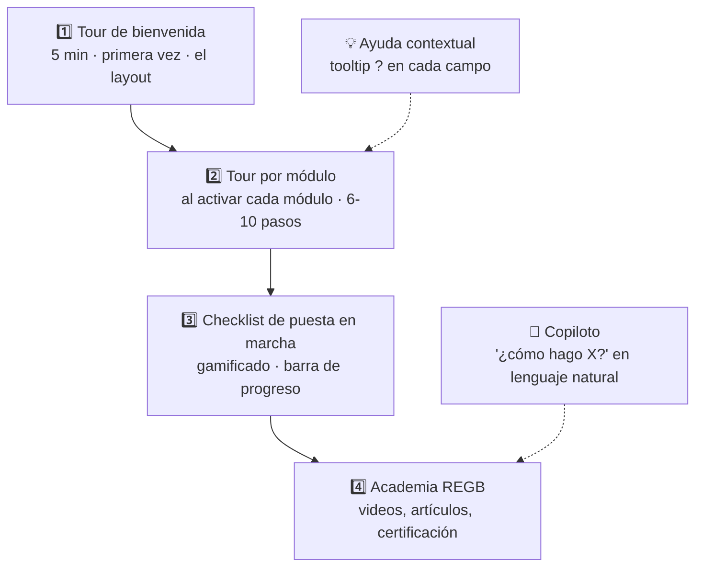

### 14.2 Definición de un tour

```typescript
// modules/inventory/tour/index.ts
export default defineTour({
  id: 'inventory.intro',
  title: 'Domina tu inventario',
  estimatedMinutes: 6,
  reward: { xp: 100, badge: 'inventory-rookie' },
  audience: ['almacenista', 'admin', 'gerente'],

  steps: [
    {
      target: '[data-tour="inventory-nav"]',
      title: 'Aquí vive tu inventario',
      body: 'Todo lo que entra, sale y se mueve pasa por aquí.',
      placement: 'right',
    },
    {
      target: '[data-tour="stock-table"]',
      title: 'Tus existencias en tiempo real',
      body: 'Cada fila es un producto en un almacén. El color del punto indica el nivel de stock.',
      placement: 'top',
    },
    {
      target: '[data-tour="adjust-btn"]',
      title: 'Ajustar existencias',
      body: 'Cuando el conteo físico no cuadra, ajustas aquí. Queda auditado y contabilizado.',
      action: 'click', // el usuario DEBE hacer clic para avanzar
      tip: 'Ajustes mayores a $10,000 requieren aprobación.',
    },
    {
      target: '[data-tour="transfer-btn"]',
      title: 'Mover entre almacenes',
      body: 'Las transferencias tienen estado "en tránsito" hasta que el destino confirma.',
      video: 'transfers-30s.mp4',
    },
    // … 4 pasos más
  ],

  onComplete: async (ctx) => {
    await ctx.awardBadge('inventory-rookie')
    await ctx.suggestNext('inventory.advanced')
  },
})
```

### 14.3 Checklist de puesta en marcha (gamificado)

```
╔══════════════════════════════════════════════════════════════════════╗
║  🎓 Tu camino en REGB                                    68% ▓▓▓▓▓░ ║
║                                                                       ║
║  ✅ Configurar los datos de tu empresa               +50 XP           ║
║  ✅ Invitar a tu equipo (4/5 aceptaron)              +100 XP          ║
║  ✅ Importar tu catálogo de productos                +150 XP          ║
║  ✅ Hacer tu primera venta                           +200 XP          ║
║  ✅ Configurar la facturación electrónica            +150 XP          ║
║  ⬜ Registrar tu primera compra                      +100 XP          ║
║  ⬜ Hacer tu primer conteo de inventario             +150 XP          ║
║  ⬜ Cerrar tu primer mes contable                    +300 XP          ║
║                                                                       ║
║  🏆 Nivel 3 · Operador  ·  850 / 1,200 XP para Nivel 4               ║
║  🎁 Al 100%: 1 mes gratis + sesión de optimización                   ║
╚══════════════════════════════════════════════════════════════════════╝
```

### 14.4 Ayuda contextual

| Elemento                     | Comportamiento                                                                 |
| ---------------------------- | ------------------------------------------------------------------------------ |
| **`?` junto al campo**       | Tooltip con explicación + ejemplo + enlace al artículo                         |
| **Empty states**             | "Aún no tienes productos. [Importar CSV] [Crear uno] [Ver tutorial 2 min]"     |
| **Errores**                  | Nunca solo "Error 500". Siempre: qué pasó, por qué y qué hacer                 |
| **`Ctrl+K` → "¿cómo?"**      | Busca en la academia además de en los datos                                    |
| **Copiloto IA**              | "¿Cómo hago una nota de crédito?" → respuesta paso a paso + botón que te lleva |
| **Primera vez en un módulo** | Banner: "¿Primera vez aquí? Tour de 6 minutos [Empezar] [Ya sé usarlo]"        |

---

## 15. Estrategia de los 3 clientes en paralelo

### 15.1 El principio: un cerebro, tres cuerpos

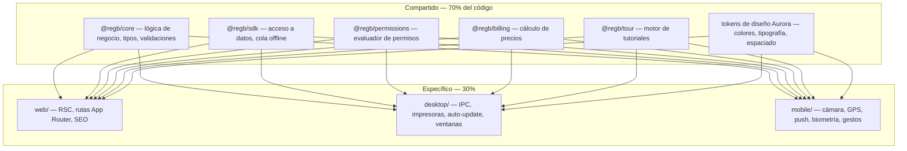

### 15.2 Reglas de paralelismo

| Regla                                                                                                 | Detalle                                                                            |
| ----------------------------------------------------------------------------------------------------- | ---------------------------------------------------------------------------------- |
| **La lógica vive en `packages/`**                                                                     | Si escribes una regla de negocio en `apps/`, es un bug.                            |
| **Un solo `manifest.ts` por módulo**                                                                  | Las 3 plataformas leen el mismo manifiesto.                                        |
| **Un solo esquema Zod**                                                                               | Validación idéntica en web, desktop, móvil y servidor.                             |
| **Tokens compartidos, componentes separados**                                                         | `ui/` (web) y `ui-native/` consumen el mismo `tokens.json`.                        |
| **Feature flags por plataforma**                                                                      | `platforms: { mobile: false }` deshabilita un módulo en móvil sin ramas de código. |
| **Un módulo se considera "hecho"** cuando funciona en las 3 (o declara explícitamente que no aplica). |
| **Un solo pipeline CI**                                                                               | Turborepo detecta lo afectado y prueba/construye solo eso.                         |

### 15.3 Flujo de trabajo por módulo

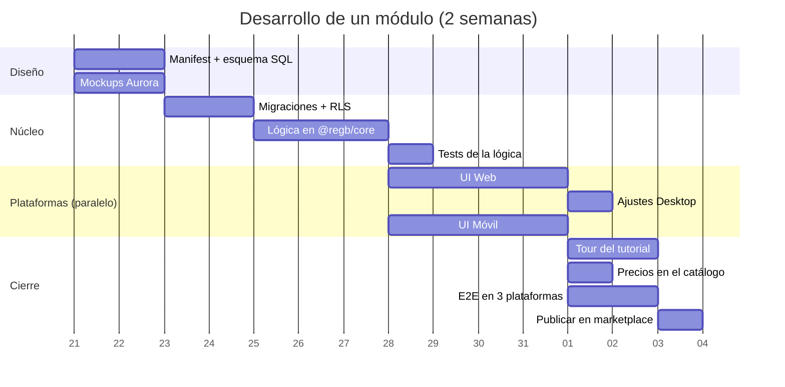

### 15.4 Definición de "Terminado" para un módulo

- [ ] `manifest.ts` completo (precios, permisos, deps, eventos, plataformas)
- [ ] Migraciones `up` + `down` + políticas RLS probadas
- [ ] Lógica en `@regb/core` con ≥80% de cobertura
- [ ] UI web responsive (xs → 2xl)
- [ ] UI móvil para el alcance declarado en `mobileScope`
- [ ] Desktop verificado (impresión, offline, atajos)
- [ ] Tour de tutorial con mínimo 6 pasos
- [ ] Datos demo (`seed/`)
- [ ] Al menos 2 widgets de dashboard
- [ ] Eventos emitidos y escuchados documentados
- [ ] Precio cargado en `regb.module_pricing` para los 3 tiers
- [ ] E2E verde en las 3 plataformas
- [ ] Documentación en `docs/modules/<id>.md`
- [ ] Accesibilidad AA verificada

---

## 16. Agentes especializados

Definidos en `.claude/agents/`. Cada uno tiene un dominio estricto.

| Agente                | Rol                    | Dominio                                                                |
| --------------------- | ---------------------- | ---------------------------------------------------------------------- |
| `regb-architect`      | Arquitecto             | Decisiones de estructura, límites entre paquetes, contratos, ADRs      |
| `regb-module-builder` | Constructor de módulos | Genera módulos completos desde el template: manifest, SQL, UI ×3, tour |
| `regb-db`             | Ingeniero de datos     | Esquemas, migraciones, índices, RLS, rendimiento de queries            |
| `regb-security`       | Seguridad              | RLS, permisos, aislamiento de tenants, secretos, auditoría             |
| `regb-design`         | Diseño                 | Design System Aurora, tokens, componentes, mockups, accesibilidad      |
| `regb-web`            | Frontend web           | Next.js 15, RSC, App Router, PWA, rendimiento                          |
| `regb-desktop`        | Electron               | IPC, offline, impresoras, auto-update, empaquetado, firma              |
| `regb-mobile`         | React Native           | Expo, navegación, cámara, GPS, push, offline, tiendas                  |
| `regb-billing`        | Facturación            | Motor de precios, medición de consumo, facturas, dunning               |
| `regb-tutorial`       | Tutoriales             | Tours, checklists, textos de ayuda, academia                           |
| `regb-qa`             | Calidad                | Tests unitarios, E2E en 3 plataformas, regresión visual                |
| `regb-docs`           | Documentación          | Docs técnicas, manual de usuario, changelog, API                       |

Ver los archivos en [`.claude/agents/`](../.claude/agents/).

---

## 17. Skills del proyecto

Definidos en `.claude/skills/`. Se invocan con `/nombre`.

| Skill            | Invocación                | Qué hace                                                                                                             |
| ---------------- | ------------------------- | -------------------------------------------------------------------------------------------------------------------- |
| **new-module**   | `/new-module <id>`        | Scaffold completo de un módulo: manifest, migraciones, UI ×3, tour, seed, tests, registro en catálogo                |
| **pricing-calc** | `/pricing-calc`           | Calcula/simula la cotización de un cliente: tier + módulos + extras + descuentos, y genera la propuesta en markdown  |
| **aurora-ui**    | `/aurora-ui <componente>` | Genera un componente siguiendo el Design System Aurora, con variantes web y native, tokens correctos y accesibilidad |
| **rls-audit**    | `/rls-audit`              | Audita todas las tablas: RLS activo, política de tenant, `module_active`, fugas entre tenants; reporta y corrige     |
| **tour-writer**  | `/tour-writer <módulo>`   | Escribe el tour del tutorial de un módulo analizando su UI real                                                      |
| **tri-platform** | `/tri-platform <feature>` | Toma una feature y la implementa coordinadamente en web, desktop y móvil, respetando qué corresponde a cada una      |

Ver los archivos en [`.claude/skills/`](../.claude/skills/).

---

## 18. Roadmap y fases

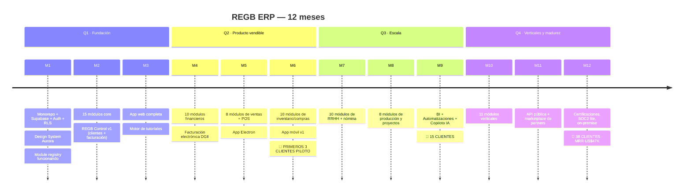

### 18.1 Hitos críticos

| Hito                             | Cuándo | Criterio de éxito                                                                      |
| -------------------------------- | ------ | -------------------------------------------------------------------------------------- |
| **Registry vivo**                | Mes 1  | Activar un módulo desde REGB Control lo hace aparecer en el sidebar del cliente en <5s |
| **Aislamiento probado**          | Mes 1  | Pentest: ningún tenant puede leer datos de otro por ninguna vía                        |
| **Primera factura automática**   | Mes 2  | El motor calcula, emite y cobra sin intervención                                       |
| **Cliente piloto en producción** | Mes 6  | Un negocio real opera 30 días sin volver a Excel                                       |
| **3 plataformas paridad**        | Mes 6  | El mismo módulo funciona en web, desktop y móvil                                       |
| **Rentabilidad unitaria**        | Mes 9  | Costo de infraestructura por cliente < 8% de su MRR                                    |

---

## 19. Métricas de éxito y KPIs

### 19.1 Negocio

| KPI                            | Meta año 1    | Cómo se mide                  |
| ------------------------------ | ------------- | ----------------------------- |
| MRR                            | US$ 47.000    | REGB Control › Overview       |
| Clientes activos               | 38            | tenants con `status='active'` |
| Ticket promedio                | US$ 1.244/mes | MRR / clientes                |
| Churn mensual                  | < 2%          | cancelaciones / clientes      |
| CAC                            | < US$ 2.500   | gasto comercial / nuevos      |
| LTV:CAC                        | > 5:1         | (ARPU × vida) / CAC           |
| Módulos por cliente            | > 8           | promedio `tenant_modules`     |
| Conversión de prueba de módulo | > 45%         | trials que pasan a activo     |
| Tiempo a go-live               | < 30 días     | `installed_at` → `go_live_at` |

### 19.2 Producto

| KPI                                    | Meta            | Nota                        |
| -------------------------------------- | --------------- | --------------------------- |
| Usuarios activos diarios / licenciados | > 60%           | señal real de adopción      |
| Tours completados                      | > 70%           | el tutorial funciona        |
| Tiempo a primera transacción           | < 48 h          | onboarding efectivo         |
| Tickets por cliente/mes                | < 1.5           | el producto se explica solo |
| CSAT                                   | > 4.5 / 5       | encuesta post-ticket        |
| Sesiones móviles                       | > 30% del total | el móvil se usa de verdad   |

### 19.3 Técnico

| KPI                            | Meta     |
| ------------------------------ | -------- |
| P95 de carga de pantalla       | < 800 ms |
| P95 de query                   | < 150 ms |
| Uptime                         | > 99.9%  |
| Tasa de error                  | < 0.1%   |
| Cobertura de tests en `core`   | > 80%    |
| Tiempo de build del monorepo   | < 6 min  |
| Costo de infraestructura / MRR | < 8%     |

---

## 20. Riesgos y mitigaciones

| #   | Riesgo                                       | Prob. |     Impacto     | Mitigación                                                                                                         |
| --- | -------------------------------------------- | :---: | :-------------: | ------------------------------------------------------------------------------------------------------------------ |
| 1   | **Fuga entre tenants**                       | Baja  | 🔴 Catastrófico | RLS en toda tabla + tests automáticos de aislamiento en CI + pentest anual + nunca `service_role` en el cliente    |
| 2   | **93 módulos = alcance imposible**           | Alta  |     🟠 Alto     | Priorizar por demanda real; 15 core + 20 más ya son vendibles. El resto se construye contra clientes pagando       |
| 3   | **Postgres se satura**                       | Media |     🟠 Alto     | Índices por `tenant_id`, particionado de tablas calientes, réplicas de lectura, plan de sharding por tenant grande |
| 4   | **Paridad de 3 plataformas ahoga el equipo** | Alta  |     🟠 Alto     | `mobileScope` explícito: el móvil NO tiene que hacer todo. Electron reutiliza la web al 95%                        |
| 5   | **Cambios fiscales DGII**                    | Alta  |    🟡 Medio     | Módulo `e-invoice` aislado y versionado; adaptadores por país                                                      |
| 6   | **Cliente pide "un módulo a la medida"**     | Alta  |    🟡 Medio     | Solo para tier GRANDE, cotizado aparte, construido como módulo real del catálogo (se revende)                      |
| 7   | **Deuda de migraciones**                     | Media |     🟠 Alto     | Toda migración con `down`, probada en staging con copia de producción; nunca DDL manual                            |
| 8   | **Dependencia de Supabase**                  | Baja  |     🟠 Alto     | Todo es Postgres estándar; el SDK abstrae el cliente. Salida posible a Postgres autogestionado                     |
| 9   | **Precios mal calculados = pérdida**         | Media |     🟠 Alto     | Motor de precios con tests exhaustivos; toda factura se pre-genera y revisa en borrador el primer año              |
| 10  | **Impersonación mal usada**                  | Baja  |     🔴 Alto     | MFA + razón + límite de tiempo + banner + doble auditoría + solo lectura por defecto                               |
| 11  | **Onboarding lento mata el flujo de caja**   | Media |     🟠 Alto     | Importadores robustos + plantillas por industria + checklist gamificado + cobro de instalación 50% por adelantado  |
| 12  | **Competencia (Odoo abarata)**               | Media |    🟡 Medio     | Nuestra ventaja es UX + soporte local + fiscalidad RD. No competimos por precio                                    |

---

## 📎 Anexos

| Documento                                               | Contenido                                                      |
| ------------------------------------------------------- | -------------------------------------------------------------- |
| [`docs/FASES-DE-DESARROLLO.md`](FASES-DE-DESARROLLO.md) | **Plan operativo: 12 fases, 84 sprints, puertas de no-avance** |
| `docs/MODULOS.md`                                       | Ficha detallada de los 93 módulos                              |
| `docs/DESIGN-SYSTEM.md`                                 | Aurora completo: tokens, componentes, ejemplos                 |
| `docs/API.md`                                           | Referencia del API público                                     |
| `docs/SEGURIDAD.md`                                     | Modelo de amenazas y controles                                 |
| `.claude/agents/`                                       | 12 agentes especializados                                      |
| `.claude/skills/`                                       | 6 skills del proyecto                                          |
| `graphify-out/`                                         | Grafo de conocimiento del proyecto                             |

---

## ✅ Resumen ejecutivo en 10 líneas

1. **REGB ERP** es un ERP modular multi-tenant con identidad propia.
2. **93 módulos**: 15 core gratis + 78 activables desde un marketplace interno.
3. **3 tiers de cliente**: PYME (US$500 + $79/mes), Mediano (US$3.500 + $399/mes), Grande (US$15.000 + $1.500/mes).
4. El precio **varía** por tier × módulos × usuarios × sucursales × consumo, con fórmula transparente.
5. **REGB Control** es tu panel privado: todos tus clientes, MRR, cobros, salud, impersonación auditada.
6. **Roles y permisos** en 3 niveles: licencia (tú), configuración (cliente), rol (admin del cliente).
7. **Tres apps en paralelo**: Next.js, Electron y React Native sobre un 70% de código compartido.
8. **Supabase** como backend único, con RLS estricto por tenant en cada tabla.
9. **Design System Aurora**: oscuro por defecto, teal `#0D847C`, denso, rápido, accesible AA.
10. **Tutorial en 4 capas** para que nadie necesite consultores: tours, checklist gamificado, ayuda contextual y copiloto IA.

---

_Documento generado el 2026-07-21 · REGB ERP v1.0 · Randy Grullón_
