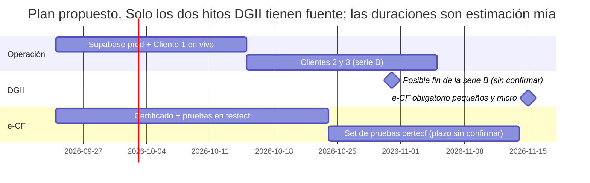
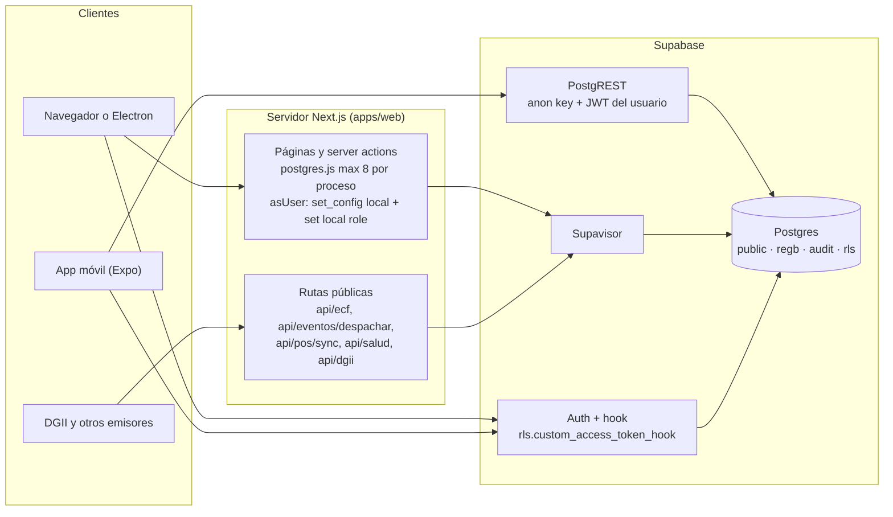

# REGB ERP — Definición v1: a quién vender hoy y cómo dejar Supabase listo

> **Para:** Randy (dueño del producto). **Fecha:** 23 de septiembre de 2026.
> **Escrito por:** `regb-docs`, con `regb-architect` y `regb-db`.
>
> Todo sale del repo y de la base de pruebas `regb_test`, no de memoria:
> [`ESTADO.md`](ESTADO.md), [`esto_es.md`](esto_es.md),
> [`PROYECTO-REGB-ERP.md`](PROYECTO-REGB-ERP.md), las fichas de
> [`modules/`](modules/README.md), las migraciones y los scripts. Los precios
> de módulos salen de `regb.module_pricing` y del motor
> [`packages/billing`](../packages/billing/src/formula.ts). Los datos de
> Supabase (precios, límites) salen de su documentación pública consultada
> hoy; cada uno dice de dónde viene. Lo que no encontré, lo digo.

> **Actualizado el 23 sep, después de la ronda 2** ([`esto_es.md`](esto_es.md)):
> se cerraron las FK sin guarda, el respaldo incompleto, `invoice-capture` a
> la venta, importar `1,234`, las invitaciones, los eventos core y la factura
> de REGB; el colmado ya puede cumplir con la DGII solo con la caja; el
> crédito tiene límite y B04; la contabilidad se genera sola; la nómina ya no
> paga doble. Lo que sigue bloqueando es el **e-CF** y lo que no es código.

**Cómo leer el semáforo**

| | Significa |
|---|---|
| 🟢 **Piloto ya** | El código cubre su operación diaria. Lo que falta es lo mismo para todos: montar Supabase de producción, cargar datos y NCF. |
| 🟡 **Piloto con condiciones** | Sirve, pero hay un hueco concreto que el cliente tiene que aceptar por escrito o que hay que cerrar antes. |
| 🔴 **Todavía no** | Le falta algo que su negocio no puede dejar de hacer. |

---

## 1. Resumen en 5 líneas

1. **Se puede vender hoy, como piloto,** un ERP web para comercio PYME de mostrador y crédito: caja con lector y ticket de 80 mm, inventario con costo, pedidos y cobro a crédito con mora, compras, NCF serie B y reportes 606/607/608 — entre **US$117 y US$303 al mes** y **US$800–2,100 de instalación**, según el giro.
2. También se puede ofrecer, con acompañamiento, a distribuidoras (contabilidad, CxP, impuestos, despacho; ~**US$813/mes** en tier MEDIANO) y a empresas de servicios y proyectos.
3. **No se puede vender todavía:** e-CF (el módulo está despublicado, sin certificado y nunca habló con la DGII), la app móvil (nunca abierta en un teléfono), la gaveta y el modo sin internet, el cobro automático de la mensualidad, la nómina como reemplazo de la actual, los verticales (restaurante, clínica, hotel…) y lo enterprise (SSO, on-premise, SOC2).
4. Antes del primer cliente real falta **operación, no módulos**: Supabase de producción con login real, dos claves foráneas sin guarda de cliente, invitaciones que no se envían y un "respaldo" del cliente que promete más de lo que guarda.
5. **El reloj manda:** desde el **15 de noviembre de 2026** el e-CF es obligatorio para pequeños y micro contribuyentes ([`DGII-ECF-MERCADO.md`](DGII-ECF-MERCADO.md) §1). Vende ya con serie B, pero cada contrato necesita un plan de e-CF para esa fecha: el de REGB certificado, o un proveedor autorizado en paralelo.

---

## 2. Empresas que pueden usar este ERP ya

### 2.1 Cómo se calculó cada precio

- **Fórmula:** la de §6.4 del documento maestro, tal como la implementa
  [`packages/billing/src/formula.ts`](../packages/billing/src/formula.ts):
  base del tier + mensual de cada módulo + usuarios extra + sucursales extra
  − módulos incluidos en el tier (**los más caros primero**) − descuento por
  ciclo + ITBIS 18 %.
- **Precios de módulo:** `regb.module_pricing`. Consultado hoy: los 93 módulos
  siguen exactamente la matriz por categoría de §6.3.

  | Categoría | Instalación PYME / MEDIANO / GRANDE | Mensual PYME / MEDIANO / GRANDE |
  |---|---:|---:|
  | core (16, incluido `products`) | 0 / 0 / 0 | 0 / 0 / 0 |
  | standard | 150 / 600 / 1,800 | 19 / 69 / 190 |
  | advanced | 400 / 1,500 / 4,000 | 45 / 160 / 420 |
  | vertical | 600 / 2,200 / 6,000 | 59 / 210 / 550 |
  | enterprise | — / — / 12,000 | — / — / 900 |

- **Tiers** ([`tiers.ts`](../packages/billing/src/tiers.ts)): PYME US$500 + US$79/mes, 5 usuarios, 1 sucursal, 0 módulos incluidos, usuario extra US$9. MEDIANO US$3,500 + US$399/mes, 25 usuarios, 5 sucursales, **5 módulos incluidos**, usuario extra US$7.
- **Supuestos** (los de la skill `pricing-calc` cuando no hay dato): usuarios = 40 % de los empleados, 1 sucursal, 1 RNC, ciclo mensual, storage dentro de lo incluido. Precios en **US$**; se facturan en DOP a la tasa del día (§6.6). No hay tasa en el repo, así que no convierto.
- **Comprobación del motor:** reproduce el caso "Colmado La Esperanza" de §6.5 al centavo: **US$950** de instalación y **US$123.25** al mes con ciclo anual.
- **Solo módulos publicados y construidos.** Quedan fuera `e-invoice` (despublicado), `invoice-capture` (publicado pero sin una sola pantalla, [ficha](modules/invoice-capture.md)) y los 11 verticales (despublicados, F12).

> ✅ **Corregido el 23 sep (0128):** la factura automática ya aplica la fórmula completa, con usuarios, sucursales y empresas reales e ITBIS 18 % en RD. El texto de abajo describe cómo estaba.
>
> ⚠️ **(Antes) Lo que el sistema facturaba no era esta cifra.** La factura automática
> de REGB Control ([`control.ts:135`](../apps/web/src/lib/control.ts),
> [`invoicing.ts:67`](../apps/web/src/lib/invoicing.ts)) cotiza con
> `usage = 0` y sin `taxRate`: cobra base + módulos − descuento, **sin
> usuarios extra, sin sucursales extra y sin ITBIS**. La columna "sistema hoy"
> de la tabla de abajo lo muestra. La diferencia hay que cobrarla a mano o
> arreglar el motor antes de facturar.

### 2.2 Lo que necesitan todos, y lo que a todos les falta hoy

**Hardware de mostrador** (según [`HARDWARE-Y-DGII.md`](HARDWARE-Y-DGII.md) y [`PLATAFORMAS.md`](PLATAFORMAS.md)):

| Pieza | Estado hoy | Nota |
|---|---|---|
| PC con Windows o tablet, con Chrome o Edge al día | ✅ | La app es web |
| Internet estable en el local | **obligatorio** | La web no vende sin conexión. La cola offline del escritorio existe, pero `/api/pos/sync` **nunca recibió una venta real** |
| Lector de código de barras USB (modo *keyboard wedge*, sufijo `Enter`) | ✅ funciona sin driver | Cargar `barcode` en el catálogo |
| Impresora térmica 80 mm USB, instalada como impresora de Windows | ✅ con el diálogo de impresión | Impresión directa y corte: escritorio, **sin probar con aparato** |
| Gaveta de dinero | ❌ en web · ⚠️ escritorio sin probar | Se abre a mano |
| Impresora fiscal certificada | ❌ no soportada | La DGII **no la exige**; exige NCF y reportes |
| UPS o inversor | recomendación mía | Sin luz no hay caja web |
| Teléfono Android | ⚠️ opcional | Solo conteos, transferencias, gastos y vacaciones. **Nunca se ha abierto en un teléfono** |

**Lo que falta a todos, sin importar el giro:**

| Falta | Qué hacer mientras | Fuente |
|---|---|---|
| Supabase de producción con login real (hoy corre en modo demostración) | Sección 4 de este documento | [`ESTADO.md`](ESTADO.md), [`PRIMER-CLIENTE.md`](PRIMER-CLIENTE.md) §1 |
| e-CF (obligatorio desde el 15 nov 2026) | Serie B hasta el corte; plan de e-CF firmado con el cliente | [`modules/e-invoice.md`](modules/e-invoice.md) |
| Certificado digital de **persona física** del cliente (Ley 126-02) | Que lo tramite ya: lo necesita con REGB o con cualquier proveedor | [`DGII-ECF-INVESTIGACION.md`](DGII-ECF-INVESTIGACION.md) §2.2 |
| Invitar usuarios: ✅ resuelto en código (0123); el correo sale cuando se configure el SMTP propio | Mientras tanto la pantalla da el enlace para copiarlo | [`modules/users.md`](modules/users.md) |
| Cobro de la mensualidad (Stripe y Azul sin conectar) | Transferencia y "registrar pago" en `/control/facturacion` | [`PRIMER-CLIENTE.md`](PRIMER-CLIENTE.md) §7 |
| ~~Importar lee `1,234` como 1.23~~ ✅ resuelto: lo ambiguo se rechaza con motivo | Probar igual con 10 filas | [`modules/imports.md`](modules/imports.md) |
| ~~Módulo `backup` incompleto~~ ✅ resuelto (0122): trae todo el negocio | Tu respaldo de la base sigue siendo el de verdad (§4.10) | [`modules/backup.md`](modules/backup.md) |

### 2.3 El cuadro completo

Mensual **sin ITBIS**, ciclo mensual. "Anual" = −15 %. "Sistema hoy" = lo que la factura automática cobraría (ver 2.1).

| # | Perfil | Tier | Módulos (ids del catálogo) | Instalación | Mensual | Con ITBIS | Anual | Sistema hoy | Estado |
|---|---|---|---|---:|---:|---:|---:|---:|:--:|
| 0 | Tienda de electrónicos (Cliente #1) | PYME | `pos` `inventory` `sales-orders` `ar` `purchase-orders` | 1,250 | 174.00 | 205.32 | 147.90 | 174 | 🟢 |
| A1 | Colmado / minimarket, solo contado | PYME | `pos` `inventory` | 800 | 117.00 | 138.06 | 99.45 | 117 | 🟡 |
| A2 | Colmado con fiao | PYME | `pos` `inventory` `sales-orders` `ar` | 1,100 | 155.00 | 182.90 | 131.75 | 155 | 🟡 |
| B | Farmacia (contado, sin ARS) | PYME | `pos` `inventory` `purchase-orders` `lots-serials` | 1,350 | 181.00 | 213.58 | 153.85 | 181 | 🟡 |
| C | Ferretería | PYME | `pos` `inventory` `sales-orders` `ar` `purchase-orders` `quotes` `price-lists` | 1,550 | 221.00 | 260.78 | 187.85 | 212 | 🟢 |
| D | Distribuidora / mayorista | MEDIANO | `inventory` `sales-orders` `ar` `purchase-orders` `receipts` `price-lists` `transfers` `ap` `accounting` `taxes` `logistics` | 7,100 | 813.00 | 959.34 | 691.05 | 813 | 🟡 |
| E | Repuestos | PYME | `pos` `inventory` `sales-orders` `ar` `purchase-orders` `lots-serials` | 1,650 | 228.00 | 269.04 | 193.80 | 219 | 🟡 |
| F | Materiales de construcción | PYME | `pos` `inventory` `sales-orders` `ar` `purchase-orders` `quotes` `price-lists` `fleet` `logistics` | 2,100 | 303.00 | 357.54 | 257.55 | 276 | 🟢 |
| G | Importadora pequeña | PYME | `purchase-orders` `receipts` `inventory` `sales-orders` `ar` `ap` `multicurrency` `suppliers` | 1,700 | 231.00 | 272.58 | 196.35 | 231 | 🟡 |
| H | Manufactura ligera | PYME | `inventory` `purchase-orders` `sales-orders` `ar` `bom` `manufacturing` | 1,900 | 254.00 | 299.72 | 215.90 | 245 | 🟡 |
| I | Servicios y proyectos | PYME | `projects` `timesheets` `quotes` `contracts` `sales-orders` `ar` `project-costing` | 1,800 | 247.00 | 291.46 | 209.95 | 238 | 🟢 |
| J | Empresa con nómina TSS (80 empleados) | MEDIANO | `employees` `payroll` `attendance` `time-off` `hr-portal` `expenses` `benefits` `accounting` | 5,300 | 655.00 | 772.90 | 556.75 | 606 | 🔴 / 🟡 en paralelo |

Los módulos core (`auth`, `users`, `rbac`, `orgs`, `branches`, `dashboard`, `search`, `notifications`, `audit`, `settings`, `files`, `tour`, `marketplace`, `imports`, `backup`, `products`) van incluidos gratis en todos.

> **Dependencias que el marketplace agrega solo.** `ar` requiere `sales-orders`
> en el catálogo, y la pantalla lo añade al marcarlo ("se agrega solo al
> marcarlo", `MarketplaceView.tsx:632`). Por eso todo perfil con crédito lleva
> `sales-orders`, y se cobra.

### 2.4 Perfil por perfil

#### 0 · Tienda de electrónicos y electrodomésticos — 🟢 Piloto ya (Cliente #1 confirmado)

| | |
|---|---|
| **Por qué le sirve** | Vende al contado y a crédito a 15/30 días según el cliente: es exactamente el MVP de F4 más compras. |
| **Módulos** | `pos`, `inventory`, `sales-orders`, `ar`, `purchase-orders` |
| **Precio** | US$1,250 instalación · US$174/mes (US$147.90 anual) · 3 usuarios |
| **Hardware** | PC + lector USB + térmica 80 mm + internet |
| **Le falta** | e-CF antes del 15 nov. Número de serie por equipo para garantías: existe en `lots-serials` (advanced, +US$400 / +US$45), pero la caja **no lo pide sola** al vender ([ficha](modules/lots-serials.md), línea 63). |
| **Veredicto** | Es el primero. Todo lo que pide está construido y probado contra Postgres real. |

#### A · Colmado o minimarket — 🟡 Piloto con condiciones

| | |
|---|---|
| **Por qué le sirve** | Caja con lector, NCF B02 al consumidor y B01 al que trae RNC, inventario con costo promedio, cierre de turno con arqueo por cajero. Con fiao: cartera por cliente y mora. |
| **Módulos** | Contado: `pos`, `inventory`. Con fiao: + `sales-orders`, `ar` |
| **Precio** | Contado US$800 + US$117/mes · con fiao US$1,100 + US$155/mes |
| **Hardware** | El de mostrador completo. UPS muy recomendable |
| **Ya resuelto (23 sep)** | Con solo `pos` ya carga NCF y saca su 607/608 e IT-1 (`/pos/comprobantes`, `/pos/dgii`, 0129). La demo trae el ITBIS real de la canasta básica: arroz y habichuelas **exentos**, aceite comestible al **16 %** (Ley 253-12) — al cargar su catálogo, revisar la tasa de cada producto, porque un colmado lo nota en el primer ticket. |
| **Le falta** | (1) **e-CF con volumen:** un colmado emite cientos de tickets al mes y el Facturador Gratuito de la DGII llega a ~150 facturas mensuales ([`DGII-ECF-MERCADO.md`](DGII-ECF-MERCADO.md) §3.3), así que el 15 nov necesita e-CF de verdad. (2) **Vender sin internet ni luz:** no se puede en web. (3) **Precio:** Alegra cobra US$19–35/mes con e-CF incluido ([`DGII-ECF-MERCADO.md`](DGII-ECF-MERCADO.md) §4.2). |
| **Veredicto** | Vender al minimarket con dolor de inventario, no al colmado más chico. No es el primer cliente. |

#### B · Farmacia (general, sin seguros) — 🟡 Piloto con condiciones

| | |
|---|---|
| **Por qué le sirve** | Lotes y vencimientos con FEFO como algoritmo, alertas de caducidad y recall; compras con costo real. |
| **Módulos** | `pos`, `inventory`, `purchase-orders`, `lots-serials` |
| **Precio** | US$1,350 + US$181/mes |
| **Hardware** | Mostrador completo |
| **Le falta** | **La caja no descuenta por lote**: `consumirFefo()` es manual y "todavía NO está conectada al checkout de `sales-orders` o `pos`" ([`modules/lots-serials.md`](modules/lots-serials.md)). Recetas, controlados y cobro a ARS son el vertical `pharmacy` (F12, no publicado). |
| **Veredicto** | Solo farmacia que vende al contado y acepta ajustar lotes a mano. La que factura a ARS **no es cliente todavía**. |

#### C · Ferretería — 🟢 Piloto ya

| | |
|---|---|
| **Por qué le sirve** | Mostrador y crédito al maestro de obra, cotizaciones con versiones que dan los mismos totales que pedidos y caja, precio por cliente o volumen con precedencia real. |
| **Módulos** | `pos`, `inventory`, `sales-orders`, `ar`, `purchase-orders`, `quotes`, `price-lists` |
| **Precio** | US$1,550 + US$221/mes (6 usuarios) |
| **Hardware** | Mostrador completo |
| **Le falta** | e-CF. Lo demás, el mismo patrón que el Cliente #1. |
| **Veredicto** | Segundo o tercer cliente natural: reutiliza todo lo que valide la tienda de electrónicos. |

#### D · Distribuidora o mayorista — 🟡 Piloto con condiciones

| | |
|---|---|
| **Por qué le sirve** | Pedidos con reserva de stock y entregas parciales, recepción con inspección, traslados entre almacenes con tránsito, listas de precio, CxP con retenciones, contabilidad de partida doble, calendario fiscal y rutas con prueba de entrega. |
| **Módulos** | 8 standard (`inventory`, `sales-orders`, `ar`, `purchase-orders`, `receipts`, `price-lists`, `transfers`, `ap`) + 3 advanced (`accounting`, `taxes`, `logistics`). MEDIANO incluye 5: los 3 advanced y 2 standard; se cobran 6 |
| **Precio** | US$7,100 + US$813/mes · 50 empleados, 20 usuarios, 2 sucursales (incluidas) |
| **Hardware** | PCs de oficina, lector en almacén; teléfono para conteos (sin probar) |
| **Le falta** | La puerta de F6 no pasó: **ningún contador ha firmado un cierre** hecho en REGB. `logistics` es honesto: **sin GPS** ni optimización de rutas. Un mediano contribuyente ya debía emitir e-CF (dic. 2025 o nov. 2026, sin confirmar, [`DGII-ECF-MERCADO.md`](DGII-ECF-MERCADO.md) §1.2): lo más probable es que ya tenga proveedor de e-CF, y sin e-CF propio REGB le obliga a digitar dos veces. |
| **Veredicto** | El mejor ticket. Entrar cuando 0, C y F estén estables y con un contador del cliente dispuesto a validar el primer cierre. |

#### E · Repuestos — 🟡 Piloto con condiciones

| | |
|---|---|
| **Por qué le sirve** | Mostrador, crédito a talleres, compras, seriales para garantía. |
| **Módulos** | `pos`, `inventory`, `sales-orders`, `ar`, `purchase-orders`, `lots-serials` |
| **Precio** | US$1,650 + US$228/mes (6 usuarios) |
| **Le falta** | No encontré en las fichas de `products` ni `inventory` búsqueda por aplicación (marca, modelo y año del vehículo) ni equivalencias entre piezas. **Verificarlo en la demo**; si no existe, es el hueco que decide la venta. |
| **Veredicto** | Solo si el cliente busca por código o por nombre. |

#### F · Materiales de construcción — 🟢 Piloto ya (mostrador y crédito) · 🟡 despacho

| | |
|---|---|
| **Por qué le sirve** | Cotización al ingeniero, crédito a la constructora, precios por volumen, camiones con combustible y mantenimiento, despacho a obra con prueba de entrega. |
| **Módulos** | `pos`, `inventory`, `sales-orders`, `ar`, `purchase-orders`, `quotes`, `price-lists`, `fleet`, `logistics` |
| **Precio** | US$2,100 + US$303/mes (20 empleados, 8 usuarios) |
| **Le falta** | Rutas sin GPS; la prueba de entrega desde el teléfono depende de la app móvil sin probar. |
| **Veredicto** | Vender el mostrador y el crédito; el despacho, como segunda etapa. |

#### G · Importadora pequeña — 🟡 Piloto con condiciones

| | |
|---|---|
| **Por qué le sirve** | Órdenes de compra en USD, recepción con discrepancias, CxP, multimoneda con diferencia cambiaria, proveedores con documentos que vencen. |
| **Módulos** | `purchase-orders`, `receipts`, `inventory`, `sales-orders`, `ar`, `ap`, `multicurrency`, `suppliers` |
| **Precio** | US$1,700 + US$231/mes |
| **Le falta** | No encontré en ninguna ficha el **costo de importación** (flete, seguro, DGA) prorrateado al costo del producto. Si no existe, el costo promedio nace bajo y el margen sale inflado. Verificarlo antes de venderle. |
| **Veredicto** | Piloto si acepta cargar el costo aterrizado a mano en la recepción. |

#### H · Manufactura ligera (panadería industrial, muebles, envasadora) — 🟡 Piloto con condiciones

| | |
|---|---|
| **Por qué le sirve** | Lista de materiales multinivel con costeo real, órdenes de producción con consumo y mermas. |
| **Módulos** | `inventory`, `purchase-orders`, `sales-orders`, `ar`, `bom`, `manufacturing` (+ `mrp`, `quality` si crece) |
| **Precio** | US$1,900 + US$254/mes (15 empleados, 6 usuarios) |
| **Le falta** | La puerta de F8 no pasó (trazabilidad hasta materia prima en < 10 s, MRP contra un plan real). |
| **Veredicto** | Piloto con quien produzca contra pedido. **Ojo:** "taller de reparación" es otra cosa, el vertical `workshop` (F12). |

#### I · Servicios y proyectos (consultora, contratista eléctrico, mantenimiento) — 🟢 Piloto ya

| | |
|---|---|
| **Por qué le sirve** | Proyectos con dependencias reales, horas aprobadas, margen y WIP derivados del historial, contratos de iguala con renovación, facturación de servicios sin existencias (migración 0100). |
| **Módulos** | `projects`, `timesheets`, `quotes`, `contracts`, `sales-orders`, `ar`, `project-costing` (+ `field-service` si tiene técnicos) |
| **Precio** | US$1,800 + US$247/mes (6 usuarios) |
| **Hardware** | Ninguno especial |
| **Le falta** | e-CF (factura a empresas con B01, que pasa a E31). La puerta F10 pide un proyecto real de punta a punta: el piloto es eso. |
| **Veredicto** | El piloto con menos riesgo técnico: no depende de hardware ni de internet en un mostrador. |

#### J · Empresa con nómina TSS — 🔴 como reemplazo · 🟡 en paralelo

| | |
|---|---|
| **Por qué le sirve** | TSS e ISR con retención anualizada, regalía, cesantía y preaviso del caso general, vacaciones según el art. 177, préstamos y adelantos, portal del empleado. |
| **Módulos** | `employees`, `payroll`, `attendance`, `time-off`, `hr-portal`, `expenses`, `benefits`, `accounting`. MEDIANO incluye 5 (2 advanced + 3 standard); se cobran 3 |
| **Precio** | US$5,300 + US$655/mes con 32 usuarios. **Si los 80 empleados entran al portal, cada uno es usuario: US$991/mes** |
| **Le falta** | Las tasas son una **referencia de 2024** (`TASAS_TSS_REFERENCIA_2024`, [`modules/payroll.md`](modules/payroll.md)) que hay que verificar contra la ley vigente. **No genera el archivo del portal de la TSS.** Salarios sin cifrar: `pgsodium` no aparece en ninguna migración. La puerta F7 (nómina real de ≥ 50 empleados cuadrada al centavo) no pasó. La geocerca necesita un teléfono. |
| **Veredicto** | Solo **en paralelo** con su nómina actual durante 3 meses, como pide `FASES-DE-DESARROLLO.md` §16. |

### 2.5 Quién NO es cliente todavía

| Negocio | Por qué no | Qué haría falta |
|---|---|---|
| Restaurante con mesas, comandas y cocina | `restaurant` es vertical F12, no publicado | Un cliente que pague la instalación del vertical (US$600 + US$59/mes en PYME) antes de construirlo |
| Clínica o consultorio | `clinic` F12; además, datos de salud | Ídem, más revisión de seguridad |
| Hotel | `hotel` F12 | Ídem |
| Farmacia que factura a ARS o vende controlados | `pharmacy` F12 | Ídem |
| Taller de reparación, constructora con cubicaciones, colegio, gimnasio, inmobiliaria, finca, lavandería | `workshop`, `construction`, `education`, `gym`, `real-estate`, `agro`, `laundry`: F12 | Ídem |
| Grupo empresarial que pide SSO (SAML, Azure AD, SCIM), on-premise o VPC, pentest externo o SOC2 | F11 va en 1 de 5 ([`ESTADO.md`](ESTADO.md)) | Construirlo contra un contrato GRANDE |
| Contador que quiere digitalizar facturas con una foto | `invoice-capture` está publicado **sin una sola pantalla** | Despublicarlo hoy; construirlo cuando haya comprador |
| Negocio que exige vender todo el día sin internet | La cola del escritorio nunca subió una venta real | Probarla con el cable desconectado (puerta F5) |
| Negocio que quiere cobrar con tarjeta o link de pago integrado | `payments` no procesa pagos: no hay pasarela | Credenciales de Azul o Stripe |

---

## 3. Los primeros 5 clientes: en qué orden y qué enseñar

### 3.1 El orden

| # | Cliente | Por qué en ese lugar | Meta antes del siguiente |
|---|---|---|---|
| 1 | **Tienda de electrónicos (Cliente #1)** | Ya está confirmado y pide exactamente el MVP de F4 | 30 días corridos sin volver a Excel (puerta F4). Empezar antes del 31 oct |
| 2 | **Ferretería** | Mismo patrón, más cotizaciones y listas de precio | Primera cotización convertida en factura a crédito y cobrada |
| 3 | ~~Claves foráneas sin guarda de cliente~~ | ✅ **Cerrado el 23 sep** (0121): 45 FK sin guarda y 85 que solo se revisaban al insertar | — | — |
| 4 | **Empresa de servicios** | Valida proyectos y horas sin riesgo de hardware; B2B | Un proyecto de punta a punta (puerta F10) |
| 5 | ~~El respaldo del cliente no trae el negocio~~ | ✅ **Cerrado** (0122): trae toda tabla del cliente y dice exactamente qué trae | — | — |

**Por qué no un colmado primero:** volumen de e-CF, apagones y sensibilidad al precio. **Por qué no nómina primero:** la puerta F7 no pasó y un error ahí lo paga un empleado.

**El e-CF cambia el orden de prioridad, no el de clientes.** La certificación la saca cada contribuyente declarando a REGB como su software, y para ser Proveedor de Servicios de FE hay que haber certificado antes a **3 contribuyentes** (Norma General 10-2021, [`DGII-ECF-MERCADO.md`](DGII-ECF-MERCADO.md) §6.3). Los clientes 1, 2 y 3 son esos tres. Conviene que tramiten su certificado de persona física desde ya.



### 3.2 Qué enseñar en la demo (15 minutos)

| Paso | Qué ves | Por qué convence |
|---|---|---|
| 1 | Pasar un producto con el lector en `/pos`, cobrar y sacar el ticket de 80 mm con NCF B02. Repetir con un cliente con RNC → B01 | Es su mostrador, con su papel |
| 2 | Venta a crédito a 30 días → cartera por antigüedad en `/cobrar` → cargo por mora, y un cliente marcado exento | Es el dinero que hoy se le pierde |
| 3 | Recibir una compra con su costo → inventario valorado → kardex que no se edita | "Sé cuánto vale lo que tengo" |
| 4 | 607 y 608 del mes en `/cobrar/dgii`, en CSV y en TXT | "Esto se lo das al contador" |
| 5 | `/perfil` con el rol Cajero: qué puede hacer y hasta cuánto descuenta | Acaba con el "no me deja" |
| 6 | ~~`invoice-capture` publicado sin pantallas~~ | ✅ **Cerrado** (0124): despublicado, sin cobro y la base se niega a activarlo | — | — |
| 7 | Invitación de usuarios | ✅ **Resuelta en código** (0123); **falta** SMTP propio y la plantilla de Supabase para que el correo salga (§4.5) | 🟡 | Todos, hasta configurar el SMTP |

**Presentación:** lenguaje visual tipo Apple, **tema oscuro por defecto y claro a un clic** (botón de sol/luna en la cabecera). El marketplace enseña la captura real de cada módulo en el tema que esté activo.

### 3.3 Qué NO prometer en la venta

| No prometas | Porque hoy |
|---|---|
| "Facturamos electrónico" o una fecha de e-CF | No emite y nunca habló con la DGII |
| La app del celular | Nunca se abrió en un teléfono |
| Gaveta, impresión directa, vender sin internet | Solo en escritorio, y sin probar con aparato |
| "Invita a tu equipo por correo" | Sale solo cuando configures el SMTP propio de Supabase; antes, se comparte el enlace |
| Captura de facturas por foto | No existe |
| Cobro con tarjeta o link de pago | Sin pasarela |
| Archivo de TSS listo para subir | No se genera |

---

## 4. Supabase: qué hacer para no tener problemas más adelante

Cada punto dice **qué hacer**, **por qué en este código** y **cómo verificarlo**. Lo que implica cambiar código está marcado **→ tarea** con el agente que la haría; este documento no toca código.

### 4.0 Cómo habla este código con Supabase hoy



Tres hechos que condicionan todo lo demás:

1. **La web no usa PostgREST.** Se conecta directo a Postgres con `DATABASE_URL` ([`db.ts`](../apps/web/src/lib/db.ts)) y, por cada consulta de un cliente, abre una transacción que fija los claims y baja al rol `authenticated`. Sin `asUser()`, consulta como dueño de las tablas.
2. **El móvil sí usa PostgREST**, con la anon key y el JWT del usuario. Ahí la única barrera es la RLS.
3. **No hay ni una Edge Function.** `supabase/functions/` no existe. Todo lo que el documento maestro ubica en Edge Functions corre hoy en el servidor de Next.

### 4.1 Tres proyectos y una región

| Qué | Por qué en este código | Cómo verificarlo |
|---|---|---|
| **Tres proyectos:** `regb-dev`, `regb-staging`, `regb-prod`. Se queda también el Postgres local `regb-test-db` para `gate:f0` | Las migraciones **no tienen `down`** ([`modules/README.md`](modules/README.md), "Deuda declarada"). Staging es el único ensayo posible de una migración antes de producción | Cada entorno con su `NEXT_PUBLIC_SUPABASE_URL`, su anon key y su `DATABASE_URL`. En staging, `pnpm db:migrar-remoto --listar` da "0 pendientes" antes de tocar prod |
| DGII por entorno: dev → `testecf`, staging → `certecf`, prod → `ecf` | `ecf_config.ambiente` es por tenant, y pasar a `ecf` sin certificar quema secuencias ([`modules/e-invoice.md`](modules/e-invoice.md)) | `select tenant_id, ambiente, certificado from public.ecf_config;` en cada proyecto |
| **Región `us-east-1` (Norte de Virginia)** | Es la región de AWS más cercana a RD entre las que ofrece Supabase. **El servidor de Next tiene que estar en la misma región**: cada acción hace al menos `begin`, `set_config`, `set local role`, las consultas y `commit`, y cada una es un viaje de ida y vuelta. La región no se cambia después sin crear otro proyecto | Desde el servidor de Next, medir la latencia de `select 1`. Desde la tienda del cliente, medir la carga de `/pos` |
| El proyecto real que ya existe va "60 migraciones por detrás" ([`aplicar-migraciones.mjs`](../scripts/aplicar-migraciones.mjs)) | Si no tiene datos de clientes, adoptarlo con `--marcar-hasta` es riesgo sin beneficio | Si no hay datos reales: crear `regb-prod` limpio y aplicar las 120 desde 0001, como hace `gate:f0` |

### 4.2 Plan y tamaño de cómputo

| Qué | Por qué | Cómo verificarlo |
|---|---|---|
| **Plan Pro** para staging y prod | El plan gratis pausa proyectos inactivos y no trae respaldos diarios; Pro trae 7 días de respaldo diario (doc de Supabase) | Settings → Billing |
| **Cómputo Small** en prod para arrancar (2 GB, 90 conexiones directas, 400 clientes en el pooler) | Es el mínimo que exige PITR (doc de Supabase, *Backups*) | Settings → Compute and Disk |
| **Para ~500 tenants: no lo adivines, mídelo.** Sube un escalón cuando se cumpla una de estas: CPU > 70 % sostenido, P95 de consulta > 150 ms (meta de §19.3), conexiones cerca del límite, *cache hit* < 99 % | Cada consulta de negocio pasa por políticas con `rls.module_active()`. El costo real a 500 tenants depende de las consultas calientes (ventas del día, kardex, cartera), que solo se ven con datos | En staging: sembrar 500 tenants sintéticos y medir el top de `pg_stat_statements` (§4.13) antes de pasar de 50 clientes reales |
| Cambiar de tamaño **fuera del horario de mostrador** | Cambiar el cómputo reinicia la base | Ventana sugerida: 1:00–5:00 a. m. hora de RD |

Tamaños según la doc de Supabase (consultada el 23 sep 2026):

| Tamaño | RAM | CPU | Conexiones directas | Clientes en el pooler | US$/mes aprox. |
|---|---:|---|---:|---:|---:|
| Micro | 1 GB | compartida | 60 | 200 | 10 |
| Small | 2 GB | compartida | 90 | 400 | 15 |
| Medium | 4 GB | compartida | 120 | 600 | 60 |
| Large | 8 GB | 2 vCPU | 160 | 800 | 110 |
| XL | 16 GB | 4 vCPU | 240 | 1,000 | 210 |
| 2XL | 32 GB | 8 vCPU | 380 | 1,500 | 410 |

### 4.3 El pooler de conexiones — el punto técnico más importante

**Lo que hay en el código:**

- [`db.ts:28`](../apps/web/src/lib/db.ts): `postgres(DB_URL, { max: 8, onnotice })`. **Sin `prepare: false` y sin `ssl`.**
- `asUser()` hace `set_config('request.jwt.claims', …, true)` y `set local role authenticated` **dentro de** `db().begin()`. Los dos valen solo para esa transacción.
- Busqué en `apps/web/src`, `packages/*/src`, `scripts` y las migraciones: **no hay** `LISTEN/NOTIFY`, *advisory locks*, `SET` de sesión ni tablas temporales.

**Conclusión:** el código es compatible con el **modo transacción** de Supavisor, con una condición: **`prepare: false`**. La doc de Supabase lo dice sin rodeos: *"Transaction mode does not support prepared statements"*, y postgres.js los usa por defecto.

| Modo | Puerto | ¿Sirve con este código? | Cuándo usarlo |
|---|---|---|---|
| **Transacción** (Supavisor) | 6543 | Sí, **con `prepare: false`** | Next en serverless (muchas instancias de vida corta) |
| **Sesión** (Supavisor) | 5432 del host del pooler | Sí | Servidor persistente sin IPv6; migraciones; `pg_dump` |
| **Directa** | 5432 de `db.<ref>.supabase.co` | Sí | Servidor persistente con IPv6 o con el add-on de IPv4; migraciones; `pg_dump` |

**La cuenta que decide:** conexiones = instancias × 8. Un servidor persistente con 2 procesos abre 16: cabe en cualquier modo. Un despliegue serverless con 20 instancias calientes abre 160: pasa de las 90 directas de Small y en modo sesión agota el pool. [`PRIMER-CLIENTE.md`](PRIMER-CLIENTE.md) recomienda el *Session pooler* por IPv4; sirve para un solo servidor persistente, **no para serverless**.

**La regla que protege el multi-tenant:** con un pooler, la misma conexión física atiende a clientes distintos uno tras otro. Todo lo que fija identidad tiene que ser **`local`**. Un `set_config(…, false)` o un `set role` sin `local` dejaría los claims de un tenant pegados a la conexión y el siguiente usuario, **de otro cliente**, los heredaría. Hoy el código lo cumple; hay que impedir que deje de cumplirlo.

**✅ Hecho el 23 sep:** `db.ts` usa `prepare: false` y `ssl: 'require'` fuera de localhost, y `pnpm audit:identidad` (en la puerta) falla si algo fija la identidad fuera de la transacción. Lo que queda es de configuración: las dos URL y bajar `max` en serverless.

~~**→ tarea `regb-web`** (cambio de una línea):~~

```ts
postgres(DB_URL, { max: 8, prepare: false, ssl: 'require', onnotice: () => {} })
```

En serverless, además, bajar `max` (el ejemplo de Supabase usa `max: 1`) y dejar que el pooler multiplexe.

**→ tarea `regb-qa`:** que `gate:f0` falle si aparece `set_config(` con `false` o `set role` sin `local`.

**Dos URL, no una:** `DATABASE_URL` (la app, modo transacción) y una segunda para migraciones y respaldos (sesión o directa). Los scripts leen `DATABASE_URL`, así que se invoca `DATABASE_URL=<url de sesión> pnpm db:migrar-remoto`.

**Cómo verificarlo:**

```sql
-- Quién está conectado y cuántas conexiones usa cada uno
select usename, application_name, state, count(*)
from pg_stat_activity
where datname = current_database()
group by 1, 2, 3
order by 4 desc;
```

El error `prepared statement "…" does not exist` (o `already exists`) es la señal de que falta `prepare: false`. Y en staging, una prueba de carga con dos tenants a la vez **a través del pooler**: las 1,099 pruebas de aislamiento van directo a Postgres, no pasan por Supavisor.

### 4.4 Migraciones: un solo camino

| Qué | Por qué en este código | Cómo verificarlo |
|---|---|---|
| **Solo `pnpm db:migrar-remoto`** ([`aplicar-migraciones.mjs`](../scripts/aplicar-migraciones.mjs)), primero en staging y después en prod | Lleva su libro en `regb.migraciones_aplicadas` con el hash de cada archivo, y **aborta si una migración ya aplicada cambió** en el repo | `--listar` antes; después, `select count(*) from regb.migraciones_aplicadas;` igual al número de archivos (120 hoy) |
| **No mezclar con `supabase db push`** | La CLI lleva su propio registro (`supabase_migrations.schema_migrations`) y no conoce el nuestro: mezclarlos es pedir que algo corra dos veces o no corra | Una sola herramienta en el runbook |
| **Nunca DDL desde el SQL Editor ni el Table Editor en prod** | El script detecta si cambió un **archivo**, no si alguien cambió la **base**. Un cambio a mano es deriva invisible | `pnpm db:diff` (`supabase db diff`) contra staging de vez en cuando |
| Una corrección urgente es **una migración nueva** | "Una migración aplicada no se edita: se escribe otra nueva" (el propio script) | — |
| **Hallazgo a verificar: el libro nace sin RLS.** El script crea `regb.migraciones_aplicadas` antes de la 0001. Cuando la 0005 corre `grant … on all tables in schema regb to authenticated`, la tabla ya existe y el grant la cubre. Si `regb` está expuesto en la API, un usuario de un cliente podría leerla o escribirla | Es la única tabla del sistema que no nace de una migración | `select * from regb.rls_coverage where not rls_enabled;` en staging. Si aparece, **→ tarea `regb-db`**: migración que le active RLS con `provider_only` o le quite el grant |

### 4.5 Auth

| Qué | Por qué en este código | Cómo verificarlo |
|---|---|---|
| **Registrar el hook:** Authentication → Hooks → *Customize Access Token (JWT) Claims* → Postgres → esquema **`rls`**, función **`custom_access_token_hook`** (no `auth.`) | Sin el hook el token no trae `tenant_id` y el usuario no ve nada (falla cerrado, [0008](../supabase/migrations/0008_auth_token_hook.sql)). Y sin `role_id`, `rls.has_perm()` **deja pasar** ([`PERMISOS-Y-RLS.md`](PERMISOS-Y-RLS.md) §4) | Entrar y abrir `/perfil`: rol y permisos visibles. En SQL: `select rls.custom_access_token_hook(jsonb_build_object('user_id', '<uuid>', 'claims', '{}'::jsonb));` tiene que devolver `tenant_id` y `role_id` |
| En [`config.toml`](../supabase/config.toml) falta el registro local. **→ tarea `regb-db`**: agregar `[auth.hook.custom_access_token]` con `enabled = true` y `uri = "pg-functions://postgres/rls/custom_access_token_hook"` | Con `supabase start`, hoy los tokens locales salen sin tenant | — |
| **Registro cerrado** ("Allow new users to sign up" apagado) y **confirmación de correo** encendida | `enable_signup = false`: nadie se registra solo, el alta la hace REGB Control | Intentar registrarse desde `/login`: tiene que fallar |
| **SMTP propio** (el diagrama de §2.1 nombra Resend), con SPF, DKIM y DMARC en tu dominio. Después, subir el límite de correos por hora | El SMTP por defecto manda **2 correos por hora** y solo a miembros del equipo (doc de Supabase, *auth-smtp*). Hoy los usuarios se crean con "Invite user" del dashboard, y el enlace mágico de `/login` también manda correo | Invitar a una dirección de prueba externa y ver que llega, sin caer en spam |
| **Site URL** `https://<tu dominio>` y **Redirect URLs** exactas: `https://<tu dominio>/auth/callback`, las de staging y `regb://auth` para el móvil. Sin comodines en prod | `config.toml` trae `localhost:3000` y `regb://auth`. La ruta `/auth/callback` existe ([`modules/auth.md`](modules/auth.md)) | Un enlace mágico que vuelve al dominio correcto |
| **JWT de 1 hora** (`jwt_expiry = 3600`) y rotación de refresh | El hook se evalúa al emitir el token: desactivar un cajero o suspender un tenant **tarda hasta una hora** en cortarle. Díselo al cliente | Desactivar un usuario de prueba y cronometrar |
| **MFA (TOTP)** habilitado | §10.3 lo exige para Owner, Admin, Contador y REGB Control, y §7.4 para impersonar. **Hoy no hay pantalla para enrolarlo** ([`modules/auth.md`](modules/auth.md)) | Hueco abierto: **→ tarea `regb-web`** antes de que exista un segundo usuario de REGB Control |
| **Rate limits:** revisar los que trae por defecto | Inicio de sesión 30 cada 5 min, refresco de token 150 cada 5 min, verificaciones 30 cada 5 min, MFA 15 por minuto (doc de Supabase). Una distribuidora con 20 personas detrás de una sola IP pública queda dentro, pero conviene saberlo | Authentication → Rate Limits |
| **Plantillas en español** con tu marca: confirmar correo, invitación, enlace mágico, cambio de correo, recuperar contraseña | Van al cliente final; en inglés parecen phishing | Recibir cada una en staging |
| **Un correo, un tenant** | El hook toma la primera membresía con `limit 1` y sin orden: una persona en dos clientes entra a uno indefinido ([`modules/auth.md`](modules/auth.md)). Te afecta a ti y a los contadores externos | Regla de operación hasta que haya selector de tenant |

**Crear un usuario hoy, mientras la invitación no funciona** (es un dato, no DDL: va en una transacción y queda en la bitácora):

1. Authentication → Users → *Invite user* con su correo (requiere el SMTP propio).
2. Comprobar que el rol es **del mismo tenant**, porque `memberships.role_id` no tiene guarda de cliente:
   `select id from public.roles where id = '<rol>' and tenant_id = '<tenant>';`
3. `insert into public.memberships (tenant_id, user_id, role_id, is_active, invited_at, accepted_at) values ('<tenant>', '<id de auth.users>', '<rol>', true, now(), now());` — el hook exige `accepted_at`.
4. Que la persona cierre sesión y vuelva a entrar.

### 4.6 Secretos: `service_role`, `DATABASE_URL` y el certificado de la DGII

| Qué | Por qué en este código | Cómo verificarlo |
|---|---|---|
| **`service_role` solo en el servidor**: secretos de Edge Functions o variable de servidor **sin** prefijo `NEXT_PUBLIC_`. Hoy no se usa en ningún sitio | [`.env.example`](../.env.example) lo prohíbe y `pnpm audit:secrets` rompe el build si aparece en código de cliente | `pnpm audit:secrets` en cada despliegue |
| **`DATABASE_URL` es la joya de la corona**, más que la `service_role`: conecta como `postgres`, que en local es superusuario y se salta la RLS | Toda la web consulta con ella | Solo en las variables del servidor de Next. Una por entorno. Si se filtra: *Reset database password* |
| Rol `postgres` en Supabase: tiene que poder hacer `set role authenticated` y saltarse la RLS para las consultas de REGB Control | En local es superusuario y todo pasa; en Supabase no es superusuario | `select rolname, rolsuper, rolbypassrls from pg_roles where rolname in ('postgres','authenticated','service_role');` y `select pg_has_role('postgres', 'authenticated', 'member');` |
| `REGB_CRON_SECRET` y `ALERTAS_WEBHOOK` en cada entorno | Sin el secreto, `/api/eventos/despachar` y `/api/salud` responden 503 a propósito | Llamar `/api/salud` con y sin el Bearer |
| **Certificado de la DGII (.p12 y su clave) en Vault** (`vault.create_secret`), uno por tenant, leído solo por una función de servidor | Es de **persona física** y tiene responsabilidad legal. Hoy no se guarda en ningún sitio: `ecf_config` no tiene columna para él | Ni en una tabla de `public`, ni en Storage, ni en el repo. **→ tarea `regb-db`** cuando se conecte e-CF |
| **Antes de cifrar salarios con `pgsodium`** (§10.3, puerta F7), revisar su estado en la doc de Supabase | Supabase lo marcó para deprecación; Vault sigue. Verifícalo antes de construir encima | Hoy ninguna migración usa `pgsodium` |

### 4.7 Storage

| Qué | Por qué en este código | Cómo verificarlo |
|---|---|---|
| **Hoy no hace falta ningún bucket.** `files` guarda hasta 512 KB dentro de la base; no hay código que suba a Storage ([`modules/files.md`](modules/files.md)) | — | — |
| Cuando se construya: **buckets privados**, rutas `<tenant_id>/…`, política en `storage.objects` que compare la primera carpeta con `rls.tenant_id()`, límite por archivo (`config.toml` trae 50 MiB) y lista de tipos permitidos | Mismo aislamiento que las tablas | Probar con dos tenants, igual que los tests de aislamiento |
| **Respaldar Storage aparte** | Los respaldos de la base **no incluyen** los objetos de Storage (doc de Supabase, *Backups*) | — |
| Vigilar el peso de los archivos dentro de la base | Hoy cuentan como disco de la base | Consulta de tamaños de §4.14 |

### 4.8 RLS y qué expone la API

| Qué | Por qué en este código | Cómo verificarlo |
|---|---|---|
| **Revisar `regb.rls_coverage` después de cada migración** | Es la red de seguridad de [0005](../supabase/migrations/0005_rls_policies.sql). En la base de pruebas hay 245 tablas y solo 1 sin RLS: `public.schema_migrations`, que crea el migrador local de CI y **no existe en prod** | `select * from regb.rls_coverage where not rls_enabled or not rls_forced or policy_count = 0;` |
| Comprobar los `REVOKE` que sostienen la seguridad | 0109 quitó el costo promedio a `authenticated` y 0008 cerró `provider_users` | `select has_column_privilege('authenticated','public.stock_levels','avg_cost','select');` → **false**. `select has_table_privilege('authenticated','regb.provider_users','select');` → **false** |
| **Exponer solo `public` en la Data API** (Settings → API → Exposed schemas), salvo que una prueba demuestre que el móvil necesita otro | `config.toml` expone `public`, `regb` y `audit`. El móvil solo usa tablas de `public` y las RPC `mi_rol` y `mis_modulos` | Recorrer las 7 pantallas del móvil en staging después del cambio |
| Saber lo que la RLS **no** cierra | Por PostgREST, dentro de un mismo cliente, cualquier rol lee las tablas de sus módulos activos: un cajero puede leer la cartera de crédito ([`PERMISOS-Y-RLS.md`](PERMISOS-Y-RLS.md) §3). **No cruza entre clientes** | Decisión de producto pendiente, documentada |
| Revisar el **Security Advisor** y el **Performance Advisor** del dashboard cada semana | Detectan tablas sin RLS, funciones con `search_path` mutable, índices faltantes | Dashboard → Advisors |

**Para ver lo que ve un usuario sin apagar la RLS.** El SQL Editor corre como `postgres`, que se salta la RLS: lo que ves ahí **no** es lo que ve el cliente.

```sql
begin;
select set_config('request.jwt.claims',
  '{"sub":"<user_id>","app_metadata":{"tenant_id":"<tenant_id>","role_id":"<role_id>"}}', true);
set local role authenticated;
select count(*) from public.products;   -- lo que ve esa persona
rollback;
```

### 4.9 `pg_cron`: particiones de la bitácora y tareas programadas

**El problema:** `audit.log` está particionada por mes, y `audit.ensure_partition()` solo corre dentro de migraciones y al impersonar ([`modules/audit.md`](modules/audit.md)). Sin partición, **cada escritura auditada falla y revierte su transacción**: el ERP entero sin poder guardar. La [0120](../supabase/migrations/0120_particiones_de_bitacora_por_adelantado.sql) creó 37 meses por delante contados desde el día en que corre (una base creada hoy llega a septiembre de 2029), y [`particiones-bitacora.test.ts`](../supabase/tests/particiones-bitacora.test.ts) pone roja la puerta cuando quedan menos de 12 meses. Falta que se renueven solas.

**→ tarea `regb-db`**: una migración nueva, protegida para que no rompa el Postgres local de CI, que hoy solo tiene `plpgsql`:

```sql
do $$
begin
  if exists (select 1 from pg_available_extensions where name = 'pg_cron') then
    create extension if not exists pg_cron with schema pg_catalog;
    -- día 1 de cada mes, 07:00 UTC = 3:00 a. m. en RD
    perform cron.schedule('bitacora-particiones', '0 7 1 * *', $c$
      select audit.ensure_partition((date_trunc('month', now()) + make_interval(months => g))::date)
      from generate_series(0, 12) g
    $c$);
  end if;
end $$;
```

**Cómo verificarlo:**

```sql
select jobname, schedule, active from cron.job;
select status, start_time from cron.job_run_details order by start_time desc limit 5;
select max(c.relname) from pg_class c join pg_namespace n on n.oid = c.relnamespace
where n.nspname = 'audit' and c.relname ~ '^log_\d{4}_\d{2}$';   -- el mes más lejano
```

**Lo que se programa fuera de la base** (necesita una máquina o el programador de tareas del hosting):

| Tarea | Cada cuánto | Qué pasa si no corre |
|---|---|---|
| `GET` o `POST /api/eventos/despachar` con `REGB_CRON_SECRET` (o `CRON_SECRET` de Vercel). En servidor propio: `pnpm despachar` | Cada minuto | Los eventos se acumulan: **sin esto no salen los asientos contables automáticos (0131)**, ni las automatizaciones, ni los webhooks |
| `pnpm alertas` | Cada mañana | Nadie se entera de un NCF agotado o un respaldo atrasado |
| `pnpm db:respaldar` contra prod | Cada noche | Ver §4.10 |
| Facturas del mes en `/control/facturacion` | Mensual, a mano | No cobras |

Se podrían disparar con `pg_cron` + `pg_net`, pero el secreto quedaría escrito en `cron.job`. Mejor el programador del hosting.

### 4.10 Respaldos, PITR y simulacro

| Qué | Por qué | Cómo verificarlo |
|---|---|---|
| **Respaldo diario de Supabase**: incluido en Pro, 7 días | Es la base mínima | Database → Backups |
| **PITR de 7 días** (~US$100/mes; 14 días ~US$200; 28 días ~US$400; exige cómputo Small o mayor, según la doc de Supabase) **desde el primer cliente cuyas ventas vivan solo en REGB** | Con el respaldo diario, un fallo a las 6 p. m. pierde el día entero de ventas y NCF consumidos. PITR baja eso a minutos | Database → Backups → Point in time |
| **Una copia propia fuera de Supabase cada noche:** `DATABASE_URL=<url de sesión> node scripts/respaldo.mjs --destino <carpeta sincronizada a otra nube>` | [`RESPALDOS.md`](RESPALDOS.md) lo pide ("que la copia salga de la máquina") y **nunca se ha probado contra el Supabase real** | Que el archivo exista y que `pnpm alertas` no avise |
| `pg_dump` de la **misma versión mayor o superior** que el proyecto | El contenedor local trae `pg_dump` 16.15. Si el proyecto es Postgres 17, `--docker regb-test-db` falla | Settings → Infrastructure, versión de Postgres |
| **Riesgo a verificar: los permisos no viajan en tu copia.** [`respaldo.mjs`](../scripts/respaldo.mjs) usa `--no-owner --no-acl`, y los `REVOKE` de 0008 y 0109 son permisos. Restaurado en un Supabase, cuyos esquemas dan privilegios por defecto a `anon` y `authenticated`, el costo promedio podría volver a ser legible, y `regb` podría quedar sin los grants que la app necesita. `db:verificar-respaldo` **cuenta filas, no permisos** | Restaurar "bien" y reabrir un agujero se ven igual en un conteo | Después de cualquier restauración, las dos consultas de privilegios de §4.8. **→ tarea `regb-db`**: agregarlas a `restaurar.mjs --verificar` |
| **Simulacro mensual** con `pnpm db:verificar-respaldo`, y **uno trimestral de PITR** hacia un proyecto nuevo, con cronómetro | Puerta F11: "restore point-in-time probado de verdad, con cronómetro". Restaurar deja el proyecto inaccesible mientras dura (doc de Supabase) | Anotar el tiempo que tardó: ese es tu RTO real |
| `pnpm alertas` mira la carpeta `respaldos/` **de la máquina donde corre** | Si el respaldo corre en otra máquina, avisa en falso | Correr los dos en la misma máquina, o apuntar `DIR_RESPALDOS` |

### 4.11 Red y SSL

| Qué | Por qué en este código | Cómo verificarlo |
|---|---|---|
| **Enforce SSL** encendido | `db.ts` no pide SSL; `aplicar-migraciones.mjs` usa `ssl: 'prefer'`, que sin la obligación podría caer a texto plano | `select ssl, count(*) from pg_stat_ssl join pg_stat_activity using (pid) group by ssl;` → todo `true` |
| **Network Restrictions:** permitir solo las IP de salida del servidor de Next y la de tu oficina (para migrar y respaldar) | `DATABASE_URL` da acceso total | Conectar desde otra red: tiene que rechazar |
| Si Next corre en serverless con IP variable, no se puede restringir por IP | — | Contraseña larga, rotación y SSL obligatorio |
| La restricción de red es para Postgres, no para la API HTTP | El móvil (PostgREST y Auth) no se ve afectado | Probar el móvil después del cambio |
| MFA en **tu cuenta** de supabase.com | Quien entra al dashboard entra a todo | Account → Security |

### 4.12 Zona horaria

| Qué | Por qué en este código | Cómo verificarlo |
|---|---|---|
| **La base en UTC; no cambiarla.** La presentación en `America/Santo_Domingo`, que es el default de `regb.tenants.timezone` ([0002](../supabase/migrations/0002_regb_provider.sql)) | Timestamps en `timestamptz`, guardados en UTC (regla 7 de `regb-db`) | `show timezone;` → `Etc/UTC` (así está la base de pruebas) |
| **Revisar los `current_date`:** aparece **98 veces en 74 migraciones**. En UTC, desde las **8:00 p. m. de RD** (UTC−4 todo el año), `current_date` ya es mañana | Un colmado abierto hasta las 10 p. m. puede ver una factura "vencida" un día antes, un NCF que "vence" antes de tiempo o una antigüedad de saldos corrida | Hacer una venta y una factura a las 9 p. m. y mirar la fecha del ticket, del 607 y de la antigüedad. Donde la fecha sea fiscal o de cara al cliente, **→ tarea `regb-db`**: `(now() at time zone 'America/Santo_Domingo')::date` |

### 4.13 Rendimiento: `pg_stat_statements` e índices por `tenant_id`

| Qué | Por qué | Cómo verificarlo |
|---|---|---|
| `pg_stat_statements` activo en prod y top 10 semanal por tiempo total (regla de `regb-db`) | Es la única forma de saber dónde duele antes de subir de cómputo | `select * from pg_extension where extname = 'pg_stat_statements';` y `select query, calls, total_exec_time, mean_exec_time from pg_stat_statements order by total_exec_time desc limit 10;` |
| **Índices con `tenant_id` al frente** | Todo filtra por tenant. Medido hoy en `regb_test`: 521 índices en tablas de `public` con `tenant_id`; 180 son la PK por `id`; **19** (fuera de las PK) no empiezan por `tenant_id`. Los tres no únicos que revisé son deliberados: la cola global `event_outbox`, `memberships.user_id` (lo usa el hook) y `portal_invites.token` | Repetir la consulta en cada migración nueva y justificar cada excepción |
| `explain (analyze, buffers)` de las consultas calientes con 500 tenants sintéticos | Objetivo P95 < 150 ms (§19.3) | En staging |

### 4.14 Tamaño de base y disco

| Qué | Por qué | Cómo verificarlo |
|---|---|---|
| Saber qué incluye Pro: **8 GB de disco**, US$0.125 por GB extra. El disco crece solo al llegar al **90 %**, un **50 %** más (tope de 200 GB por salto), máximo **4 cambios cada 24 h** (doc de Supabase) | La bitácora guarda el antes y el después en JSON de cada cambio: es la tabla que más crece | `select pg_size_pretty(pg_database_size(current_database()));` |
| **Quitar el *spend cap* en prod**, con alertas de facturación | Según la doc, hay que quitarlo para que Pro crezca más allá de 8 GB. Una base que se queda sin disco deja de guardar | Settings → Billing |
| **Medir los bytes por cliente** tras 30 días de piloto y proyectarlo a 500 | La base de pruebas pesa 27 MB con datos demo: no sirve para proyectar | `select c.relname, pg_size_pretty(pg_total_relation_size(c.oid)) from pg_class c join pg_namespace n on n.oid = c.relnamespace where n.nspname in ('public','audit') and c.relkind in ('r','p') order by pg_total_relation_size(c.oid) desc limit 15;` |
| Saber que **REGB no cobra el storage extra** | `regb.usage_meters` no se alimenta todavía | — |

### 4.15 Logs y alertas

| Qué | Por qué | Cómo verificarlo |
|---|---|---|
| **Programar `pnpm alertas`** con `BASE=<url de prod>`, `REGB_CRON_SECRET` y `ALERTAS_WEBHOOK` (Discord, Slack o Telegram) | Sale con código 1 si hay algo crítico; si el ERP no contesta, **esa** es la alerta ([`alertas.mjs`](../scripts/alertas.mjs)) | Apagar staging y ver llegar el aviso |
| `/control/salud` cada mañana: NCF en riesgo, respaldos, eventos atascados, impersonaciones abiertas | [`PRIMER-CLIENTE.md`](PRIMER-CLIENTE.md), "Lo que hay que mirar cada mañana" | — |
| Reports del dashboard: CPU, memoria, conexiones, disco. **Logs de Auth** buscando errores del hook | Un hook que falla da tokens sin tenant: el usuario "entra y no ve nada" | Pro guarda **7 días** de logs; Team, 28 |

### 4.16 Dominio propio

| Qué | Por qué | Cómo verificarlo |
|---|---|---|
| La app en un dominio tuyo (por ejemplo `erp.<tudominio>.do`) | Site URL de Auth, correos con SPF/DKIM, y sobre todo **las tres URL que cada cliente declara a la DGII**: cambiarlas después es trámite | — |
| **Dominio propio de Supabase** (add-on, US$10/mes por proyecto, según la doc) **antes de publicar la app móvil** | La app lleva la URL de Supabase dentro del binario. Con `api.<tudominio>` puedes mudar de proyecto sin republicar en las tiendas | La app móvil apunta al dominio propio, no a `<ref>.supabase.co` |

### 4.17 Edge Functions y endpoints públicos

**Hoy no hay ninguna** (`supabase/functions/` no existe). El documento maestro (§2.2 y §10.3) pone precios y firma fiscal en Edge Functions; en el código viven en el servidor de Next. El principio "servidor manda" se cumple igual: es servidor, no cliente. Decide un sitio y documéntalo.

| Necesidad | Dónde vive hoy | Recomendación |
|---|---|---|
| Recepción, aprobación y autenticación e-CF | [`/api/ecf/[token]/[servicio]`](../apps/web/src/app/api/ecf/%5Btoken%5D/%5Bservicio%5D/route.ts), en Next | Quedarse en Next, con dominio propio. El tenant sale del token de 128 bits de la URL, nunca del RNC del XML. Una URL base por entorno |
| Despachador del bus de eventos | `/api/eventos/despachar` | Programador cada pocos minutos (§4.9) |
| Webhooks salientes (`api-webhooks`) | Next | Tiempos de espera y reintentos |
| Invitaciones por correo | **No existe** ([`modules/users.md`](modules/users.md)) | Necesita la `service_role` (API de admin de Auth): server action con `SUPABASE_SERVICE_ROLE_KEY` sin `NEXT_PUBLIC_`, o una Edge Function `invitar` |
| Webhooks de pasarela (Azul o Stripe) | **No existe** | Verificar la firma; idempotencia por `external_id` (`regb.record_payment` ya deduplica) |

Si se crean Edge Functions: secretos por proyecto con `supabase secrets set --env-file <archivo del entorno> --project-ref <ref>`, y `verify_jwt = false` **solo** en las que llama un tercero (DGII, pasarela), que traen su propia validación.

### 4.18 Realtime

| Qué | Por qué | Cómo verificarlo |
|---|---|---|
| **Dejarlo sin tablas publicadas** | `config.toml` lo habilita, pero el código no lo usa: no hay `.channel(` ni `postgres_changes` en `apps/web`, `apps/mobile` ni `packages/sdk` | `select * from pg_publication_tables where pubname = 'supabase_realtime';` → 0 filas |
| Si un día se usa (el chat es el candidato), publicar **solo esa tabla** | Realtime evalúa la RLS por suscriptor y por cambio: el costo crece con los usuarios conectados | — |

### 4.19 Costos esperados

**Arranque (1–5 clientes)**, precios de supabase.com/pricing consultados el 23 sep 2026:

| Concepto | US$/mes |
|---|---:|
| Plan Pro (por organización) | 25 |
| Cómputo Small de prod | 15 |
| Crédito de cómputo que incluye Pro | −10 |
| PITR 7 días en prod | ~100 |
| Dominio propio en prod | 10 |
| Staging en Micro | ~10 |
| Dev (local o proyecto gratis aparte) | 0 |
| **Total** | **~150** (~50 sin PITR) |

**No incluido, porque no está en el repo y no lo invento:** el hosting de Next, el proveedor de SMTP, el certificado digital de cada cliente (lo paga el cliente) y el add-on de IPv4 si hiciera falta.

**A ~500 tenants:** el cómputo sale de medir (§4.2), en algún punto entre Medium (US$60) y 2XL (US$410); más PITR de 14 días (~US$200), disco extra a US$0.125/GB y tráfico a US$0.09/GB después de 250 GB. Los usuarios activos no pesan: 500 clientes con ~5 usuarios son ~2,500, frente a 100,000 incluidos.

**La regla que ordena la cuenta** (§19.3, infraestructura < 8 % del MRR): 500 clientes al precio más bajo de este documento (US$117) son **US$58,500 de MRR**, y el 8 % son **US$4,680/mes**. Un 2XL con PITR de 28 días y Pro ronda **US$835**. El riesgo no es el costo de Supabase; es el costo de no medir.

**Plan Team (US$599/mes):** SOC2 e ISO 27001, 14 días de respaldo y 28 de logs. Solo cuando llegue un cliente GRANDE que lo exija (F11).

### 4.20 Los "no hagas"

| No hagas | Por qué en este código |
|---|---|
| Desactivar la RLS "un momento" para depurar | Usa el bloque `begin … set local role … rollback` de §4.8 |
| Poner la `service_role` o la `DATABASE_URL` en el cliente (`NEXT_PUBLIC_*`, app móvil, Electron) | La `DATABASE_URL` se salta la RLS entera |
| Editar tablas en el Table Editor o correr DDL desde el dashboard en prod | Deriva que `db:migrar-remoto` no ve |
| Mezclar `supabase db push` con `db:migrar-remoto` | Dos libros de migraciones |
| Editar una migración ya aplicada | El script aborta por deriva; se escribe otra |
| Usar `set_config(…, false)` o `set role` sin `local` | Con pooler, un cliente hereda la identidad de otro |
| Borrar un tenant (`delete from regb.tenants`) | Se archiva (`status = 'archived'`). Los asientos contabilizados son inmutables incluso en cascada ([`ESTADO.md`](ESTADO.md), deuda) y "los módulos nunca borran datos" |
| Borrar ventas, NCF o comprobantes | Lo fiscal no se borra (0108); un NCF consumido se reporta anulado en el 608 |
| Pasar un tenant a `ecf` sin certificar | Quema secuencias autorizadas |
| Dejar abierto el registro libre o usar el SMTP por defecto | El alta es por invitación; el SMTP por defecto manda 2 correos por hora |
| Exponer `regb` y `audit` en la API sin necesidad | Superficie de ataque gratis |
| Restaurar un `pg_dump --no-acl` sobre prod sin revisar permisos | §4.10 |
| Cambiar la zona horaria de la base | §4.12 |
| Compartir un usuario entre dos personas, o un correo entre dos tenants | La bitácora deja de servir; el hook elige tenant sin orden |

### 4.21 Checklist, en orden

- [ ] Crear `regb-staging` y `regb-prod` en `us-east-1`, plan Pro, prod en Small.
- [ ] Decidir dónde corre Next (persistente o serverless), en la misma región.
- [ ] `prepare: false` y `ssl: 'require'` en `db.ts`; dos URL (app y migraciones). → `regb-web`
- [ ] Prueba de `gate:f0` contra `set_config(…, false)` y `set role` sin `local`. → `regb-qa`
- [ ] `pnpm db:migrar-remoto` en staging; revisar `regb.rls_coverage` y el libro de migraciones; repetir en prod.
- [ ] Registrar el hook `rls.custom_access_token_hook`; agregarlo a `config.toml`. → `regb-db`
- [ ] Registro cerrado, confirmación de correo, SMTP propio, plantillas en español, Site URL y redirects.
- [ ] Solo `public` en la Data API; recorrer el móvil en staging.
- [ ] Enforce SSL y restricciones de red.
- [ ] Migración de `pg_cron` para las particiones de la bitácora. → `regb-db`
- [ ] PITR (o copia nocturna propia fuera de la máquina) y el primer simulacro de restauración con cronómetro.
- [ ] Programar `pnpm alertas`, el despachador de eventos y el respaldo nocturno.
- [ ] Dominio propio para la app; el de Supabase antes de publicar el móvil.
- [ ] MFA en tu cuenta de Supabase.
- [ ] Revisar los `current_date` que ve el cliente. → `regb-db`

---

## 5. Riesgos que siguen abiertos, y a quién bloquean

| # | Riesgo | Fuente | Gravedad | Bloquea a |
|---|---|---|:--:|---|
| 1 | **e-CF no emite**: módulo despublicado, sin certificado, cero llamadas a la DGII. La firma, el transporte y el RFCE existen como librería ([`packages/ecf-firma`](../packages/ecf-firma/src/index.ts)) pero no están conectados a la caja ni a las facturas | [`modules/e-invoice.md`](modules/e-invoice.md), [`DGII-ECF-INVESTIGACION.md`](DGII-ECF-INVESTIGACION.md) §10–13 | 🔴 | **Todos** desde el 15 nov. Primero los de mucho volumen: colmado, farmacia, ferretería. Un mediano contribuyente ya debería estar emitiendo |
| 2 | La serie B podría dejar de valer el **31 oct 2026** (art. 55 del Reglamento 587-24, **sin confirmar**) | [`DGII-ECF-MERCADO.md`](DGII-ECF-MERCADO.md) §1.5 | 🔴 si se confirma | Todos. Llamar a la DGII o a un contador esta semana |
| 3 | `memberships.role_id` y `branches.company_id`: clave foránea sin guarda de cliente | [`ESTADO.md`](ESTADO.md), [`modules/users.md`](modules/users.md), [`modules/branches.md`](modules/branches.md) | 🔴 | Todos. Arreglarlo antes del primer cliente real |
| 4 | Login real sin configurar (modo demo) | [`ESTADO.md`](ESTADO.md) | 🔴 | Todos. Es la sección 4 |
| 5 | El respaldo del cliente no trae el negocio y el aviso dice que sí | [`modules/backup.md`](modules/backup.md) | 🟠 | Todos: no enseñarlo como respaldo |
| 6 | `invoice-capture` publicado con precio y sin pantallas | [`modules/invoice-capture.md`](modules/invoice-capture.md) | 🟠 | Cualquiera que lo compre en el marketplace. Despublicarlo |
| 7 | La invitación no se envía e inventa un `user_id` | [`modules/users.md`](modules/users.md) | 🟠 | Todos: alta manual (§4.5) |
| 8 | ~~La factura de REGB no cobra usuarios, sucursales ni ITBIS~~ | ✅ **Cerrado** (0128): fórmula completa, ITBIS 18% en RD, vence a 15 días, pruebas que vencen, instalación una vez | — | — |
| 9 | **Tu propia factura no lleva NCF**: `regb.invoices` numera por dentro. Un cliente con RNC te va a pedir B01 (o E31 desde el 15 nov) para descontar el ITBIS | Columnas de `regb.invoices` | 🟠 | Todo cliente con RNC. Tu empresa también es contribuyente obligada al e-CF |
| 10 | ~~Importar lee `1,234` como 1.23~~ | ✅ **Cerrado**: lo ambiguo se rechaza con motivo; conteo nuevos / ya existían / rechazados | — | — |
| 11 | App móvil nunca abierta en un teléfono | [`PLATAFORMAS.md`](PLATAFORMAS.md) | 🟠 | Distribuidora (conteos), materiales (entregas), nómina (geocerca), servicios en campo |
| 12 | Térmica y gaveta sin hardware físico; `/api/pos/sync` sin una venta real | [`ESTADO.md`](ESTADO.md) | 🟡 | Colmado y farmacia (sin internet), cualquier POS que quiera gaveta |
| 13 | Pasarelas Stripe y Azul sin conectar | [`ESTADO.md`](ESTADO.md) | 🟡 | El cobro automático de la mensualidad; `payments` para el cliente |
| 14 | Nómina: sin archivo SUIR ni IR-3, sin horas extra ni aportes patronales, salarios sin cifrar. **Ya no** paga doble ni muestra volantes ajenos, y los topes TSS 2026 están verificados (0132) | [`modules/payroll.md`](modules/payroll.md) | 🟠 para J | Empresa con nómina |
| 15 | La caja no descuenta por lote (FEFO manual) | [`modules/lots-serials.md`](modules/lots-serials.md) | 🟡 | Farmacia, repuestos con serial |
| 16 | Por PostgREST, dentro de un cliente, cualquier rol lee las tablas de sus módulos. **Cerrado** que la web no mandara `role_id` y que un Cajero se subiera a Owner (0127); **abierto** que un Admin cree un rol con `*` para otra cuenta | [`modules/users.md`](modules/users.md) | 🟡 | Clientes que usen el móvil con roles muy separados |
| 17 | ~~Ningún módulo core emite los eventos que declara~~ | ✅ **Cerrado**: se emiten y una prueba lo vigila. **Ojo:** sin cron del despachador no se procesan (§4.9) | — | — |
| 18 | `orgs` no hace cumplir ni cobra el límite de empresas del plan | [`modules/orgs.md`](modules/orgs.md) | 🟡 | Tu ingreso con clientes de varios RNC |
| 19 | `current_date` en UTC después de las 8 p. m. | **Cerrado en lo fiscal** (0129: `hoy_fiscal()`, 607/606/IT-1, NCF, caja); quedan otras pantallas por revisar (§4.12) | 🟡 | Negocios que cierran tarde |
| 20 | El libro de migraciones podría quedar sin RLS y con grant a `authenticated` | §4.4 | 🟡 a verificar | Seguridad general |
| 21 | Una restauración `--no-acl` podría reabrir permisos | §4.10 | 🟡 a verificar | Recuperación ante desastre |
| 22 | Consolidación toma el acumulado, no el período | [`ESTADO.md`](ESTADO.md) | 🟡 | Grupos con varias empresas |
| 23 | F11 enterprise en 1 de 5; verticales F12 bajo demanda | [`ESTADO.md`](ESTADO.md) | — | Grupos y rubros de §2.5 |
| 24 | Un usuario con membresía en dos tenants entra a uno indefinido | [`modules/auth.md`](modules/auth.md) | 🟡 | Contadores externos, tu propia cuenta de pruebas |

### 5.1 Discrepancias entre documentos que encontré

La regla de `regb-docs` es avisar cuando algo contradice al documento maestro, o cuando dos documentos se contradicen entre sí.

| # | Dónde | Qué dice | Qué hay en el repo |
|---|---|---|---|
| 1 | §6.5, "Colmado La Esperanza" | Activa `ar` sin `sales-orders` | El catálogo exige `sales-orders` para `ar` y el marketplace lo agrega solo. La cotización real sería US$1,100 de instalación y US$139.40/mes anual (con 6 usuarios). El motor sí reproduce el caso tal como está escrito |
| 2 | §6.5 frente a la factura automática | US$123.25/mes | La factura automática cobraría US$115.60: no suma el usuario extra (`usage = 0`) |
| 3 | Regla de `regb-docs`: "los precios salen de `regb.module_pricing`" | Una sola fuente | El motor usa la matriz por categoría de `module-pricing.ts`, no la tabla. Hoy coinciden en los 93 módulos; si alguien edita un precio en la tabla, la factura no lo verá. Para `enterprise` en PYME y MEDIANO, la tabla dice 0/0 y el código dice "no disponible" |
| 4 | §5.4 (#47) y F4 | `products` es un módulo que se vende | En el catálogo es `core`: 0/0/0 |
| 5 | [`PRIMER-CLIENTE.md`](PRIMER-CLIENTE.md) (2 sep) y [`modules/ar.md`](modules/ar.md) | 606 sin construir, escritorio y móvil ❌, e-CF "es F6", "aplica las 40 migraciones" | 606 existe ([0099](../supabase/migrations/0099_dgii_606.sql)), hay 120 migraciones y el código de F5 y F6 está hecho |
| 6 | [`modules/e-invoice.md`](modules/e-invoice.md) frente a [`DGII-ECF-INVESTIGACION.md`](DGII-ECF-INVESTIGACION.md) §10–13 | "No hay firma ni XML" frente a "firma, transporte y RFCE construidos" | Los dos coinciden en lo que importa: nada se ha emitido ni enviado a la DGII |
| 7 | §2.2 y §10.3 | Precios y firma fiscal en Edge Functions; `pgsodium` para columnas sensibles | No hay Edge Functions ni `pgsodium` |
| 8 | §11 (Aurora) frente al commit `eb8ab1a` | Tema oscuro por defecto | Lenguaje visual tipo Apple con tema claro por defecto; pediste oscuro por defecto |

---

_Documento generado el 23 de septiembre de 2026 · `regb-docs` con `regb-architect` y `regb-db` · Fuente de verdad: el repo y `regb_test`, no la memoria._
