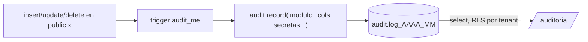

# `audit` — Auditoria

**Que resuelve:** quien creo, cambio o borro que, y cuando, con la fila de
antes y la de despues. Una bitacora que nadie del cliente puede editar ni
borrar, ni siquiera el Owner.

**Categoria:** `core` (§5.1 #9) · **Precio:** 0/0/0 instalacion · 0/0/0 mes
(derivado de `category = 'core'` en `0009_module_catalog.sql`) ·
**Requiere:** ninguno · **Plataformas:** web ✔️ desktop ✔️ movil ✖️

---

## La bitacora la escribe la base, no la aplicacion

`audit.log` (migracion [`0004_audit_log.sql`](../../supabase/migrations/0004_audit_log.sql))
se llena con un trigger generico, `audit.record('<modulo>')`, que se engancha
`after insert or update or delete` a cada tabla que importa. La aplicacion no
tiene que acordarse de registrar nada: si la fila cambio, quedo escrito, venga
el cambio de una pantalla, de la app movil o de un `psql`.

Un borrado logico (`deleted_at` pasa de nulo a fecha) se registra como
`delete`, porque eso es lo que el usuario hizo.



## Inmutable por ausencia de politica

`audit.log` tiene RLS `enable` + `force` y **una sola politica, de `select`**
(`tenant_reads_own_audit`, en `0005_rls_policies.sql`). No hay politica de
`insert`, `update` ni `delete`, y `authenticated` solo recibe `grant select`.
Con `force`, la falta de politica niega la operacion: la unica via de
escritura es el trigger, que es `security definer`.

> Para quien audite la RLS: la ausencia de `update`/`delete` es deliberada.
> No la "arregles" a `for all`.

## Particionada por mes, y cada particion se protege sola

La tabla se particiono desde el dia uno (`partition by range (at)`) porque
reparticionar 200 millones de filas en produccion no es opcion.
`audit.ensure_partition()` crea cada mes **con su propia RLS**: la RLS del
padre no protege una consulta dirigida a la hija, y sin esas lineas
`select * from audit.log_2026_07` devolveria la bitacora de todos los
clientes. La red `isolation.test.ts` revisa todas las tablas del esquema
`audit` (las particiones son `relkind = 'r'`).

## Los secretos se guardan tapados

`to_jsonb(new)` guarda la fila entera. En `ecf_config` eso metia en claro el
`endpoint_token` de la facturacion electronica, legible por cualquiera con
permiso de bitacora. Desde
[`0103_audit_secretos.sql`](../../supabase/migrations/0103_audit_secretos.sql)
los argumentos del trigger a partir del segundo son columnas a ocultar, y se
guardan como `oculto:<8 del md5>`: se sigue viendo **que** cambio y **cuando**,
sin poder reconstruir el valor. El mecanismo es generico: el core no sabe que
existe `e-invoice`, el nombre de la columna viaja como dato en la definicion
del trigger.

## Los roles tambien

Hasta 0121, `public.roles` no llevaba `audit_me`: si alguien le daba a un
cajero permiso de descuento, la bitacora no lo registraba, aunque el tour
`core.permisos` promete que "todo queda en la bitacora". Desde
[`0121_referencias_del_mismo_cliente.sql`](../../supabase/migrations/0121_referencias_del_mismo_cliente.sql)
se audita con `audit.record('rbac')` -de `rbac` son los permisos que
gobiernan `/roles`-, sin columnas tapadas: `permissions` y `scope` son
justo lo que se quiere ver cambiar. El alta de un tenant tambien deja sus
filas (los roles de sistema se crean y se ajustan sin usuario). Prueba:
[`fk-guardas.test.ts`](../../supabase/tests/fk-guardas.test.ts), "Bitacora
de roles".

## Pantallas

| Ruta | Permiso | Que hace |
|---|---|---|
| `/auditoria` | `audit.view` | Las ultimas 200 entradas del tenant, con filtro por entidad |

```
┌─ Auditoria ─────────────────────────────────────────────────────────┐
│ Quien hizo que y cuando. Esta bitacora no se puede editar ni borrar │
│ [Todo] [branches] [companies] [products] [user_profiles]            │
├──────────────┬────────────────┬─────────┬───────────┬───────────────┤
│ Cuando       │ Quien          │ Accion  │ Entidad   │ Detalle       │
├──────────────┼────────────────┼─────────┼───────────┼───────────────┤
│ 18 sept 10:42│ Maria Rosario  │ Cambio  │ products  │ price, cost   │
│ 18 sept 09:15│ Maria Rosario  │ Creo    │ branches  │ Santiago      │
│ 17 sept 16:03│ Sistema        │ Imperson│ impersona │ Soporte #4512 │
└──────────────┴────────────────┴─────────┴───────────┴───────────────┘
```

La columna "Detalle" resume un `update` con los nombres de las claves que
cambiaron (hasta cuatro); un `create`, con el nombre del registro.

## Permisos que expone

| Permiso | Uso real |
|---|---|
| `audit.view` | Abre `/auditoria` |
| `audit.create`, `audit.edit`, `audit.delete` | Declarados en el manifiesto; **ninguna accion los usa**. La bitacora no se crea, edita ni borra desde la aplicacion, asi que no tienen sentido y conviene quitarlos del manifiesto |
| `audit.export` | Declarado; no hay exportacion |

## Eventos

No declara ni emite eventos, **a proposito**. `/auditoria` solo lee; la
bitacora la escriben los triggers de la base. Un evento por fila de
bitacora duplicaria cada cambio del sistema en el outbox, y cada modulo ya
emite sus propios hechos de negocio: la bitacora es el rastro de todos, no
un tema mas.

## Definicion de Terminado

| # | Punto | Estado |
|---|---|---|
| 1 | `manifest.ts` completo | ⚠️ declarado; `audit:manifests` no se corrio en esta entrega. Declara tres permisos que no pueden existir (ver arriba) |
| 2 | Migraciones + RLS probadas | ⚠️ parcial. Probado: el trigger escribe (`products.test.ts`, caso "Bitacora"), la impersonacion deja rastro en la bitacora del tenant (`dunning.test.ts`), el token de e-CF no queda en claro ni al crear ni al cambiar (`ecf.test.ts`, 4 casos), toda particion tiene RLS (`isolation.test.ts`, red), crear, cambiar y borrar un rol queda escrito con usuario y antes/despues, y B no lee la bitacora de roles de A (`fk-guardas.test.ts`, 3 casos, 0121). **Sin prueba propia** de que `authenticated` no pueda hacer `update`/`delete`, ni de que un tenant no lea la bitacora de otro en general (la de roles si esta cubierta) |
| 3 | Logica pura con cobertura | ❌ `resumen()` vive dentro de la pagina, sin prueba |
| 4 | UI web responsive | ⚠️ no verificado en esta entrega |
| 5 | UI movil | ➖ no aplica: `platforms.mobile = false` |
| 6 | Desktop verificado | ⚠️ no verificado |
| 7 | Tour ≥6 pasos | ❌ `f13.auditoria` tiene 4 pasos |
| 8 | Datos demo | ✅ la siembra crea empresas, sucursales, perfiles y productos con trigger, asi que la bitacora nace con filas |
| 9 | ≥2 widgets | ❌ ninguno |
| 10 | Eventos documentados | ➖ no aplica: la pantalla solo lee y la bitacora la escribe la base; razon en "Eventos" |
| 11 | Precio en 3 tiers | ✅ 0/0/0, cargado desde 0009 |
| 12 | E2E en 3 plataformas | ⚠️ no verificado |
| 13 | Ficha | ✅ este archivo |
| 14 | Accesibilidad AA | ✅ en la sonda de F4 (`/auditoria` esta entre las 29 rutas, tercera pasada sin fallos). No se volvio a medir despues |

## Lo que NO hace

- **Crear las particiones de los meses que vienen.** `ensure_partition()` solo
  corre dentro de migraciones (0004 crea el mes actual y los tres siguientes)
  y dentro de `regb.start_impersonation()`. No hay tarea programada que la
  llame. Una base migrada hoy tiene particion hasta dentro de tres meses; el
  primer insert fuera de ese rango no encuentra particion, Postgres lanza
  error, y como el trigger corre en la misma transaccion **el cambio de
  negocio que lo disparo tambien se revierte**. Es el riesgo mas serio de este
  modulo y no esta cubierto por ninguna prueba.
- **Auditar todas las tablas del core.** No llevan `audit_me`
  `tenant_settings`, `notifications`, `import_batches`, `backups` ni
  `tour_progress`. Los **roles** si, desde 0121 (ver "Los roles tambien").
- **Buscar por persona, por fecha o por documento.** El tour `f13.auditoria`
  lo promete; la pantalla filtra solo por entidad, y las entidades del filtro
  salen de las 200 filas cargadas, no de toda la bitacora.
- **Registrar desde donde.** Las columnas `ip`, `user_agent` y `platform`
  existen en la tabla, pero `audit.record()` no las llena.
- **Export firmado.** Lo promete la descripcion del catalogo (0009) y §5.1; no
  existe.
- **Mostrar el antes y despues completo.** Se guarda; la pantalla solo ensena
  los nombres de las claves que cambiaron, no los valores.
