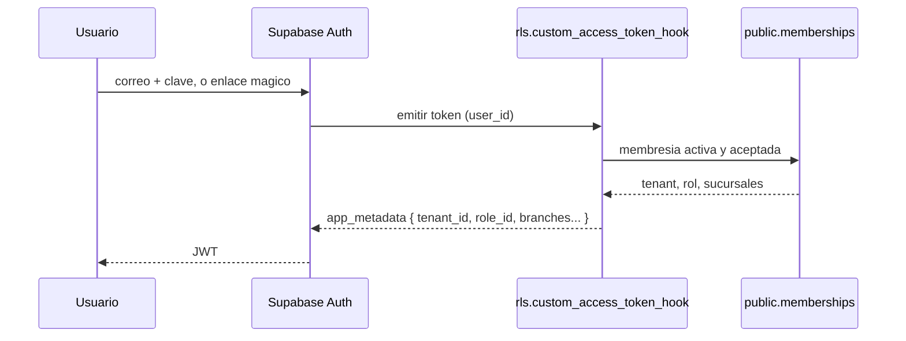

# `auth` — Mi cuenta (Autenticacion)

**Que resuelve:** quien eres para el sistema. Pone el `tenant_id` en tu
token, y en `/perfil` te ensena tus datos, tu rol y **exactamente que te deja
hacer el sistema**.

**Categoria:** `core` (§5.1 #1) · **Precio:** 0/0/0 instalacion · 0/0/0 mes
(derivado de `category = 'core'` en 0009) · **Requiere:** ninguno ·
**Plataformas:** web ✔️ desktop ✔️ movil ✔️ (`mobileScope: view`)

---

## El tenant sale de la base, no de la aplicacion

Todo el aislamiento de REGB descansa en que `rls.tenant_id()` lea un tenant
del JWT. Ese claim lo pone `rls.custom_access_token_hook()`
([`0008_auth_token_hook.sql`](../../supabase/migrations/0008_auth_token_hook.sql)),
que Supabase invoca al emitir cada token y que lee `public.memberships`.
Para cambiar de tenant hay que cambiar esa fila: no hay parametro que la
aplicacion pueda manipular.



## Falla cerrado

| Caso | Token sale con |
|---|---|
| Membresia activa y aceptada, tenant `active` o `past_due` | `tenant_id`, `role_id`, `branches`, `companies` |
| Sin membresia | `tenant_id: null` |
| Invitado que no ha aceptado | `tenant_id: null` |
| Membresia desactivada | `tenant_id: null` en el siguiente token |
| Tenant `suspended` o `archived` | `tenant_id: null` y `tenant_status` |
| Usuario de REGB Control (`regb.provider_users`) | `is_provider: true`, **ningun** tenant |

Un cliente en mora (`past_due`) **todavia entra**: la escalera de mora avisa
antes de bloquear. El bloqueo llega con `suspended`.

## El hook no lo puede llamar un cliente

`revoke execute ... from public, anon, authenticated`: si un cliente pudiera
invocarlo, se fabricaria los claims que quisiera. Y `regb.provider_users` no
tiene **ningun** grant para `authenticated`: un cliente no recibe una lista
vacia, recibe `permission denied` antes de llegar a la RLS. Doble barrera a
proposito.

## `/perfil` la ve todo el mundo

La ruta declaraba `auth.view` y solo los roles administrativos lo tenian: un
cajero abriendo su propia cuenta recibia 404.
[`0032_mi_cuenta_para_todos.sql`](../../supabase/migrations/0032_mi_cuenta_para_todos.sql)
agrega `auth.view` a todos los roles, incluidos los que se crean despues
(envuelve `provision_system_roles` en vez de copiar sus literales).

La pantalla lee los permisos de `ctx.role`, **el mismo objeto que evalua el
servidor** al decidir si te deja hacer algo, asi que lo que ensena no puede
contradecir lo que pasa. "No me deja" es la consulta de soporte numero uno
de un ERP, y casi siempre la respuesta es un permiso que el rol no tiene.

## Pantallas

| Ruta | Permiso | Que hace |
|---|---|---|
| `/login` | publica | Correo + contrasena, o enlace magico. Sin Supabase configurado, ofrece el modo demostracion |
| `/perfil` | `auth.view` (oculta del menu) | Tus datos, tu rol, tus permisos y tus limites de alcance |
| `/auth/callback`, `/auth/salir` | publicas | Vuelta del enlace magico y cierre de sesion |

```
┌─ Mi cuenta ───────────────────────────────────────────────────────┐
│ ┌ Tus datos ───────────────────┐ ┌ Seguridad ────────────────────┐│
│ │ Nombre     Maria Rosario     │ │ Tu clave es tuya.             ││
│ │ Correo     maria.rosario@... │ │ Soporte puede entrar, con     ││
│ │ Telefono   809-555-0101      │ │ motivo escrito y registrado.  ││
│ │ Empresa    Colmado La Esp.   │ │ Todo queda grabado.           ││
│ │ Tu rol     [Cajero]          │ │                               ││
│ └──────────────────────────────┘ └───────────────────────────────┘│
│ ┌ Que puedes hacer ─────────────────────────────────────────────┐ │
│ │ pos        pos.sell            [Si]                           │ │
│ │            pos.discount.max    [hasta 10]                     │ │
│ │ Ademas, tu rol tiene limites de alcance:                      │ │
│ │  > Solo la caja en la que abriste turno.                      │ │
│ └───────────────────────────────────────────────────────────────┘ │
└───────────────────────────────────────────────────────────────────┘
```

## Permisos que expone

| Permiso | Uso real |
|---|---|
| `auth.view` | Abre `/perfil`. Todos los roles lo tienen desde 0032 |
| `auth.create`, `auth.edit`, `auth.delete`, `auth.export` | Declarados; ninguna accion los usa |

## Eventos

No declara ni emite eventos.

## Definicion de Terminado

| # | Punto | Estado |
|---|---|---|
| 1 | `manifest.ts` completo | ⚠️ declarado; `audit:manifests` no se corrio en esta entrega |
| 2 | Migraciones + RLS probadas | ✅ `supabase/tests/auth-hook.test.ts` — 16 casos: claims correctos, el tenant sale de la fila, fallar cerrado (sin membresia, invitacion sin aceptar, baja, suspendido, reactivacion, `past_due` sigue entrando), usuario de Control sin tenant y su desactivacion, el cliente no puede invocar el hook ni leer `provider_users` ni nombrarse proveedor, y tres de invitacion (`invite_member`) |
| 3 | Logica pura con cobertura | ➖ no tiene logica pura propia; `valorLegible()` vive en la pagina |
| 4 | UI web responsive | ⚠️ no verificado en esta entrega |
| 5 | UI movil | ⚠️ la app movil trae su pantalla de entrada (`apps/mobile/app/index.tsx`); segun `ESTADO.md` nunca se ha abierto en un telefono. No hay pantalla de perfil movil |
| 6 | Desktop verificado | ⚠️ no verificado |
| 7 | Tour ≥6 pasos | ❌ `f14.cuenta` tiene 4 pasos, y dos de ellos mandan a hacer cosas que `/perfil` no tiene (ver abajo) |
| 8 | Datos demo | ✅ Maria Rosario, Owner en los dos tenants demo |
| 9 | ≥2 widgets | ➖ no aplica |
| 10 | Eventos documentados | ➖ no tiene |
| 11 | Precio en 3 tiers | ✅ 0/0/0 |
| 12 | E2E en 3 plataformas | ⚠️ no verificado |
| 13 | Ficha | ✅ este archivo |
| 14 | Accesibilidad AA | ✅ `/perfil` en la sonda de F4, tercera pasada sin fallos. `/login` no esta en la lista de la sonda: no medido |

## Lo que NO hace

- **MFA, cambio de contrasena, sesiones activas.** La pantalla lo dice ("llegan
  cuando se conecte el inicio de sesion real"). El tour `f14.cuenta` si manda a
  "Activa el segundo factor" y a "Ver mis sesiones" en `/perfil`, donde no
  existen: el tour promete mas que la pantalla.
- **SSO con Google o Microsoft, politicas de contrasena.** Estan en §5.1 y en
  la descripcion del catalogo (0009); no hay codigo.
- **Registro libre.** A proposito: nadie se registra solo, un administrador
  invita (ver [`users`](users.md)).
- **Editar tu nombre o correo.** Lo hace quien administra usuarios; la pantalla
  lo dice.
- **Elegir entre varios tenants.** El hook toma la primera membresia activa
  con `limit 1`. Un usuario con membresia en dos clientes entra siempre al
  mismo, y cual es no esta definido por un orden explicito.
