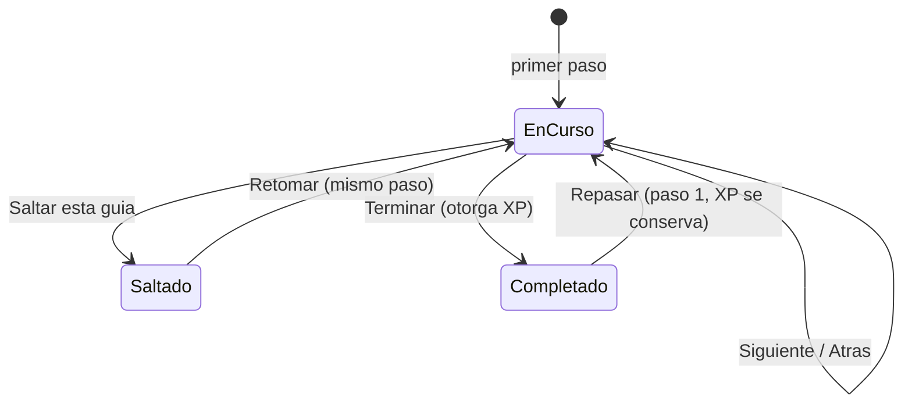

# `tour` — Tutorial

**Que resuelve:** el ERP que te ensena a usarlo. Guias cortas por modulo,
con progreso que se guarda por persona, que se pueden saltar y retomar, y que
te acompanan **dentro** de la pantalla de destino.

**Categoria:** `core` (§5.1 #12) · **Precio:** 0/0/0 instalacion · 0/0/0 mes
(derivado de `category = 'core'` en 0009) · **Requiere:** ninguno ·
**Plataformas:** web ✔️ desktop ✔️ movil ✔️ en el manifiesto
(`mobileScope: view`)

---

## Los pasos son datos, no codigo

El contenido vive en `TOURS` ([`packages/core/src/tours.ts`](../../packages/core/src/tours.ts)).
Cada tour dice de que modulo es (`moduleId`), y `toursFor()` solo ensena los
de modulos licenciados: un modulo nuevo trae su tour sin tocar el motor.

| Campo de un paso | Para que |
|---|---|
| `title`, `body` | Lo que se lee |
| `action` | "Hazlo ahora": ruta relativa, sin query |
| `tip` | Lo que sabe quien ya lleva tiempo con un ERP |
| `target` | Valor de `data-tour` del elemento a resaltar. Es un **nombre**, no un selector CSS: el contenido es dato editable, y un selector crudo dejaria que ese dato apuntara a cualquier cosa del documento |

## Cada modulo del catalogo tiene tour, y una prueba lo exige

`tours.test.ts` lee `modules/` **del disco**: si alguien agrega un modulo sin
tour, la prueba se pone roja ese mismo dia. Tambien falla si un tour apunta a
un modulo que no existe. Asi se encontraron `core.permisos` y
`core.marketplace` apuntando a `rbac` y `marketplace`, que no son modulos del
registry: escritos, mantenidos y **nunca ensenados a nadie**. Hoy cuelgan de
`users` y `settings`.

## La guia sigue dentro de la pantalla

"Hazlo ahora" lleva `?tour=<id>&paso=<n>` en la URL, y `guiaDelPaso()`
([`module-page.ts`](../../apps/web/src/lib/module-page.ts)) pinta ese paso
sobre la pantalla de destino. Se valida contra `TOURS`: un tour inventado o
un paso fuera de rango en la URL devuelven nada, y la pantalla sale normal.
Antes se aterrizaba sin el paso y habia que volver al tutorial a leer el
siguiente; un tutorial que obliga a salirse no lo termina nadie.

## Progreso por persona, XP una sola vez

`public.tour_progress` ([`0003_tenant_core.sql`](../../supabase/migrations/0003_tenant_core.sql))
tiene clave `(tenant_id, user_id, tour_id)`: cada persona aprende a su ritmo.
Al terminar se otorga el XP del tour con
`greatest(xp_awarded, excluded.xp_awarded)`, asi que repasar y volver a
terminar no suma dos veces.



## Pantallas

| Ruta | Permiso | Que hace |
|---|---|---|
| `/tutorial` | `tour.view` | Resumen (completados, puntos, disponibles) y una tarjeta por tour con su paso actual |

```
┌─ Tutorial ────────────────────────────────────────────────────────┐
│ ┌Completados┐ ┌Puntos──────┐ ┌Disponibles─────┐                   │
│ │   3/19    │ │ 110        │ │ 19             │                   │
│ │           │ │ de 520     │ │ segun tus mod. │                   │
│ └───────────┘ └────────────┘ └────────────────┘                   │
│ ┌ Primeros pasos en REGB ──────────────────────────── [50 pts] ┐  │
│ │ ■■■□□                                                        │  │
│ │ Paso 3 de 5 · Invita a tu equipo                             │  │
│ │ Cada quien entra con su propio usuario...                    │  │
│ │ [Ir a Usuarios] [Atras] [Siguiente]        Saltar esta guia  │  │
│ └──────────────────────────────────────────────────────────────┘  │
└───────────────────────────────────────────────────────────────────┘
```

## Permisos que expone

| Permiso | Uso real |
|---|---|
| `tour.view` | Abre `/tutorial` |
| `tour.edit` | Avanzar, retroceder, saltar, retomar, repasar |
| `tour.create`, `tour.delete`, `tour.export` | Declarados; ninguna accion los usa |

## Eventos

| Evento | Cuando | Payload | Donde |
|---|---|---|---|
| `tour.tour.completed` | Al **terminar** una guia: solo en la transicion a completada, en la misma transaccion que el progreso | `{ tourId, userId }` | `guardar()` en [`tutorial/actions.ts`](../../apps/web/src/app/tutorial/actions.ts), via `avanzarPaso()` |

Los dos temas que declaraba el manifiesto se cambiaron:

| Tema anterior | Que se hizo | Por que |
|---|---|---|
| `tour.finished` | **Renombrado** a `tour.tour.completed` | Tenia dos segmentos. `emit_event()` exige `<modulo>.<entidad>.<accion>` y lanza una excepcion que **revierte la transaccion**: el dia que alguien lo emitiera tal cual, terminar un tutorial dejaria de guardarse. Nadie lo escuchaba, asi que renombrarlo no rompe a nadie |
| `tour.step.completed` | **Quitado** del manifiesto | "Siguiente" no comprueba que el paso se hizo (ver "Lo que NO hace"): el evento afirmaria que alguien invito a su equipo cuando solo pulso un boton. Ademas seria una fila de outbox por clic, repetida cada vez que se va atras y adelante |

- La fila anterior se lee con `for update` y el evento sale solo si pasa
  de no completada a completada: un "Siguiente" repetido sobre una guia
  ya terminada no la termina otra vez.
- **Repasar y volver a terminar SI emite otra vez**: es otra vez
  terminada. El XP, en cambio, se sigue otorgando una sola vez.
- `userId` es el id interno del usuario, no su nombre ni su correo.
- Prueba: [`tutorial.accion.test.ts`](../../apps/web/src/app/tutorial/tutorial.accion.test.ts),
  accion real contra `event_outbox`: los pasos intermedios no emiten
  nada, terminar emite uno, pulsar de nuevo no duplica, repasar y terminar
  emite el segundo. Comprobado rojo: emitiendo `tour.finished`, la accion
  devuelve el aviso `Tipo invalido "tour.finished"` (antes habria
  reventado sin decir nada) y la transaccion entera se revierte.

## Definicion de Terminado

| # | Punto | Estado |
|---|---|---|
| 1 | `manifest.ts` completo | ⚠️ declarado; `audit:manifests` no se corrio en esta entrega |
| 2 | Migraciones + RLS probadas | ⚠️ `tour_progress` esta en el patron `tenant_isolation` de 0005 y en la red de `isolation.test.ts`; sin prueba propia |
| 3 | Logica pura con cobertura | ✅ `tours.test.ts` — cobertura de modulos, tours huerfanos, ids unicos, filtro por licencia, y una prueba de forma **por cada tour** (≥4 pasos, al menos una accion, rutas relativas sin query). `guiaDelPaso()` no tiene prueba propia |
| 4 | UI web responsive | ⚠️ no verificado en esta entrega |
| 5 | UI movil | ⚠️ la app movil no tiene tutorial |
| 6 | Desktop verificado | ⚠️ no verificado |
| 7 | Tour ≥6 pasos | ❌ el propio `core.bienvenida` tiene 5. La prueba del repo exige ≥4, no ≥6: **la regla del repo y la de la Definicion de Terminado no coinciden**, y ningun tour de los 14 modulos de esta tanda llega a 6 |
| 8 | Datos demo | ❌ la siembra no crea progreso: todo arranca en el paso 1 |
| 9 | ≥2 widgets | ❌ ninguno |
| 10 | Eventos documentados | ✅ `tour.tour.completed` se emite al terminar una guia; `tour.finished` (formato invalido) renombrado y `tour.step.completed` quitado, con la razon arriba. Prueba de accion real contra el outbox |
| 11 | Precio en 3 tiers | ✅ 0/0/0 |
| 12 | E2E en 3 plataformas | ⚠️ no verificado |
| 13 | Ficha | ✅ este archivo |
| 14 | Accesibilidad AA | ✅ `/tutorial` en la sonda de F4, tercera pasada sin fallos. La barra de progreso lleva `role="progressbar"` con sus valores |

## Lo que NO hace

- **Comprobar que el contenido dice la verdad.** La prueba mide forma, no
  fondo. Varios tours de esta tanda prometen cosas que la pantalla no tiene:
  MFA y sesiones (`f14.cuenta`), buscar por persona y fecha
  (`f13.auditoria`), plantillas, clientes y saldos (`f13.importar`),
  restaurar (`f13.respaldos`), canales de aviso (`f13.notificaciones`),
  tablero por usuario (`f14.tablero`), adjuntos por registro
  (`f14.archivos`), subir fotos de facturas (`f14.captura-facturas`). Cada
  ficha lo detalla en su "Lo que NO hace". Corregir el contenido toca
  `packages/core/src/tours.ts`, que se coordina aparte.
- **Academia, videos, checklist gamificado.** §5.1 los nombra; hay XP y
  progreso, no academia ni videos.
- **Saber si de verdad hiciste el paso.** "Siguiente" avanza aunque no hayas
  invitado a nadie ni subido nada.
